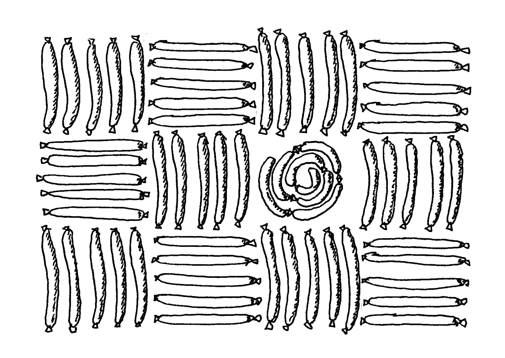
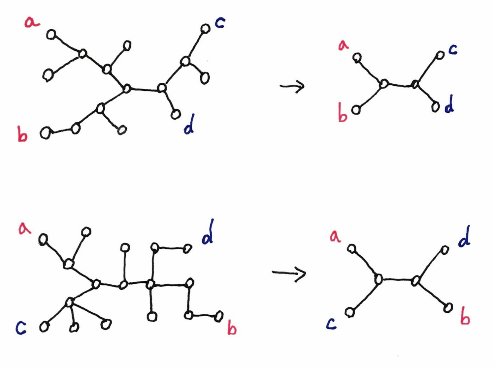

A few weeks ago the accepted papers lists of 
[STOC](http://acm-stoc.org/stoc2019/) 
and 
[SOCG](http://eecs.oregonstate.edu/socg19/) 
were made public. 
A bunch of titles caught my attention, and here are a few bits of information on
some papers I could find online.

---

{: .center-image width="60%"}

---

## Testing graphs in vertex-distribution-free models 

Graph [property testing](https://en.wikipedia.org/wiki/Property_testing) 
basically consists in deciding if a graph has a property 
or not, by looking only at some parts of it. 
More precisely one queries a few nodes, and ask for their neighbors for example, 
and then outputs whether the graph has the property or is far from having 
it. Note that such a statement can only be true with some probability.
An introduction to graph property testing is 
[here](http://www.wisdom.weizmann.ac.il/~/oded/COL/tgp-intro.pdf).

In the classic model, one is allowed to query a random node, with "random" 
meaning "uniformly at random". In a new 
[paper](http://www.wisdom.weizmann.ac.il/~/oded/VO/vdf.pdf)
the author considers the case where the random access is not uniform but depends 
on an arbitrary distribution. This in turn implies a change in the definition of 
being far from a property. 

I didn't dive in the paper, but I imagine the following scenario. 
Some nodes are more "important" than others. This translates into two things:

* It's not a very big deal if you don't detect that something is wrong around
an unimportant node.
* Your random queries have more chance to visit an important node than an 
unimportant node.

For example, you have a dynamic graph, you may not know about newly arrived 
nodes, but these are less important, so it's no big deal if you don't query them
now.

[The paper is 
*[Testing Graphs in Vertex-Distribution-Free Models](http://www.wisdom.weizmann.ac.il/~/oded/VO/vdf.pdf)*,
by [Oded Goldreich](http://www.wisdom.weizmann.ac.il/~oded/), 
and will appear at STOC 2019.
It was listed in 
[October 2018 property testing review](https://ptreview.sublinear.info/?p=1044).]

## Transportation problem

The transportation problem is the following. 
Given a graph, where each node $v$ is given a (positive or negative) supply 
$\mu(v)$, such that $\sum_v \mu(v)=0$, one has to find a flow to transport the 
supplies in order to reach the configuration where every node has supply 0. 
See the picture below.

{: .center-image width="100%"}

This is very similar to the 
[optimal transport problem](Transportation theory (mathematics)) in non-discrete 
mathematics. The [paper](https://arxiv.org/pdf/1902.08384.pdf) presents an 
approximation algorithm for fixed dimensions via continuous optimization. 

I don't know how much continuous optimization is used, but it reminds me of an 
excellent invited talk by 
[Aleksander Mądry](https://people.csail.mit.edu/madry/) at 
[HALG 2016](http://2016.highlightsofalgorithms.org/), that convinced me that 
continuous optimization can be a good approach to solve combinatorial problems.
There is no video of the talk, but 
[this one](https://www.youtube.com/watch?v=noRNcDbqtVY)
seems pretty close.

[The paper is 
*[Preconditioning for the Geometric Transportation Problem](https://arxiv.org/pdf/1902.08384.pdf)*
by [Boris A. Khesin](http://www.math.toronto.edu/khesin/),
[Aleksandar Nikolov](http://www.cs.toronto.edu/~anikolov/),
and Dmitry Paramonov, and will appear at SOCG.]

## LP roundings: iterated meets randomized

A classic approach in combinatorial optimization is to express the problem as a 
linear program. 
Unfortunately, only the fractional case is known to be solvable 
efficiently, and only the integer solutions can be transfered back to solution 
for the original problem. 
A solution is to compute a fractional solution and then to round it to an integer 
solution. This approach is very powerful for approximation algorithms. 

There are two important types of rounding: randomized rounding and iterated 
rounding. 
In [randomized rounding](https://en.wikipedia.org/wiki/Randomized_rounding), 
a fractional variable $x_i$ is simply rounded to 1 
with probability $x_i$. 
In iterated rounding, one iteratively modify the fractional solution until it 
gets to an integral solutions (for example adding some small amount to a set of 
variables, until they reach 1, etc.). 
Both roundings have their pros and cons.

[The paper](https://arxiv.org/pdf/1811.01597.pdf) presents a method that 
combines the two approaches into one common framework, and shows how to use it. 

[The paper is 
*[On a generalization of iterated and randomizedrounding](https://arxiv.org/pdf/1811.01597.pdf)*
by [Nikhil Bansal](https://www.win.tue.nl/~nikhil/), and will appear at STOC.]

## Queue layout

Given a graph, a $k$-queue layout is an ordering of the vertices and a partition 
of the
edges into $k$ sets, such that there are not two edges of the same partition, 
that are nested. 
Below is an example of a graph and a 2-queue layout of it.

{: .center-image width="90%"}

The [queue number](https://en.wikipedia.org/wiki/Queue_number) of a graph is 
the minimum $k$ such that there exists a $k$ layout of the graph. 
An important open question is whether planar graph have bounded queue number. 
[The paper](https://arxiv.org/pdf/1811.00816.pdf) makes a step towards a positive
answer, by proving that planar graphs with bounded degree have bounded queue 
number.

[The paper is 
*[Planar Graphs of Bounded Degree have Constant Queue Number](https://arxiv.org/pdf/1811.00816.pdf)*
by 
[Michael A. Bekos](http://algo.inf.uni-tuebingen.de/?site=mitarbeiter/michaelbekos/index), 
[Henry Förster](http://www-pr.informatik.uni-tuebingen.de/?site=mitarbeiter/henryfoerster/index),
[Martin Gronemann](https://informatik.uni-koeln.de/ls-juenger/people/gronemann/), 
[Tamara Mchedlidze](https://i11www.iti.kit.edu/en/members/tamara_mchedlidze/index),
[Fabrizio Montecchiani](http://mozart.diei.unipg.it/montecchiani/), 
Chrysanthi Raftopoulou, and
[Torsten Ueckerdt](https://i11www.iti.kit.edu/en/members/torsten_ueckerdt/index).
It will appear at STOC (even though the topic is very SOCG-friendly).
I didn't know about queue layouts, and it's good to discover it, as it is yet 
another example of graph parameter that correspond to a pattern, in the sense of 
[this paper](https://arxiv.org/abs/1812.05913).]

## Reachability of Petri nets

[Petri nets](https://en.wikipedia.org/wiki/Petri_net) are very common in 
theoretical computer science, for 
example in [model checking](https://en.wikipedia.org/wiki/Model_checking). 
Nevertheless, it is horribly hard to decide the reachability problem for this 
model: can you get from a configuration $A$ to a configuration $B$?
The decidability of the problem was proved only in the 80s, and the best 
upper bound is non-primitive recursive cubic-Ackermannian (don't ask what it 
means, exponential space is already scaring me). 
 
The [paper](https://arxiv.org/pdf/1809.07115.pdf) proves that the problem is 
[non-elemetary](https://en.wikipedia.org/wiki/Nonelementary_problem), that is, 
its time complexity cannot be bounded by a power tower. 

[The paper is 
*[The Reachability Problem for Petri Nets is Not Elementary](https://arxiv.org/pdf/1809.07115.pdf)*
by [Wojciech Czerwiński](https://www.mimuw.edu.pl/~wczerwin/),
[Sławomir Lasota](https://mimuw.edu.pl/~sl/),
[Ranko Lazić](https://warwick.ac.uk/fac/sci/dcs/people/ranko_lazic),
[Jérôme Leroux](https://www.labri.fr/perso/leroux/) and 
[Filip Mazowiecki](https://www.labri.fr/perso/fmazowiecki/); and will appear at STOC.
In France, [Sylvain Schmitz](http://www.lsv.fr/~schmitz/index.html.en) is one 
of the researcher working on this kind of stratospherical complexities. 
[Simon Halfon](http://www.lsv.fr/~halfon/) one his PhD students at the time, 
gave an excellent talk on this topic at the 
[IRIF PhD seminar](https://www.irif.fr/en/seminaires/doctorants/index) in 2017.]

## Quartet distance and 4-cycles

The [quartet distance](https://en.wikipedia.org/wiki/Quartet_distance) is a 
distance between phylogenetic trees. More precisely it is a distance between two 
unrooted trees with labeled leaves. It basically takes all the tuples of four 
leaves and count how many of them are in different topology in the two trees. 

For example in the picture below, for the two trees on the left, we want to 
decide whether the leaves $a$, $b$, $c$ and $d$ are in the same topology or not. 
We simplify the tree until we have only these leaves, and we see on the pictures
on the right  
that it is not the case. Thus this quartet will add one to the distance. 
(Note that on the left, all leaves should be labeled, but I indicate only the 
ones we are interested in).

{: .center-image width="100%"}

The [paper](https://arxiv.org/pdf/1811.06244.pdf) shows that computing the 
problem of computing 
distance between two trees is equivalent to the problem of computing the number 
of 4-cycles in a graph, up to 
polylogarithmic factors. This implies better algorithms and better insights
on the complexity.

[The paper is
*[Computing Quartet Distance is Equivalent to Counting 4-Cycles](https://arxiv.org/pdf/1811.06244.pdf)*
 by Bartłomiej Dudek (whom I have had the chance to meet in EPFL), 
and [Paweł Gawrychowski](https://sites.google.com/a/cs.uni.wroc.pl/gawry/), and 
it
will appear at STOC.]

