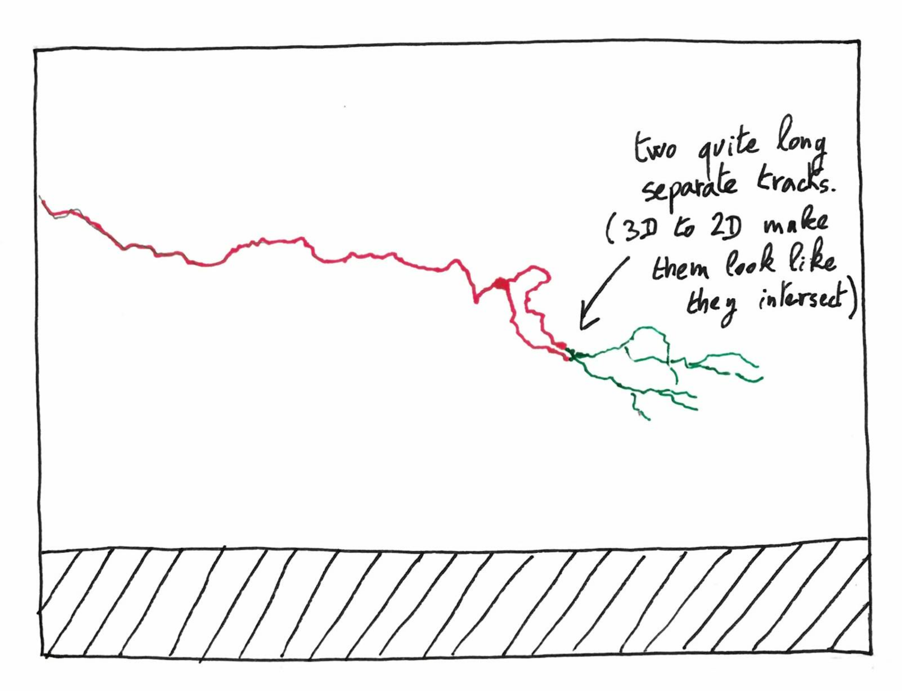
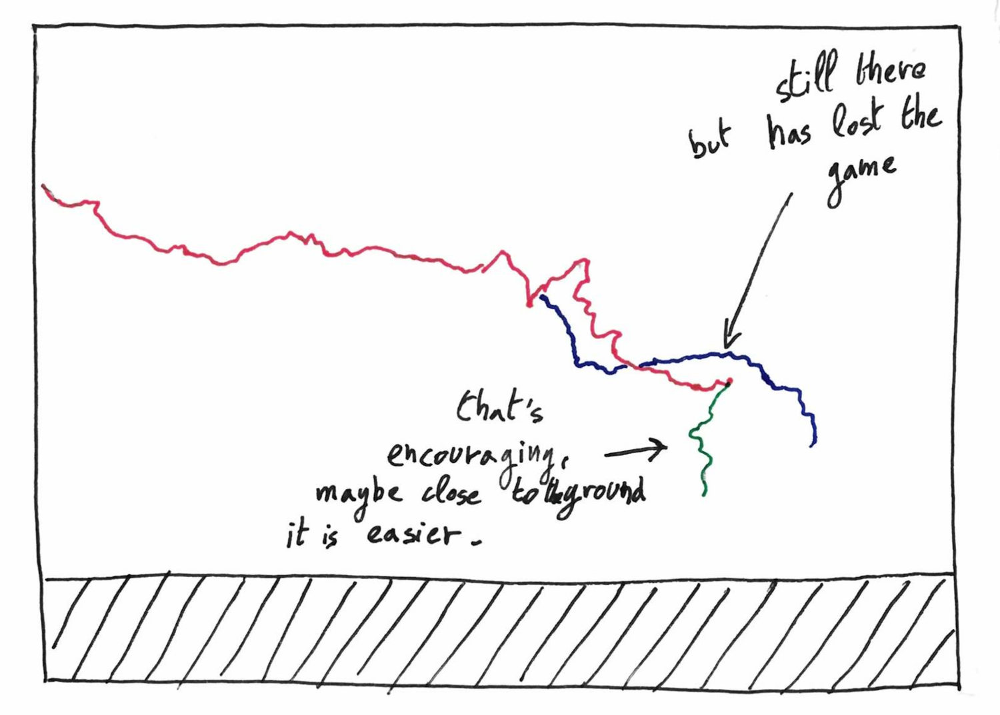
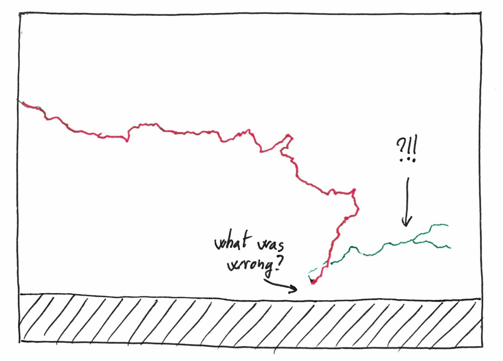
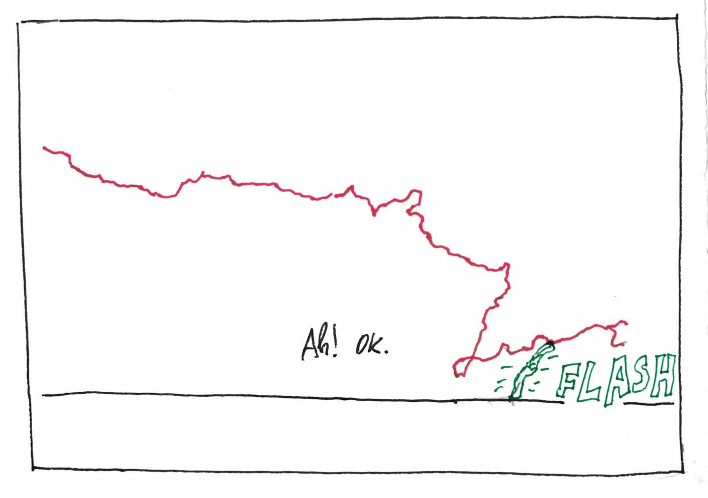

I recently stumbled on [this video](https://www.youtube.com/watch?v=nBYZpsbu9ds)
of lightning. I knew that lightning kind of "search for the good way", but 
I was stunned by how it looks like the run of a search algorithm: exploration 
phases, backtracking, compromise between depth and breadth etc.
For fun, I drew a lightning bolt, second by second. You may find it in the 
video around 0:25-0:35.

{: .center-image width="100%"}
{: .center-image width="100%"}
{: .center-image width="100%"}
{: .center-image width="100%"}
{: .center-image width="100%"}
{: .center-image width="100%"}
{: .center-image width="100%"}
{: .center-image width="100%"}
{: .center-image width="100%"}
{: .center-image width="100%"}
{: .center-image width="100%"}
{: .center-image width="100%"}

