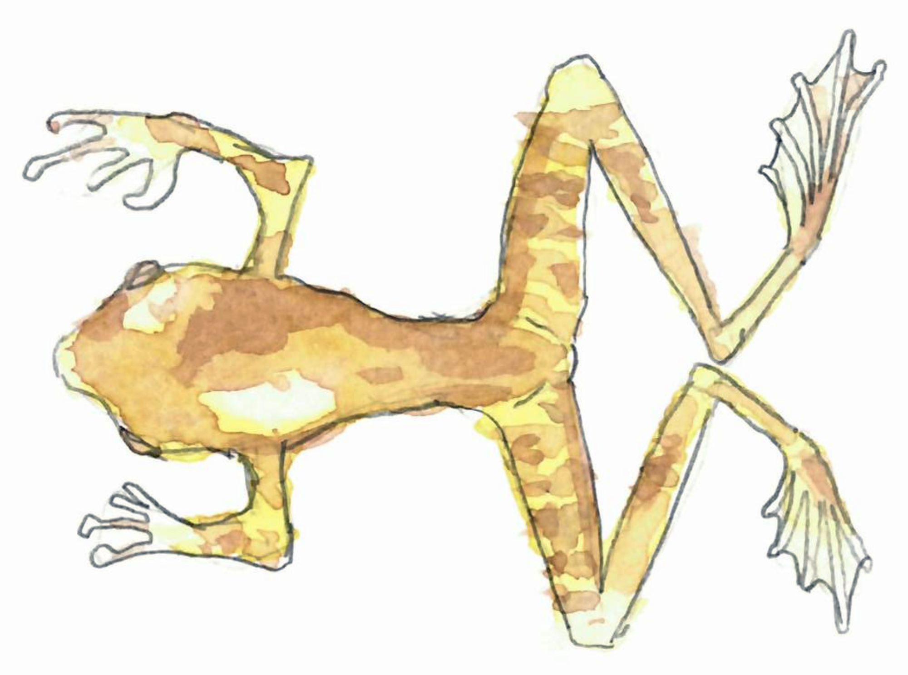

Until recently there was in Paris an exhibition about some techniques used for 
research in natural history.
It raises some algorithmic questions and comments about bones, diamonds and 
polytopes.
(More details about this great exhibition at the end of the post.)

---
{: .center-image width="80%"}

<small><i>Researchers measure the teeth of the tadpoles this frog 
species, and learn stuff.</i></small>

---

## Computing (skull) volumes

{: .center-image width="60%"}

When you get a skull, something you want to measure is how much brain you can 
fit in, that is, what is its inside volume.
This used to be done by filling the skull with some kind of grains, and then 
measuring the volume of grain. 
It is now done by with sensor measurements and computations. 
But if I give you some triangulation of an object, how do you compute the volume?
If you assume the object to be convex, then one can surely do some kind of discrete 
integrals, suming some basic polytope volumes. 
[This paper](https://www.ams.org/journals/mcom/1991-57-195/S0025-5718-1991-1079024-2/S0025-5718-1991-1079024-2.pdf) 
(or more precisely its introduction) seems to validate this intuition. 
It also raises the question about how the object to measure is given. 

This made me remember that some price was awarded for something related to 
volume computation. 
I dug out the reference: 1991 
[Fulkerson prize](https://en.wikipedia.org/wiki/Fulkerson_Prize) was awarded to 
Dyer, Frieze and Kannan for works of this flavour.
Their model is black-box: you ask for a point and you are answered whether it is 
inside or outside. 
They provide a randomized PTAS[^1] for approximating
the volume of high-dimensional polytopes using 
[Markov chain Monte Carlo](https://en.wikipedia.org/wiki/Markov_chain_Monte_Carlo) 
methods. 
As many counting problems can be rephrased in terms of polytopes, this is much 
more useful than just computing high-dimensional skull volumes.
For a bit more on this, see 
[this wikipedia page](https://en.wikipedia.org/wiki/Convex_volume_approximation).

## Inclusions of diamonds and polytopes

{: .center-image width="70%"}

The diamond above is the [Blue Diamond of the French Crown](Tavernier Blue) 
that Louis XIV bought at some point of the 17th century. 
Or actually, it's what it used to look like, because this diamond disappeared. 
It was suspected that it has been recut and is now the diamond known as the 
[Hope diamond](https://en.wikipedia.org/wiki/Hope_Diamond). 

This was presented in the exhibition because the museum in Paris has a lead cast 
of the original diamond, and used it to validated the link between the two. 
Basically the two diamonds fit so well one in the other, that is very likely 
that they are the same with only a light recut.

{: .center-image width="70%"}

But how can you decide if two polytopes could be included one in the other?
And what's the complexity? (Note that contrary to skulls, diamonds are pretty 
much polytopes.)

First for the decision problem: the two polytopes are somehow aligned and you 
just want to check the inclusion of one into the other.
If both polytopes are given by sets of vertices, then some methods similar to
[convex hull computations](https://en.wikipedia.org/wiki/Convex_hull_algorithms) 
should do the job. 

Now how to find this alignment? For our diamonds, the spikes and planar 
symmetries surely help. But what if your polytopes are say, 
very close to spheres, but with random perturbations? Doesn't seem very easy. 
This looks similar to some robotics problem, such as the 
[piano mover's problem](https://en.wikipedia.org/wiki/Motion_planning), but it's 
not quite the same. 

## Symmetrizing old bones

{: .center-image width="100%"}

Yet another problems that one can transfer to polytopes. 
Here the paleontologists find skulls like the one on the left (I didn't take 
notes of the name of this fellow), that has been deformed by non-uniform forces 
in the ground.
Then they try to reconstruct the correct shape, like the one on the right.

Again if you are a human, if you know a lot about such creatures, it is possible 
to find a plausible shape by adjusting the parameters of some transformation.
In particular, you try to have a left-right symmetry.
But what if I give you an arbitrary triangulation, and tell you: find the best 
way to modify it in order to have a symmetry?

Could be related to 
[principal component analysis](https://en.wikipedia.org/wiki/Principal_component_analysis), 
that gives you some notion of "this object is somehow aligned with this 
direction", but again if you have a random near-spherical objects, this does not 
help you (but in this case, you may be happy with any plane, as an approximation).

### About the exhibition
The name of the exhibition in French was 
*[Secrets dévoilés : voir l’imperceptible](https://www.mnhn.fr/en/node/5277)*, 
which basically means *Unveiling secrets : seeing the imperciptible*.
It was created by the 
[National Museum of Natural History of Paris](https://en.wikipedia.org/wiki/National_Museum_of_Natural_History,_France)
and consisted in panels, hung in the
[Jardin des Plantes](https://en.wikipedia.org/wiki/Jardin_des_plantes).  

Some of the pictures can be seen on the 
[website of the illustrator](https://marieducom.com/portfolio/exhibition-secrets-devoiles-voir-limperceptible/?lang=fr).

### Footnotes
[^1]: For PTAS and related acronyms, see [this post](https://discrete-notes.github.io/october-batch-forgotten).

