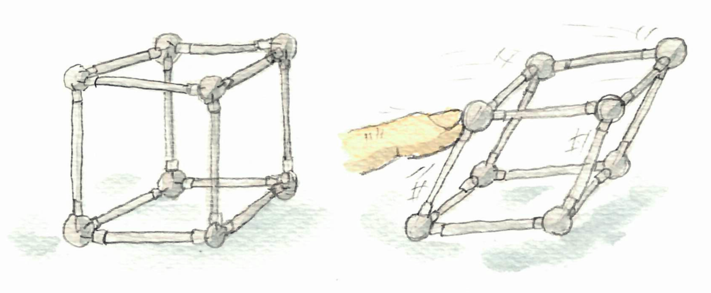

Some deadlines disturbed the schedule of the monthly notes ; this post is for 
both April and May.

{: .center-image width="95%"}

---

## Cuckoo cycles

A 
[guest post](https://blog.computationalcomplexity.org/2019/04/cuckoo-cycles.html) 
by John Tromp, on the Computational Complexity blog, is about the cuckoo cycle 
problem. 

Basically there are some crypto-currencies, where the 
[proof-of-work](https://en.wikipedia.org/wiki/Proof-of-work_system) consists in 
finding cycles in a huge graph. 
This graph is the cuckoo graph, whose edges are defined by the hash function of 
the [cuckoo hashing](https://en.wikipedia.org/wiki/Cuckoo_hashing). 
The post describes briefly the method used by the miners for this problem. 

Interesting to see a theoretical problem tackled in very practical way.

## PCP videos

At the end of 2018, a workshop took place in Tel Aviv, about the
[PCP theorem](https://en.wikipedia.org/wiki/PCP_theorem) and related topics.
Great news: the talks have been recorded, and the videos are available on a
[youtube channel](https://www.youtube.com/playlist?list=PLGRBwz8taWHiBHlgnX98zrbnWQCeDtFQ_).

I watched [Ronitt Rubinfield](https://en.wikipedia.org/wiki/Ronitt_Rubinfeld)'s 
talk, and it's very good. She tells the story of checkers and testers. 
Just a bit to arouse your interest: like many people, I know interactive proofs 
for difficult problems 
(isomorphism, satisfiability etc.), but actually testing and interactive proofs 
have started with things as simple as GCD.

## Graphs defined by matchsticks, pennies and hinges.

Here are three types of graphs that have a description in terms of real-world 
objects.
 
First, [matchstick graphs](https://en.wikipedia.org/wiki/Matchstick_graph) are 
graphs that you can draw on a table with matchsticks.

{: .center-image width="80%"}

In more precise terms, these are planar
[unit-distance graphs](https://en.wikipedia.org/wiki/Unit_distance_graph), that 
is graphs that you can draw on the plane with only (straight) edges of length 1.

Second, [penny graphs](https://en.wikipedia.org/wiki/Penny_graph) are graphs 
that can be represented by pennies on a table. More precisely, a graph is a 
penny graph, if it is possible to represent each vertex by a unit disk, and to 
place the disk in such a way that they touch only at the boundaries, and that 
each contact represents an edge.

{: .center-image width="60%"}

Penny graphs are matchsticks graphs but the reverse is not true.

Finally consider the following experiment. 
Take a graph, replace edges by rods and nodes by hinges.
Now, if when you push on some side, the graph changes shape, then the graph is 
flexible, otherwise it is 
[rigid](https://en.wikipedia.org/wiki/Structural_rigidity).
For example a cube is flexible, and a tetrahedron is rigid.

{: .center-image width="100%"}

## Breaking symmetries, in cells

A common challenge in distributed algorithms is breaking symmetry: 
if two processors have exactly the same view, they have to take the same step. 
For example, on a cycle, if the nodes do not have a way to break 
symmetry (for example unique identifiers), then they all have the same view, 
thus they take the same steps, and will output the same thing. 

Let us now take a look at biology. We know that an essential mechanism in living 
stuff is [cell division](https://en.wikipedia.org/wiki/Cell_division), 
where a cell is basically replaced by two copies of itself. 
At the very beginning of a new organism, there is one cell, and then it divides 
again and again, and at the end you get a fully developed living being. 

From a distributed computing perspective, int his context,
it would be natural to have the exact same cell everywhere, with 
the same development. 
It is not the case: brain cells are not muscle cells. 
Ok, so a first reason it that there is the environment: two identical cells 
could evolve differently because the things around them are different. 
In some sense the environment breaks symmetry.
But if you think about an embryo, the environment is probably very similar on 
one side or the other, so at least at the beginning it should be just a heap of 
identical cells, and it is not the case. So, what's going on?

A quick look at wikipedia provides the answer: cell division does not produce 
identical cells. In particular, stem cells
[divide asymmetrically](https://en.wikipedia.org/wiki/Asymmetric_cell_division).
The wikipedia article goes quickly into specific things, but from what I 
understand, that fact that the sperm cell fertilizes the egg cell "in one 
direction" gives a special 
direction, that influences the way the small stuff in the cell is distributed.
Thus what is inside the cell is not uniformly distributed. 
This asymmetry is then propagated at the level of the cells. 
This is because the division of a cell happens in such a way that the two cells 
have very different small stuff inside (because some proteins make this happen 
this way). 

## Discrete analysis and light bulbs

Once in while I remember that the 
*[Discrete Analysis](https://discreteanalysisjournal.com/)*
journal exists. 
It is one of these few journals that are really open access, 
in the sense of the [Free journal network](https://freejournals.org/).
One can check the list of free journals 
[here](https://freejournals.org/current-member-journals/).
The relevant journals for complexity/algorithms/graphs are
[DMTCS](https://dmtcs.episciences.org/), 
[JoCG](https://journals.carleton.ca/jocg/index.php/jocg), 
[JGAA](http://jgaa.info/), 
[LMCS](https://lmcs.episciences.org/), 
[TAG](https://digitalcommons.georgiasouthern.edu/tag/), 
and 
[ToC](https://theoryofcomputing.org/introduction.html).

*Discrete analysis* is mainly about analytic methods in combinatorics, thus not 
exactly my cup of tea, but I know it from the blog of 
[Timothy Gowers](https://en.wikipedia.org/wiki/Timothy_Gowers). 
And once in a while, there is a paper that arouses my curiosity.

The website is especially well-done for readers like me. 
Unlike usual journals with ugly websites, and just a list of papers, 
Discrete Analysis has a nice picture for each paper, a small page describing it,
with an introduction written by a member of the editorial board. All this is 
very nice, although at first sight it may look a bit too flashy.  

A paper that "makes the cover" of the website these days is 
[Fixed-energy harmonic functions](https://discreteanalysisjournal.com/article/2730-fixed-energy-harmonic-functions).
In addition to the introduction, there is the video of a talk about the paper. 
It goes quickly into maths that I can't understand without effort, but the first 
five minutes explain the problem in a fun fashion. 
Consider an electric circuit with light bulbs. 
The circuit is represented by a 
graph and every edge has a weight: the resistance of the light bulb of this 
section of the circuit. 
Now you can plug the wires of a battery at two arbitrary nodes of the graph and 
ask for the energy dissipated on each bulb, that is for the brightness of each 
bulb. This is a classic exercise in physics, and on reasonable circuits one 
just has to use simple laws of electricity and a lot of time. 
For example the video features this circuit, where all the resistances are equal.

{: .center-image width="80%"}

The paper studies the reverse problem: given a graph, and two nodes to plug the 
battery, how to choose the resistance of the light bulbs such that they all 
shine with the same brightness?

## Pie rule

In the [March notes](./march-2019-notes-1), I mentioned some criteria for fair 
item assignment. One is well-known: the first player defines two bundles of items, 
the second player choose the bundle it prefers. This way the first player will 
design the bundles in the most balanced way. 
A more concrete setting is with a pie (hance the name of "pie rule"): 
the first player cuts the cake into two pieces, and 
the second player chooses the slice.

I discovered that something similar exists for games such as chess, go, etc. 
In some of these two-players games, the first player has a great advantage. 
To mitigate this, one can use the 
[pie rule](https://en.wikipedia.org/wiki/Pie_rule). Let say that we consider 
chess, and that A plays white, and B plays black. Then the pie rule 
says that after A has played the first move, B has the choice between:

* playing the normal way until the end
* changing the color, that is taking the white side, and letting A do the first 
move for the black, and then playing the normal way until the end (with A playing 
black, and B playing white). 

This way, A has an incentive to make a not-too-good move to start, which 
mitigates its first-player advantage. 

## Multiplicative weight update 

The 
[multiplicative weight update method](https://en.wikipedia.org/wiki/Multiplicative_weight_update_method) 
is a general algorithmic method, that is not known enough, and that has been 
discovered several times in several contexts. 
The basic description is the following. Suppose you have several experts, that 
give you advice for a series of decisions that you take one by one. 
After each decision, you redesign the way you aggregate the advice to take a 
decision. Typically you want to give more weight to experts that have given good
advice.
The multiplicative weight update method basically states that updating the weight
in multiplicative manner is a good idea.
It seems pretty specific but it is actually very general. 

In addition to the wikipedia page and the references therein (including a survey 
by Arora, Hazan and Kale), you may want to take a look at a series of post that 
Luca Trevisan is currently writing 
on this topic. 
Actually he is mostly interested in the developments of this 
method that have been used in a variety of papers in complexity recently. 
The series of posts starts 
[here](https://lucatrevisan.wordpress.com/2019/04/17/online-optimization-for-complexity-theorists/).

Jeremy Kun also has a 
[nice post](https://jeremykun.com/2017/02/27/the-reasonable-effectiveness-of-the-multiplicative-weights-update-algorithm/) 
about the method.

## Maximum matchings that are not perfect

I recently had to think about graphs that do not have a perfect matching. 
The first example is of course graphs with an odd number of vertices. 
Next, you can find things like the one below (with a maximum non-perfect 
matching).

{: .center-image width="70%"}

Intuitively, in each triangle, one node must be matched with a node outside the 
triangle, but the three triangles are looking for the same node in the middle, 
and as only one can be served, the other triangles must have an unmatched 
node. 
Actually, even a star with three leaves is a good example.

Remember [Tutte theorem](https://en.wikipedia.org/wiki/Tutte_theorem): 
A graph, $G = (V, E)$, has a perfect matching if and only if for every subset $U$ 
of $V$, the subgraph induced by $V − U$ has at most $|U|$ connected components with 
an odd number of vertices (definition from wikipedia). 
In the drawing above, take the middle node as $U$, you get three connected component 
with an odd number of vertices. As $3>1$, this graph doesn't have perfect matching. 

Tutte theorem is actually a special case of the 
[Tutte–Berge formula](https://en.wikipedia.org/wiki/Tutte%E2%80%93Berge_formula), 
which states that the size of the maximum matching is: 
$\frac{1}{2} \min_{U\subseteq V}  \left(|U|-\operatorname{odd}(G-U)+|V|\right)$

where $\operatorname{odd}$ counts the number of odd connected components.

## Irreproducibility and unpublished failures

A
[paper in Nature](https://www.nature.com/articles/d41586-019-01307-2?utm_source=twt_nnc&utm_medium=social&utm_campaign=naturenews&sf211598052=1) 
identifies the "four horsemen of irreproducibility" that harm science. 
One of them is the publication bias: studies that do not 
conclude that there is a relation between two things are not publishable. 
Two problems with this are: (1) researchers have an incentive to find
correlations, when they should have an incentive to find the truth, and (2) if 
because of statistics a false correlation can appear in 5% of the experiments, 
then only the wrong conclusion will be made public (after 19 teams on average 
have tried, and failed to find a correlation). 

There are efforts to fight this problem. One is the notion of
 [registered report](https://cos.io/rr/). This consists in having the journal to
review an experiment (the topic, the hypothesis tested, the method), before the 
experiment is made. If this set-up is accepted, then the experiment is made, the 
paper written and it goes through a second review.
The paper is provisionally accepted after the first review.

In TCS and maths in general, this publication bias is not a central problem, as 
one can check the proofs, and hopefully be convinced that the papers published 
are correct. Nevertheless, we probably loose a lot of time trying the same 
approaches on the same problems, without making our failures public.  

## Planes etc.

As a follow-up to the 
[note of last month](https://discrete-notes.github.io/march-2019-notes-2) about 
conference travel and its environmental impact, here are a few more elements. 

An [article (in French)](https://theconversation.com/chercheurs-donnez-lexemple-prenez-moins-lavion-110613) 
about flights of researchers, mentions several alternatives. One is to have 
purely virtual conferences (such as 
[this one](https://ehc.english.ucsb.edu/?page_id=12687)).
Another one is to have the conference distributed among multiple sites, for 
example one in each continent. Probably worth testing...
By the way, remember that we can already enjoy a virtual TCS seminar: 
[TCS+](https://sites.google.com/site/plustcs/).
 
Also, it's difficult to make efforts when you are almost alone to make them and 
that it even hurts you career. Maybe a charter or a code of conduct, for 
researchers of an institution or of a community would help.
For example an important Danish newpaper now has such a charter (no domestic 
flights (remember it's Danemark), less flying in general, less advertising for 
far away destination etc.). I couldn't find good press coverage of this in English, 
but [here is an article](https://www.lemonde.fr/climat/article/2019/01/16/climat-plus-de-vols-interieurs-pour-les-journalistes-de-politiken_5409874_1652612.html?xtmc=politiken&xtcr=5) in the main French newspaper.

EDIT(July 2019): there actually exists some rules in some universities, see 
[this Wired article](https://www.wired.com/story/climate-scientists-take-the-train/).

