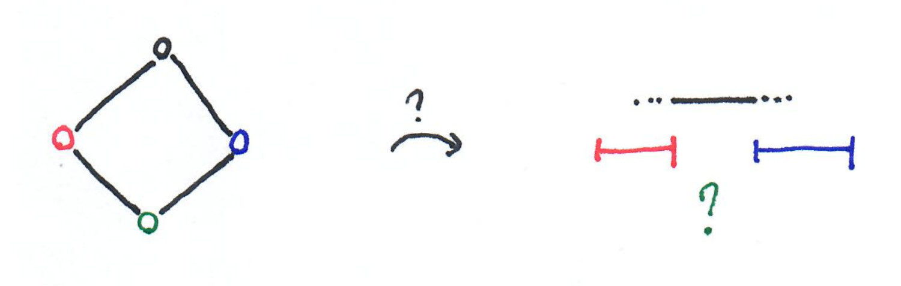
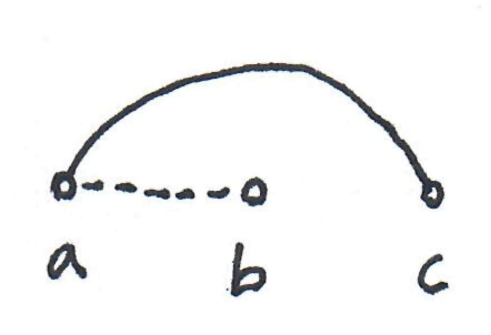

[EDIT: I changed a bit the post. It was supposed to be the first of a 
series but actually it is just a teaser for the paper.]

Michel Habib and I have quite recentely finished the paper 
[Graph classes and forbidden patterns on three vertices](https://arxiv.org/abs/1812.05913). 
Let me present it quickly.

## Why studying graph classes?

This paper is about graph classes, and it seems that it is a topic 
that is not popular with everybody, so let's start with a couple of 
reasons to study graph classes.

#### Graphs are fundamental objects 
Just like sets and languages, graphs are basic objects, thus gathering 
knowledge about them is useful. For example, the pumping lemma
for regular languages appears in distributed computing, because 
languages are basic objects, and thus they pop up everywhere. 

#### To use algorithms in the "real world"
If one wants to use algorithms for real-world problems, it is likely 
that looking at results for general graphs is not the most useful 
approach. There is a good proportion of the real-world instances that
belong to very special classes, and if (1) you can recognize such 
special classes fast, and (2) you have a fast algorithm for your problem 
on this class, then you are happy. In other words,
your transportation problem may be hard on expanders, but road networks 
are not expanders, so let's look at what road networks look like. 

## Why *not* studying graph classes?

To be fair, there is a problem with graph classes: 
there are way too many of them! The website 
[graphclasses.org](http://graphclasses.org) lists 1600 classes, and it's 
difficult to navigate in this jungle, to know what is an interesting
class, to know whether the class you're working on is known etc.
(although the website is very useful for that).

## This paper 
This paper brings a new point of view on some very classic graph classes, 
putting them all in the same framework, with algorithmic consequences.
(Thus it goes in the right direction!). 

Actually "new" should be used with a lot of quotation marks: this point of view 
has been known for a long time for several classes. I cannot cite all 
the papers here, so I'll cite none of them, but keep in mind that most of 
what I'll write about is not new. Take a look at the paper if you want 
to see the 70 citations.

Now, let's get started with two examples.

## Example 1 : forests 

Here is a complicated characterization of the forests (e.g. the acyclic 
graphs).

*Theorem:* A graph $G=(V,E)$ is a forest, if and only if, there exists an ordering 
of the nodes, such that: there does *not* exist three nodes $a < b < c$, with 
 $(a,b)\in E$ and $(a,c)\in E$.
 
That is, we forbid this pattern: 

{: .center-image width="40%"}

*Proof sketch*
$(\Rightarrow)$ : Consider a tree of the forest. Put the leaves 
first in the ordering and remove them from the tree; then repeat 
with the remaining nodes of the tree, until the tree is empty. 
Then move on to the next tree, do the same etc. 
It is easy to check that the pattern will not appear.

$(\Leftarrow)$ : If the graph is not a forest, then there is a cycle. 
Now consider any ordering of the graph. The node of the cycle that is 
the left-most in the ordering must have both its cycle neighbors on 
its right, thus the pattern appears.

## Example 2 : interval graphs

A more interesting example is interval graphs. Given a set of intervals
$S$, one can define the intersection graph of it, $I(S)$, by creating one 
node for each interval and putting an edge between two nodes if the two 
corresponding intervals intersect. 

{: .center-image width="70%"}

*Definition:* A graph $G$ is an interval graph if $G=I(S)$ for some set 
of intervals $S$.

From the picture above, we know that a path on four vertices is an 
interval graph. A graph that is not an interval graph is the cycle on 
four vertices. Consider the following picture. 

{: .center-image width="70%"}

As the red node and the 
blue node are not adjacent, they must correspond to two disjoint 
intervals, and without loss of generality, the red interval comes first. 
The black interval should intersect both the red and the blue intervals. 
Thus it uses the space between these two.
The same holds for the green interval, but the black and the green 
intervals should not intersect, thus the construction is impossible.

Here is a characterization of interval graphs.

*Theorem:* A graph $G=(V,E)$ is an interval graph, if and only if, 
there exists an ordering of the nodes, such that: there does not exist 
three nodes $a < b < c $, with $(a,b)\notin E$ and $(a,c)\in E$.

In other words, the following pattern is forbidden: 

{: .center-image width="40%"}

*Proof sketch:* 
The key idea for the proof is to consider the ordering of the left 
endpoints of the intervals. First, given a set of intervals 
it is easy to see that the ordering given by these left endpoints avoids 
the pattern. Second, to build a set of intervals, given the ordering, 
one just as to put the left endpoint of the intervals in the right order
and then to make put the right endpoint at the spot where the right most 
neighbor starts. (The pattern insures that this construction is correct.)

 
## Similar characterizations

Thus these two classes can be characterized in a 
similar way: the existence of a vertex ordering that 
avoids some small pattern. Our paper is about understanding what are the
classes that can be defined this way. 
 

