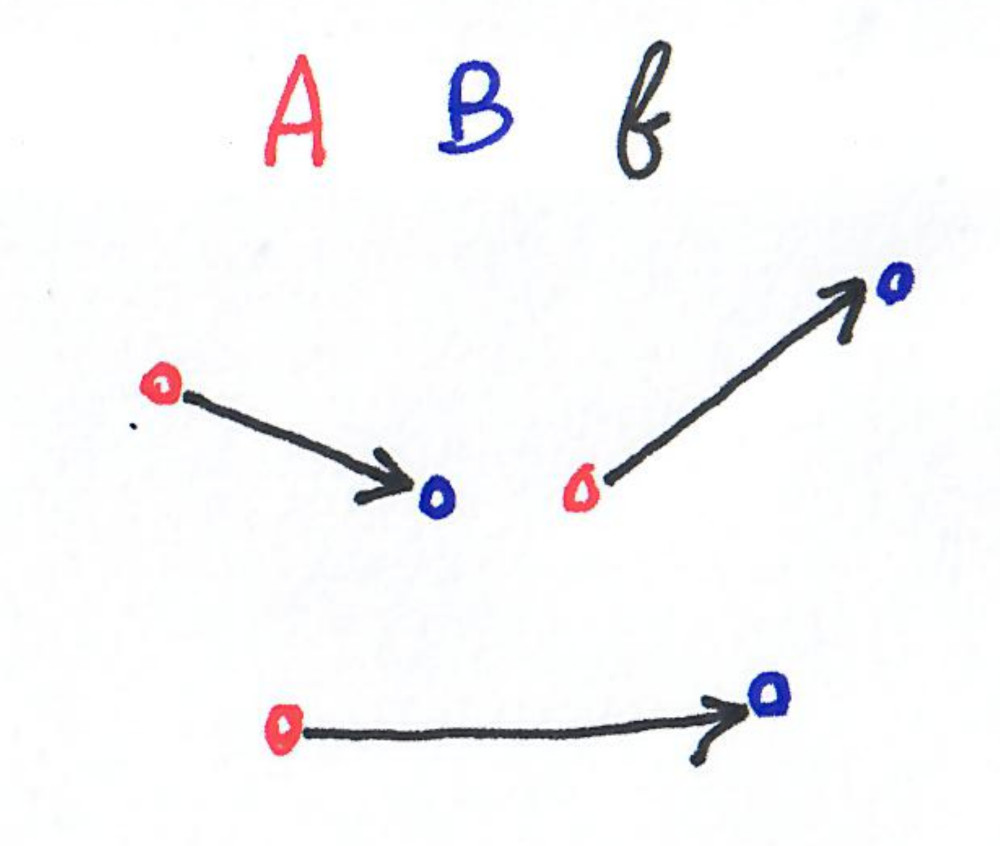
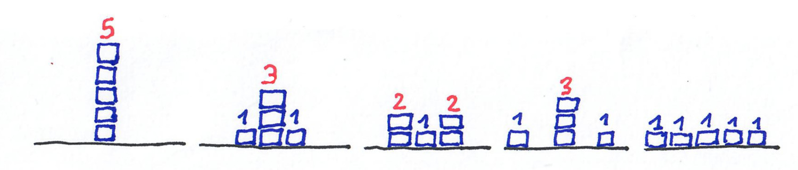

Some notes for October 2019, related to distances and to moving stuff.

--- 
{: .center-image width="60%"}

<small><i>
A lot is going on in Chile. Fortunately there are some good recipes.
</i></small>

---

## Matching graphs via Gromov-Hausdorff distance 

There are many contexts where one would like to compare two graphs, to 
measure if they are close or not. 
One way of doing this is to decide whether one is included in the other
(the 
[subgraph isomorphism problem](https://en.wikipedia.org/wiki/Subgraph_isomorphism_problem)) 
or more generally if they have a 
[large isomorphic subgraph](https://en.wikipedia.org/wiki/Maximum_common_edge_subgraph).
Another way is to measure the number of edits one has to make to go from 
one graph to the other (for example the number of edges to add and 
remove). This is what is done in 
[property testing](https://en.wikipedia.org/wiki/Property_testing), where having a 
distance on the objects is essential. 

More generally, there exists a distance for compact metric spaces called 
[Gromov-Hausdorff distance](https://en.wikipedia.org/wiki/Gromov%E2%80%93Hausdorff_convergence#Gromov%E2%80%93Hausdorff_distance), 
that applies to graphs. 

No surprise, this distance is a complicated notion 
(an inf of a max of a sup of an inf),
and computing it is NP-hard. The reduction is to the 
[quadratic bottleneck assignment problem](https://en.wikipedia.org/wiki/Quadratic_bottleneck_assignment_problem), 
a [facility location problem](https://en.wikipedia.org/wiki/Facility_location_problem).

A [fairly recent preprint](https://arxiv.org/pdf/1909.09772.pdf) studies how to 
estimate a modification of this distance in polynomial time.

## Hardness of moving earth

Given two point sets of equal size in an Euclidian space, $A$ and $B$, and a 
bijection $f: A \rightarrow B$ , the cost of transporting $A$ to $B$ 
through $f$ is the sum over the elements of $a$ of the distances 
from $a$ to $f(a)$.

{: .center-image width="40%"}

Now given two point sets, the earth mover distance is the minimum such 
distance over all bijection:
$
EMD(A,B)=\min_f \sum_{a\in A} d(a,f(a))
$

It is the discrete analogue of 
[Monge-Kantorovich metric](https://en.wikipedia.org/wiki/Transportation_theory_(mathematics))
in probability theory, and is used in machine learning. 

Algorithms to compute the EMD are quadratic in $n$, and faster algorithms 
are known for approximation but only in small dimensions.

[A recent preprint](https://arxiv.org/abs/1909.11068) proves conditional 
hardness results that explain this situation.

## Complexity of sandpiles 

Sandpile models are models close to cellular automata, based on a grid 
in some dimension $d$, where every cell has a number (the number of 
grains of sand there is at this location), and there is a local rule to 
decide where the grains move at each step.

There is [a recent survey](https://arxiv.org/pdf/1909.12150.pdf) about 
the complexity of predicting the final shape of sandpiles. 
There are some very nice things going on. For example the complexity of 
the prediction is related to the computational power of the sandpile itself:

* If the prediction is P-hard, then the sandpile has the computational 
power of a Turing machine.
* If the prediction is easier then it is not the case.

A classic sandpile model is called the
[abelian sandpile model](https://en.wikipedia.org/wiki/Abelian_sandpile_model)
(or Bak–Tang–Wiesenfeld model) and is the following. 
On a grid $Z^d$, the rule is: every node that has $2d$ grains or more 
gives one grain to each neighboring cell. 

Here is an example with $d=1$, and a starting configuration where one 
cell has 5 grains. The cells that have 2 or more grains are "unstable" 
and give one grain to their left neighbor and one grain to their right 
neighbor.

{: .center-image width="100%"}

Note that the dynamic is not exactly what you would expect from a real 
sandpile, but it is very simple and has very nice properties.

For this model, the following hold:

* In dimension 1, prediction is in [NC](https://en.wikipedia.org/wiki/NC_(complexity))
* In dimension 3 or more the prediction is P-hard.

The survey gives a lot results, sketches and conjectures.

## k-OPT ratio for TSP

[2-OPT](https://en.wikipedia.org/wiki/2-opt) and its generalization 
k-OPT, are popular heuristics for 
the (metric) [traveling salesman problem](https://en.wikipedia.org/wiki/Travelling_salesman_problem).
They consist in iteratively looking for 2 (respectively $k$ edges) to modify to improve the 
cost of the tour. Here is an example for 2-OPT.

{: .center-image width="80%"}

This heuristic performs poorly in the worst-case: exponential time, and 
approximation ratio in $\theta(\sqrt n)$. But it performs well in practice.

A [recent preprint](https://arxiv.org/pdf/1909.12025.pdf) computes the 
precise approximation ratio for 2-OPT, which is $\sqrt(n)/2$.

Other papers from the literature prove that : 
* The approximation ratio is in $O(\sqrt n)$ for random edge weights 
(which are not metric in general), see [here](https://www.sciencedirect.com/science/article/pii/S016763770900011X?via%3Dihub).
* For Euclidian instances, the worst ratio is in $O(\log n)$.
* The [smoothed analysis](https://en.wikipedia.org/wiki/Smoothed_analysis)
of the problem has been studied, eg [here](https://wwwhome.ewi.utwente.nl/~mantheyb/full/MantheyVeenstra_TwoOpt.pdf).
* The fine-grain analysis of $k$-OPT has been done [here](http://drops.dagstuhl.de/opus/volltexte/2016/6277/pdf/LIPIcs-ICALP-2016-5.pdf)
with improved complexity for $k\geq 4$. 

