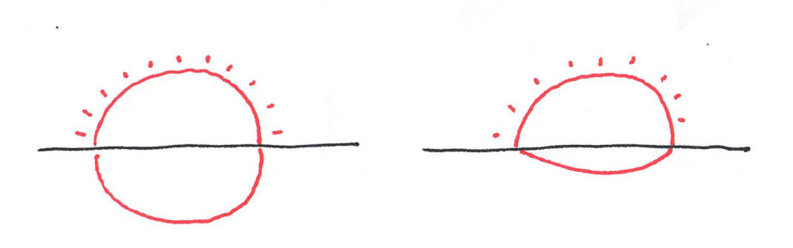

The first set of notes of 2020.

--- 
{: .center-image width="95%"}

<small><i>
Magellanic penguins.
</i></small>

---

## Conference model: outcome of the PODC survey and remote attendance

As [reported here](./mid-november-2019-non-technical) in November, the
community of the theory of distributed computing is in the process of
changing some aspects of its conference model. A survey has been proposed
that has received many answers. The email summarizing these answers
is [here](https://listserv.acm.org/SCRIPTS/WA-ACMLPX.CGI?A2=PODC;3b2ab6fa.1911&S=).
It is fairly short, and I don't have much to say, so I'll just list 
the topics discussed: 

* changing to several deadlines a year, to avoid a large gap between
important deadlines,
* a transition to a system with a journal,
* collocation of the two main conferences.

A topic mentioned in a previous mail was that this kind of survey is 
more useful than business meetings: in a business meeting, most people are 
afraid to talk, some people are very vocal and do not let others talk, 
and more importantly, it's late, and everybody wants to leave the room. 

Another related text is by Moshe Vardi in the Communication of the ACM, 
see 
[here](https://cacm.acm.org/magazines/2020/1/241717-publish-and-perish/fulltext).
He basically says that conferences have a big environmental impact, and 
that we should allow people to participate via video. 
The usual answer to this is that you would loose a lot of informal 
interaction between participants. He says he thinks it's not as bad as 
it looks.

## Selfish routing and traffic lights

A [recent paper](https://arxiv.org/pdf/1912.06513.pdf) on the arxiv, 
consider the classic model of routing but with traffic lights. 
As discussed recently on this blog (see [here](./price-anarchy-flows))
a classic problem in algorithmic game theory is to evaluate how good is 
the traffic on a network, if you allow each car to chose selfishly the 
best route. 
A surprising phenomenon in this model is that sometimes opening a new 
street can slow down the traffic 
([Braess's paradox](https://en.wikipedia.org/wiki/Braess%27s_paradox)). 
The authors show that this does not 
happen when the network is equipped with some traffic lights.  

## Sunset geometry

* Which of the two pictures below looks more like a sunset over a very 
calm lake?

{: .center-image width="100%"}

If the Earth is flat then it's the one on the left. If it's spheric, it's 
the one on the right, and you can even compute the radius of the planet
from the picture! 

See [this](https://vanderbei.princeton.edu/tex/sunset/ms.pdf) for an 
explanation using trigonometry, and 
[that](https://www.shapeoperator.com/2016/12/12/sunset-geometry/) for 
one using geometric algebra. 

[I learned about this on [Eppstein's blog](https://11011110.github.io/blog/).]

## Other notes

* A bit more of geometry if you read French or Spanish: the former flag 
of Chile has a very nice geometric construction. See 
[here](http://images.math.cnrs.fr/Un-drapeau-en-or-perdu-dans-l-histoire.html?lang=fr)
for the article in French, and 
[here](http://images.math.cnrs.fr/Una-bandera-aurea-perdida-en-la-historia.html)
in Spanish.

* [DBLP](https://dblp.uni-trier.de/) now keeps track of the citations of 
the papers. You can access them by clicking on the page symbol close to 
the colored square. Not all the citations are present because they use 
an open access database, and of course, not everything is open. 

* I used to use [latexdraw](http://latexdraw.sourceforge.net/index.html)
to generate pictures that can be included in latex. That is you draw, 
like on a software like Paint, and it generates the code of this picture. 
 Unfortunately the output is only pstricks code, and one would sometimes 
like a tikz code. 
I discovered yesterday [mathcha.io](https://www.mathcha.io/) which is an 
online latex editor, and does the same but generates tikz code.
[Thanks to 
[Pedro Montealegre](https://ingenieria.uai.cl/profesor/pedro-montealegre/)
for showing me this.]   

* We mentioned robust statistics 
[on this blog](https://discrete-notes.github.io/june-2019-notes) some 
time ago; if you're interested, there is a survey on the recent advances 
on this topic [here](https://arxiv.org/pdf/1911.05911.pdf). 

