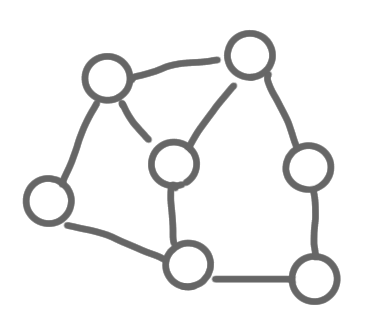
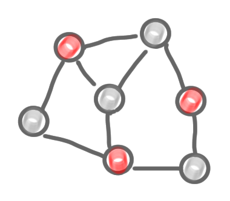
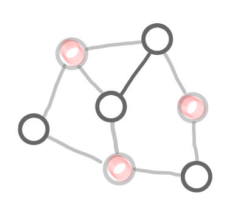
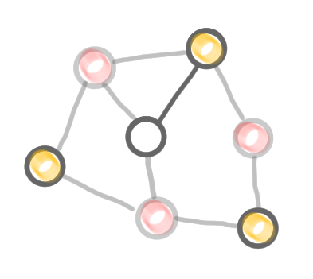
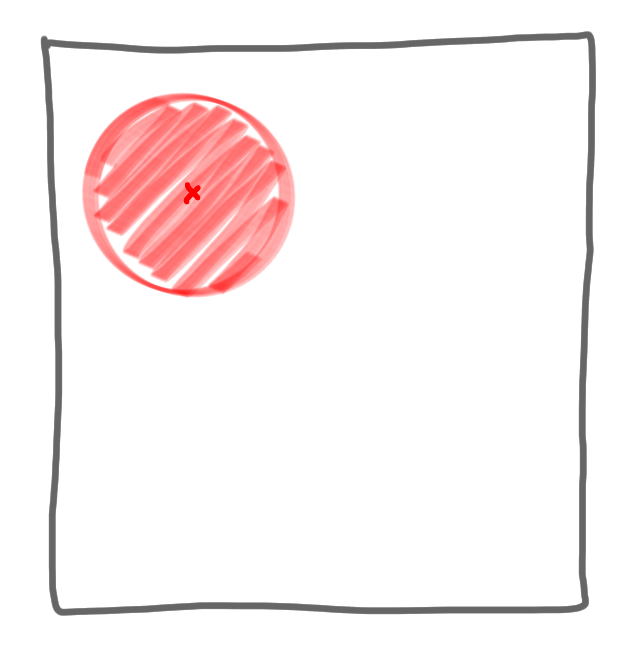
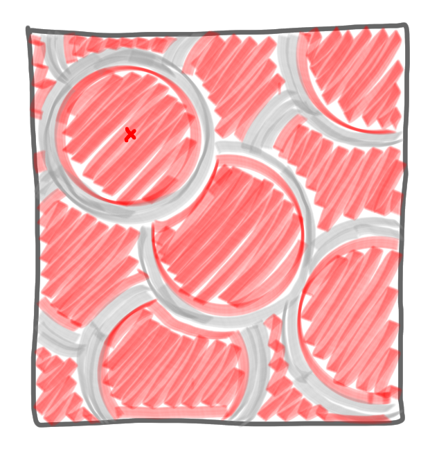
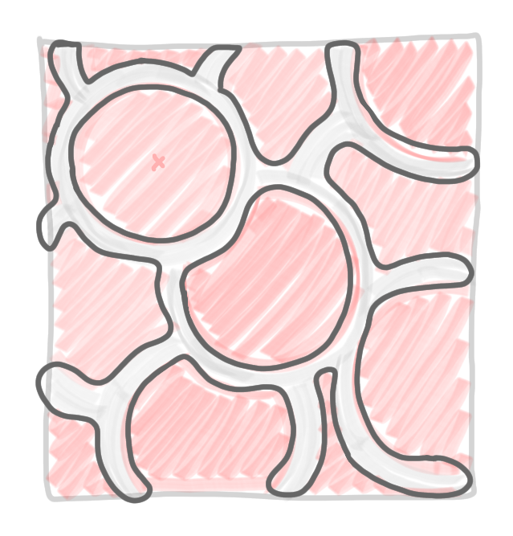
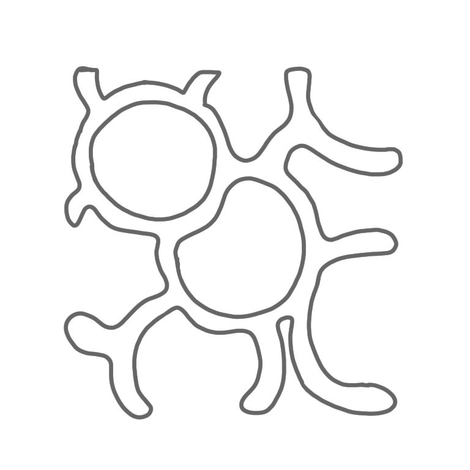
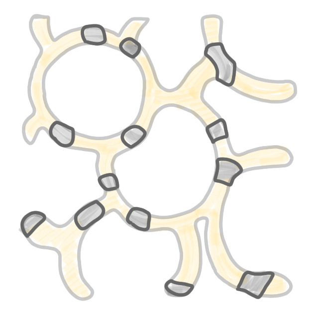
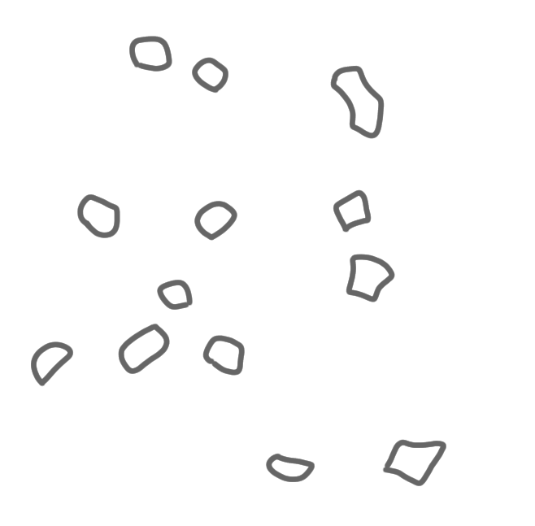

This is the third post of a series on distributed network decomposition. 
The introductory post of this series is 
[here](https://discrete-notes.github.io/network-decomposition-0). 
This post explains how to build a network decomposition in a centralized manner.
As a consequence it also shows that such decompositions exist with nice 
parameters. 

{: .center-image width="90%"}

### Recap of previous episodes

In the previous posts we saw how network decomposition can be useful to build 
efficient local algorithms. Such algorithms are efficient only if the network 
decomposition has good parameters, that is a small number of colors, and a small
diameter for each component. 
We won't bother with multiplicative constants, or even constant exponents, 
so let's say that basically, we look for something like in the following picture, 
with $\log n$ colors, and $\log n$ diameter. 

{: .center-image width="60%"}

## Basic technique to get a coloring

Suppose you want to compute a coloring in a graph in the most simple way. 
You can start with the first color $c_1$, pick a node $v$, put color $c_1$ on it, 
then choose a second node that is not a neighbor of $v$, put again color $c_1$, 
and so on and so forth,
until you cannot use color $c_1$ anymore. Then you take color $c_2$, and repeat 
the process, considering only the nodes that do not have color $c_1$, etc. 

This is basically repeating an algorithm for MIS we mentioned in the 
[post about local algorithms](https://discrete-notes.github.io/network-decomposition-1-local-algorithms).  

{: .center-image width="90%"}|{: .center-image width="90%"}|{: .center-image width="90%"}

{: .center-image width="90%"}|{: .center-image width="90%"}|{: .center-image width="90%"}

<small><i>
Step by step construction of a coloring. (1) The graph, (2) the result of the 
computation of the first color class (exactly as in the MIS algorithm), with the 
frozen nodes in grey, (3) the remaining nodes and edges after deletion of the 
colored nodes, (4) second color, (5) third color, and (6) the computed coloring.
</i></small>

## Adapting the technique to network decomposition

We adapt the technique from the previous section to network decomposition. 
That is, instead of picking a 
node and coloring it, we pick a node, and color the ball of radius $\log n$ 
around it. Similarly to what happens in the coloring algorithm above, 
every time we color a ball, we freeze all the nodes that are adjacent to it. 
That is, they will not be considered any more for the color at hand. Once we are 
finished with a color, we go to the next color, remove the nodes of the previous 
colors, defreeze the frozen nodes, and start again. 

{: .center-image width="90%"}|{: .center-image width="90%"}|{: .center-image width="90%"}

<small><i>
Computation of the first color class: (1) choose a node, and select all the 
nodes at distance at most $\log n$ from it, (2) freeze all the nodes that are 
adjacent to a selected node, and (3) repeat the operation until all nodes are
either selected or frozen.
</i></small>

{: .center-image width="90%"}|{: .center-image width="90%"}|{: .center-image width="90%"}

<small><i>
Computation of the second color class: (1) and (2) remove all the 
nodes of the first color class, and defreeze all frozen nodes. (3) Run the same 
procedure as for the first color class. 
</i></small>

{: .center-image width="90%"}|{: .center-image width="90%"}|{: .center-image width="90%"}

<small><i>
Computation of the third color class: again, (1) and (2) remove all the 
nodes of the previous color classes, and defreeze all frozen nodes. (3) Run the 
same procedure as for the first color classes. Now all nodes are selected, thus 
the algorithm stops.
</i></small>

{: .center-image width="60%"}

<small><i>
The network decomposition produced by the algorithm.
</i></small>

## An unbalanced coloring

The first thing one can note on the picture above is that the decomposition is 
not balanced at all: a huge part of the network is red, a small part is yellow, 
and a tiny part is blue. That might look like a bad thing, as for algorithms 
having balanced decomposition is usually a nice feature. But actually this is not a 
problem for the algorithms built on a network decomposition, as presented in 
the [previous post](https://discrete-notes.github.io/network-decomposition-2-impact). 
And, in fact this imbalance is good for us. Indeed suppose that each color 
covers at least half of the remaining nodes, then after at most $\log n$ steps, 
all nodes are colored. This, in turns, implies that the number of colors is 
logarithmically bounded, which is what we were looking for. 

But, is this always the case? No, you can have a situation like the one on the 
following picture: you pick a node and in its $\log n $ neighborhood, there are 
very few nodes, but the number of nodes that is frozen at the border is huge. 
If this happens everywhere, the number of nodes colored by a the first color 
class is not a constant fraction of the total number of nodes. 

{: .center-image width="70%"}

Therefore, a bad situation for us is when the ratio between what is inside 
the ball, and its border is small.

We could try to show that we can choose the centers in a smart way to avoid this 
behavior, but it wouldn't help much with the distributed construction that 
follows, as such a smart choice could require a large view of the graph.
Instead we control the size of the balls.

## Growing a ball

A technique to ensure that the interior/border ratio is large is to build the 
ball around the selected center in the following way, called *ball carving*.

* Start with only the center
* Iterate the following:

1. Measure the number of nodes in the border
2. If it is at least twice the number of nodes in the ball, take all these nodes 
in the ball, and restart the loop. 
3. Otherwise leave the loop.

* Freeze all the nodes of the border. 

Note that the loop can be run for at most $\log n$ iterations, as otherwise 
the ball would contain more than $n$ nodes. Thus the balls built this way are ok
with the definition of the network decomposition.

By construction, the size of the border of the ball is at most the size of the
interior of the ball. That is, if we select $m$ nodes to be in the ball, we 
freeze at most $m$ new nodes. This is enough for the whole construction to work.

*Next post of the series: [Weak and strong decomposition](https://discrete-notes.github.io/network-decomposition-4-weak-strong)*
