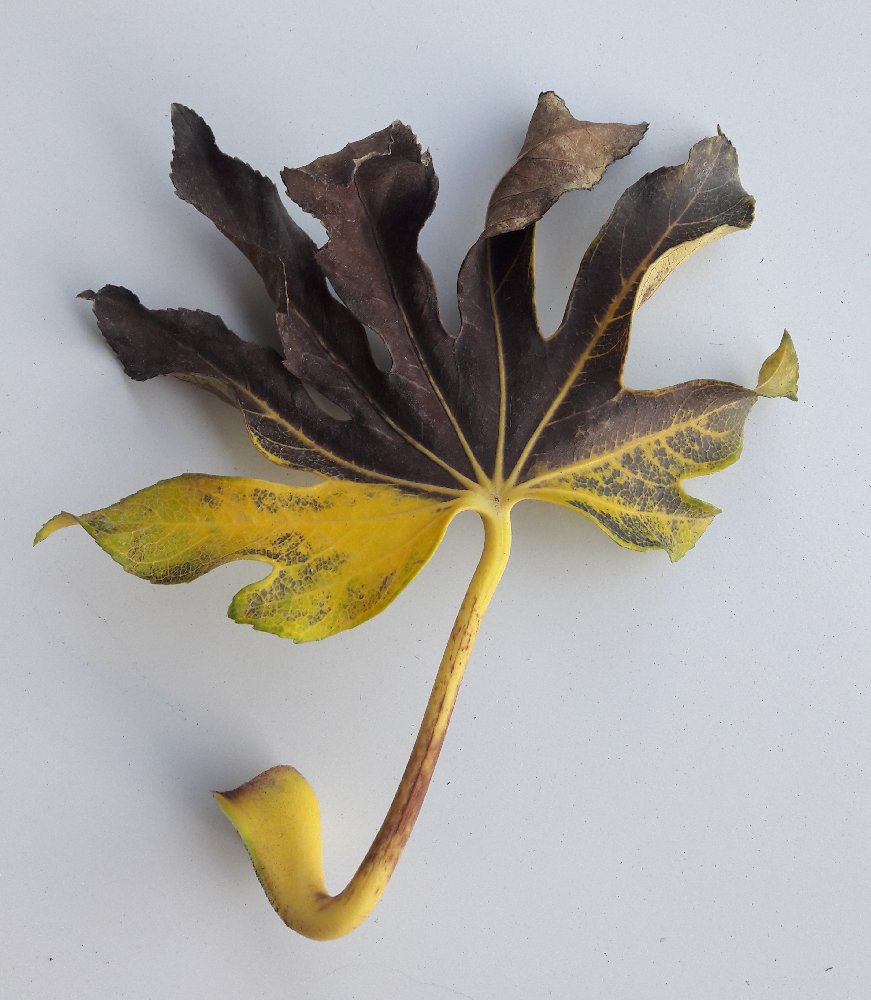

Some notes about journal fees. A random walk on the Internet, more than a 
structured essay.

{: .center-image width="50%"}

## Open access and APC

As advised by a friend, I decided to submit my 
[*Introduction to local certification*](https://www.dii.uchile.cl/~feuilloley/publications/introduction-certification.html)
to a journal. 
And as I was the only author involved, 
I thought it was a good occasion to submit the paper to an open-access journal. 

Following some advice, I checked the editors list of the journal 
[*Algorithms*](https://www.mdpi.com/journal/algorithms) which looks very good.
But then I realized that I had to pay something to get the paper published: the 
article processing charges (APC) (I don't want to ask money for that from my 
institution). I looked it up, and saw the price: 1000 Swiss francs, that is, 
around 950 euros.[^1] I was very surprised that it would be so expensive. 
At the end I did two things: submitting the paper to 
[*DMTCS*](https://dmtcs.episciences.org/) instead, and reading on the 
Internet to learn a bit about these APC. 

## Journal systems

So first there are several business models for scientific journals. The most common
one is based on requesting money from the reader (or the institution of the 
reader). Then there are open-access 
journals where the reader does not pay. Often, in this second system, the 
authors pay. Some journals propose the two schemes. Yet another type of journal 
is free for readers and authors, and can be supported by some institution.

In this post I'll focus on the open access systems: the ones where the
reader does not pay.

## Journal fees

So a first data point is this 1000 CH for *Algorithms*. I also remember 
something around 1000 euros for an open-access option of a not full-open-access 
journal. Finally I checked *PLOS*, a group of open-access journals, mostly in 
biology, and again it varies between 1000 and 3000 euros.[^2]
So it looks like a price tag around 1000 euros is common. 

What does it pay for? Here is a list of services I can see the publisher offers, 
that are not offered by scholars (reviews are "for free" for example):

* Publication: archiving the paper in a safe place, easy to reach.
* Indexation: registering the paper in the databases, getting a doi.
* Advertising: maybe advertising the paper, and most probably advertising the 
journal to ensure its prestige.
* Review process: running the plateforme to receive and store manuscripts, send 
automatic notifications etc. 
* Editorial management: the main editors might be paid by the publisher.
* Type-setting: improving the visual aspects of the papers.
* Language: in some fields, the journal improves the writing.
* Printing: for non-electronic journals.

It's difficult to measure how much all this costs, so I'll compare with another 
plateforme: LIPIcs.
  
## LIPIcs APC

LIPIcs handles proceedings of computer science conferences. Basically the 
conference pays LIPIcs for this job, and the conference itself gets the money 
from the authors via the registration fees. 
The APC is 60 euros for a 20 pages paper.[^3]

An interesting document is 
[a letter](https://www.dagstuhl.de/fileadmin/dagpub/apc/seidel-apc-increase-letter-march2016.pdf) 
telling the story of this APC. 
In a nutshell, the first APC 15 euros. This was an estimate of the cost and more 
and it included the fact that the journal was helped by
Dagstuhl's funds. But this was not ok with EU market laws, as it was unfair to 
the classic publishers. They had to increase the price from 15 to 60 euros, to
fill the gap of the Dagstuhl's funds, and also because the 15 euros estimate 
was a bit too low in comparison with the work needed. More precisely, they 
didn't expect that:

* many authors and committees would work less than required on the type-setting, 
which meant more polishing from their side
* people would use so many weird latex packages that they had to work a lot to 
solve the compatibility issues.

(Thanks to a donation, they could change the price progressively from 15 to 60.) 

## Comparison with LIPIcs

So, why is there such a difference between LIPIcs and an open-access journal? 
I see several answers, beyond "journals want to make money". Note that the 
quality is not a difference, LIPICs proceedings look great to me. Also note that 
PLOS is a non-profit organization, so is supposed to not make so much money.

### Conference proceedings versus journal 
The fact that LIPIcs handles only conference proceedings and is not a journal
could change several aspects.
Conference means a lighter review process (usually only one round). 
Also it means that the number of 
published papers is very controlled: you know it in advance basically. Also journal
papers are usually longer, and LIPIcs charges 60 euros for 20 pages, 
so 100 pages means 300 euros instead of 60. 
Something interesting here is that in the LIPICs letter cited above, they say 
that gold-open-access proceedings APC is usually in the range of 200 
to 600 euros, which is less than what I sampled. This might be because of this
conference versus journal topic.

### Less type-setting work

LIPICs expects authors and conference committees to produce papers that need
almost no additional work before being published. For a conference, this work, 
if not done by the authors, could require days of work from a member of the 
committee (I remember that Jukka Suomela worked a lot on DISC proceedings some 
years ago).

### Small scale

LIPICs does not handle hundreds of papers per day like some journals do (although 
not in TCS probably). Maybe the fact that it has a small scale allows the 
editors to be professors in some university, and not people paid by the publisher 
to run the journal.

### Some institutional support

Maybe LIPICs has some support that does not come directly as money. For example 
it seems that they have a partnership with the German National Library for 
archiving the papers.

### Altogether

Altogether it looks like there shouldn't be such a difference in prices, in my 
opinion, but there are probably many aspects that I haven't taken into account. 
Anyway, many thanks are due to the LIPIcs team for their great job.

## Fair open-access

As said above I ended up submitting the paper to DMTCS, which a journal that
is free for both readers and authors. This seems to be called *fair open access*.
Here the model is basically that the journal is run by scholars, that may pay a 
professional publisher for services such as printing. The money comes from 
institutions, as general donations, not fees related to specific papers. And the
money given to professional publishers should be controlled rigorously. 
See the 
[fair open access principles](https://www.fairopenaccess.org/the-fair-open-access-principles/).

An interesting bit in the explicative notes of these principles, is that they 
fix the maximum fee per paper a publisher can ask to the journal to 1000 euros 
(and say that "substantially lower fees should be possible in many case").

In the case of DMTCS, the two large scientific French public institutions, CNRS 
and INRIA, sponsor the plateforme [Episciences](https://www.episciences.org/), 
that the journal uses. Episciences supports around 15 fair open-access journals.

The list of fair open-access journals can be found on the 
[website of the Free Journal Network](https://freejournals.org/). Such journals
in TCS are: [DMTCS](https://dmtcs.episciences.org/), [JOCG](jocg.org), 
[JGAA](jgaa.info), [LMCS](https://lmcs.episciences.org), 
[SMAI JCM](https://smai-jcm.math.cnrs.fr/index.php/SMAI-JCM/),
[TAG](https://digitalcommons.georgiasouthern.edu/tag/) ands
[TOC](https://theoryofcomputing.org/).

And there several more if you extend the scope to combinatorics.

### References
[^1]: [APC page of *Algorithms*](https://www.mdpi.com/journal/algorithms/apc)
[^2]: [Publication fees for PLOS journals](https://plos.org/publish/fees/)
[^3]: [LIPIcs Processing charge](https://www.dagstuhl.de/en/publications/lipics/processing-charge/)

