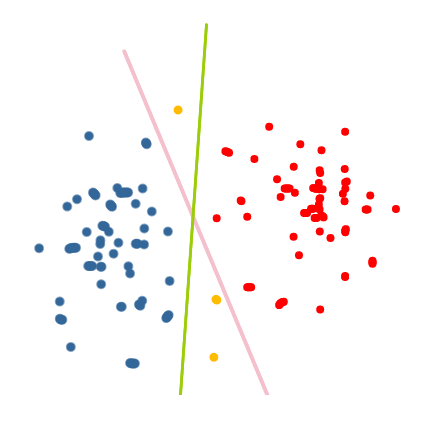
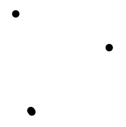
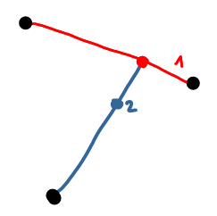
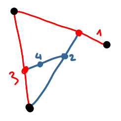
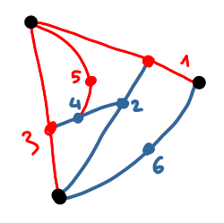
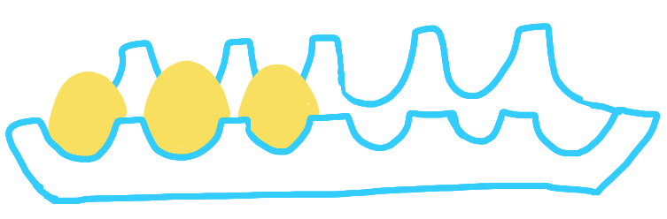
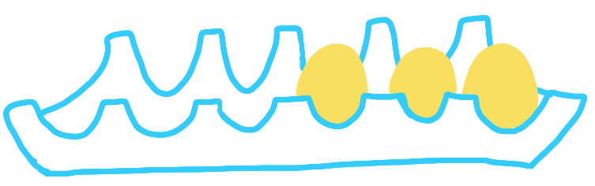
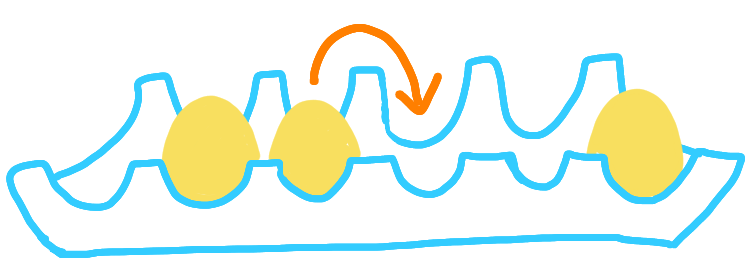

Notes for May.

{: .center-image width="70%"}

<small><i>
A picture from May 2020.
</i></small>

 

## Active learning and interactive protocols

The [Grace Murray Hopper Award](https://en.wikipedia.org/wiki/Grace_Murray_Hopper_Award)
has been given to [Maria Florina "Nina" Balcan](http://www.cs.cmu.edu/~ninamf/) 
for her work in machine learning. One of her contributions is in
*[active machine learning](Active learning (machine learning))*.

In a classic setting of machine learning, the machine is given a lot of 
labeled data and must produce a classifier: an algorithm that can guess the label
of a new data point. In active learning, this is made interactive: the machine 
can create a data point and ask for the label of this point. For example in the
following picture, in order to have a good classifier based on the red and blue
points, the machine may ask about the yellow points, to know which hypothesis is 
the best between the green and the pink one.

{: .center-image width="70%"}

A reason to do that is to save time: after processing a fraction of the data, 
the machine can have some preliminary idea of what the classification looks like, 
and only relevant data points at the boundary of this partition are really useful.
Another reason is if the data points themselves are costly. I remember a talk[^1]
where the goal was to decide whether small islands close to the shore reduce 
or increase the damages of a tsunami. If you have perfect knowledge of the 
dimensions of your island, you can run a precise fluid simulation, and that's it. 
But if you 
want a big picture of whether islands in general are bad or good, then you would 
need to run many simulations, and you cannot because it takes too much time. 
Then you can use machine learning to get an approximation of the damage as a 
function of parameters of the island. But remember that any new point takes ages 
to be computed, thus you would like to have only useful data points in you 
learning set. And somehow you cannot always select your points a priori ; then 
having active learning is great.
  
Balcan basically proved that active learning can be efficient even in the 
presence of (all kinds of) noise. The Hopper award laudatio cites two other
key works, in semi-supervised learning and clustering.

[I learned about this in a 
[post on Lipton's blog](https://rjlipton.wordpress.com/2020/04/10/nina-balcan-wins/), 
that contains the following amusing sentence: "Active learning follows a classic idea 
in computer theory: Making a protocol interactive can often decrease the cost, 
and almost always makes the protocol more complex to understand".]

## Sprouts game

[Images des maths](http://images.math.cnrs.fr) a maths popularization website in 
French has 
[an article](http://images.math.cnrs.fr/Savez-vous-planter-les-choux.html) 
on
[sprouts](https://en.wikipedia.org/wiki/Sprouts_(game)), a combinatorial game 
related to planar graphs.

It is a paper and pencil game between two players. They start from an arbitrary 
set of points, and then play one after the other. At her turn, the player has to 
do two things:

* draw a line between two points (including self-loops)
* draw a point on this line (not at one of the end points)

and there are a few constraints:

* the lines should not intersect
* every point has degree at most three.

At some point one the players cannot play anymore, this player looses. On the 
following picture, there are three initial points. The blue player makes the 
sixth move, and after that the red player cannot play. Therefore the blue player
wins. 

{: .center-image width="100%"}|{: .center-image width="100%"}|{: .center-image width="100%"}|{: .center-image width="100%"}|

Researchers have completely characterized what are the winning strategies for 
this game up to 44 initial points. And there is the following conjecture: if 
both players play perfectly, the first player cannot win if and only if the 
number of initial points is 0, 1 or 2 modulo 6...!

## Diffraction and algorithms

The other day, there was a paper on the arxiv named 
[Algorithmic Foundations for the Diffraction Limit](https://arxiv.org/pdf/2004.07659.pdf) 
and I thought that "diffraction" had a meaning that I 
didn't know about, outside of physics. So I looked 
at the abstract, and actually it's about the good old 
[optical diffraction](https://en.wikipedia.org/wiki/Diffraction)! 

From what I understood (and remember) here is the topic of the paper. When you 
have two sources of light far away one from the other, and you observe the 
diffraction image created by a circular aperture, you can say "yes there are two 
sources of light, and they are in that position". But when the two sources are 
close one from the other it's less clear. It is believed that there is a 
fundamental barrier after which you cannot decide between one and two sources. 
There are several criteria to decide where this barrier is, with various 
explanations but all are heuristics. 

The approach of the paper is to consider that one receives the diffracted image 
through (noisy) samples, and based on this samples must decide whether there are one or 
two sources. This becomes a more statistical problem, and when we ask how many 
samples are needed, then it becomes more algorithmic too. Then one can design 
algorithms with a complexity depending on the number of samples, the noise etc. 

## Trusses

In the study of social networks, a classic topic is to understand and detect 
communities. In terms of graphs, the simplest object representing a community is 
a clique. But this is a very demanding definition: there are many groups that 
one would call a community, where not everybody knows everybody. A classic 
alternative here is a $k$-core. A $k$-core is a maximal connected subgraph, with all 
nodes having degree at least $k$ in this subgraph. That is everybody should know
at least $k$ other members. 

I learned recently about another such object: $k$-trusses. A $k$-truss is a 
maximal connected subgraph, such that inside this subgraph, every node is 
adjacent to at least $k$ triangles. So now you want that every person can cite 
$k$ pairs of acquaintances who know each other. It's a more restricted notion 
than $k$-cores, because in some sense the communities must be more "local", with 
each neighborhood being more connected. 

[I learned about this while taking a look at the papers published in JGAA 
journal for the [post about journal fees](https://discrete-notes.github.io/journal-fees). 
The paper in particular is 
[this one](http://www.jgaa.info/accepted/2020/527.pdf), which discusses bounds 
and algorithms for $k$-trusses.]

## Eggs and reconfigurations
The Aperiodical has an 
[article](https://aperiodical.com/2020/04/the-big-lock-down-math-off-match-5/) 
about a maths game, with a box of eggs.
The game is the following. You start with a box of eggs in this configuration: 

{: .center-image width="50%"}

and you should transform it into that configuration:
{: .center-image width="50%"}

using only movements of the following form (move one right):
{: .center-image width="50%"}

The question is what is the minimum number of moves? 
In general I would consider this as just one more maths game, but as I will be 
working on reconfiguration problems next year (in Lyon with 
[Nicolas Bousquet](https://pagesperso.g-scop.grenoble-inp.fr/~bousquen/)), 
this is relevant. Reconfiguration problems are problems of the form: how to get 
from configuration A to B in the minimum number of moves of some sort. This is 
important for example for random generation of solutions to combinatorial 
problems. 

## Other notes

* The Simons institute launches a new series of video, "Theory shorts". The 
[first one](https://www.youtube.com/watch?time_continue=14&v=PLAZyu73tWE&feature=emb_logo) 
is about vision and brain ; quite interesting.

* An interesting blog about algorithmic fairness that I didn't know: 
[Algorithmic fairness](https://algorithmicfairness.wordpress.com/category/algorithms/).

* In [a "vidcast"](https://blog.computationalcomplexity.org/2020/05/vidcast-on-conferences.html), 
Gasarsh and Fortnow talk about conferences. In particular, 
about having conferences sometimes in person, sometimes virtual (and also about 
regional conferences). Incidentially, they mention the fact that the conference 
accronym *EC* used to be for *Electronic Commerce*, which is weird... (now it's 
*Economy and Computation* which makes more sense). 

* I realized that the blog was hard to read on smartphone because of the format 
of the pictures, it should be better now.

* I started making pictures with my tablet, and it's a very good solution. Before 
looking into it, I didn't know one could have a simple software with layers and 
opacity parameters on tablets. 
It's especially nice to have a first sketch, and then make a precise drawing. 
I use it not only for the blog but also for picture prototypes in manuscripts.

### Footnotes
[^1]: The talk was a bachelor project defence, in [CMLA](http://cmla.ens-paris-saclay.fr/), an applied maths lab  near Paris.

