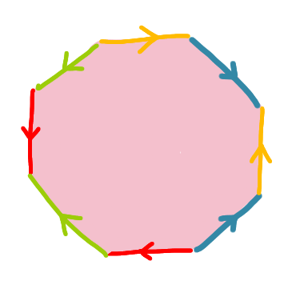
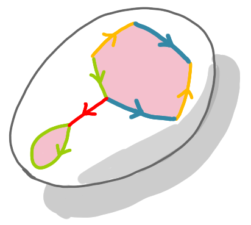
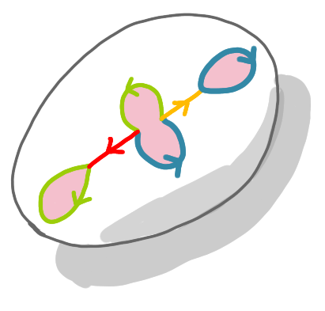
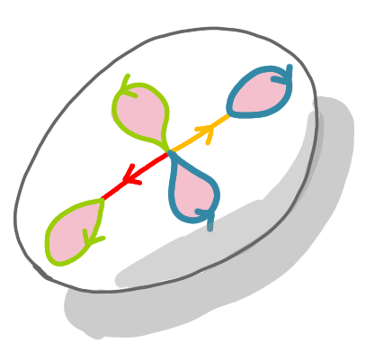
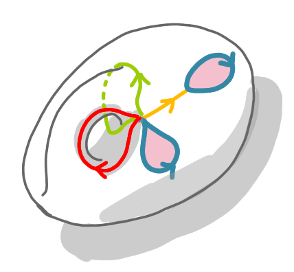
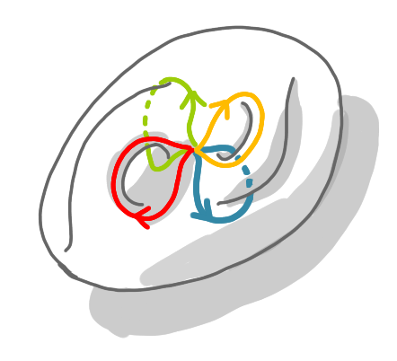
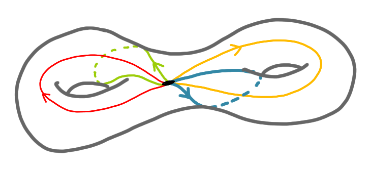

Some colleagues and I have been playing with graphs on surfaces lately, and to 
understand a bit what is done in this domain I drew a lot a figures. Here is 
a series of pictures that explain how the surfaces called the double torus can 
be built by gluing edges of a polygon.

---

First of all, everything in this post is up to homomorphism, so the 
construction cannot really be done with paper. We are playing with topological 
objects, so "a donut is the same as a cup of tea", because they both have exactly
one hole, etc. The double torus is the surface with two holes. We show how to 
build the torus by gluing faces of a polygon. 

The following picture is what is called a polygonal scheme of the double torus. 
It is an octagon whose edges have colors and orientations. There are exactly two 
edges for each color. 

{: .center-image width="50%"}

The construction consists in the following operation: take two edges of the same 
color and glue them such that the orientation is consistent (heads together, tails 
together). Here we start with the red edges.

{: .center-image width="50%"}

The same with the yellow edges. 

{: .center-image width="50%"}

Now note that as we will identify all the pairs of edges, the eight corners of the 
polygon will be identified. That is all the corners will be merged. Here it gives 
a better picture if we identify two of these (former) corners to link the yellow 
and red paths. 

{: .center-image width="50%"}

Here is the key operation. We have two oriented green loops. To merge them, we 
create a handle, that is a kind of bridge above the original (not yet finished)
surface. This creates our first hole. Note that the red path becomes a loop.

{: .center-image width="50%"}

Now we do the same with the blue loops.

{: .center-image width="50%"}

We now have a two handles, and basically we have built a double torus. To 
make it look nicer, we can stretch it a bit. 

{: .center-image width="70%"}

A key thing here is that we can do these operations in the reverse direction. To 
do so we just have to take scissors and cut along the four loops of the drawing. 
This will automatically give us the original octagon. 

A general theorem (the theorem of classification of the surfaces) tells us that
for any surface one can find loops, such that cutting along these 
loops we get a polygonal scheme. Moreover there is a canonical polygonal scheme
for each surface. The more complicated the polygonal scheme, the higher the 
genus of the surface. This applies not only to orientable surfaces (that is 
donuts with multiple holes) but also to non-orientable surfaces, such as 
[Klein bottle](https://en.wikipedia.org/wiki/Klein_bottle).

If you want to learn more, a reference for this domain with an algorithmic 
perspective can be found 
[here](http://monge.univ-mlv.fr/~colinde/cours/all-algo-embedded-graphs.pdf).

