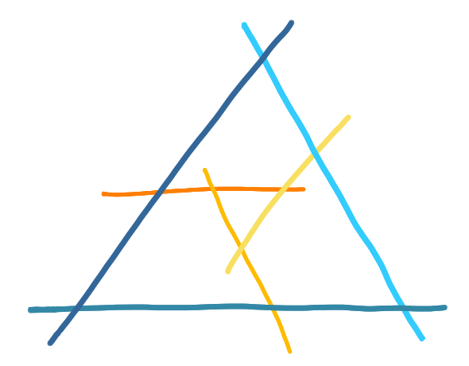
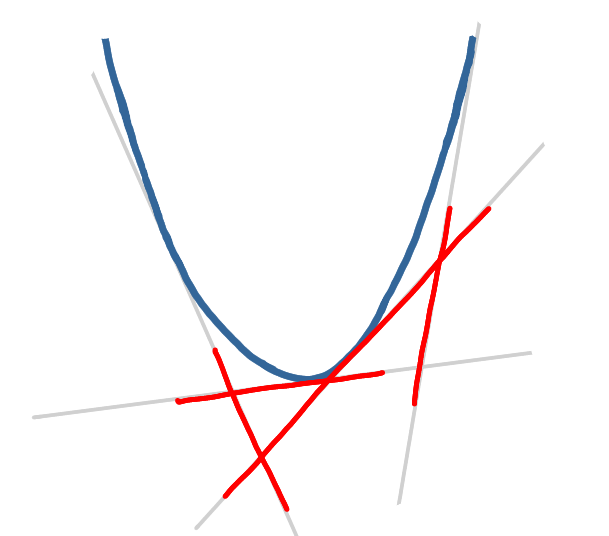

## Second twist, segments and parabolas 

[José Soto](http://www.dim.uchile.cl/~jsoto/) came back from
a postdoc in Germany at some point of my stay in Chile. 
We told him about our problem and solution
and he told us he had just attended a Master defense in Berlin where 
the same class was studied. The student was Thomas Hixon, and his 
advisor [Stefan Felsner](http://page.math.tu-berlin.de/~felsner/). 
They ended up with this class following yet another path.

They were studying *segment graphs*, which are just intersection graphs 
of segments. These are quite popular graphs ; in particular 
[Scheinerman's conjecture](https://en.wikipedia.org/wiki/Scheinerman%27s_conjecture)
(now a theorem) states that every planar graph can be represented as the
intersection of segments.
 
{: .center-image height="70%"}|{: .center-image height="80%"}

 
When studying such graphs a popular way to look at special cases is to 
allow only some directions for the segments. For example, on the 
drawing above all segments 
have angle $0$, $\pi/3$ or $2\pi/3$ with the horizontal.
But Hixon and Felsner went into another direction, which is to allow 
only segments lying on the set of lines tangent to a parabola. 

{: .center-image height="70%"}

It happens that this defines intersection graphs that have the same 
characterization as our class, thus is actually the same class.
And even worse for us, they had the same kind of algorithm for maximum 
independent set... 
Actually, José Soto even knew about an older paper by 
[Lubiw](https://cs.uwaterloo.ca/~alubiw/Site/Anna_Lubiw.html) which 
had an algorithm for the same class of graphs. She had arrived to this
class by generalizing 
[interval graphs](https://en.wikipedia.org/wiki/Interval_graph) (in the
same kind of perspective as Mauricio and Christopher from the previous 
post).

I was quite depressed to discover that I had worked all this weeks in vain, 
and José (Correa) told me something like: "It's actually good news: if people have
already answered our questions, it means that we have good questions and 
that's the most important part." (At the time I was completely convinced, 
that this was good news!)

In the end, we could strengthen our results in various ways 
(more general rectangle configurations, faster algorithm, results about 
integrality gap etc.), and it became my first paper.

Meanwhile, I had been playing with the kind of characterization we had, 
with forbidden configurations and an ordering, which is the main topic of 
this series. More in the next posts.

## Epilogue about diagonal rectangle graphs

Believe it or not, yet another group had been "discovering" the same 
graph class at the same period. This we learned from Hixon's thesis, 
which was citing it. 

Cantanzaro, Chaplick, Halldórson, Halldórson and Stacho, had introduced
*max point-tolerance graphs*, as a variation of 
[tolerance graphs](https://en.wikipedia.org/wiki/Tolerance_graph). They 
defined it as a model for biology. More precisely, they too had the point 
of view of intervals with points, and these represented segments of DNA 
with a special position, for example a suspected deletion. 
 
Cantanzaro et al. and Hixon et al. ended up merging the papers. 
It's a bit crazy how four completely independent groups studied the same 
graph class at the same moment (+ it had been studied before).

Years later I presented some results about graphs at 
[GROW 2017](http://www.fields.utoronto.ca/activities/17-18/grow2017) and 
mentioned this class without naming any authors or the story, and at 
the end of the talk 
[Steven Chaplick](https://www.maastrichtuniversity.nl/p70068141) (one 
of the authors of the merged paper) came to me and told me "by the way 
this class you mentioned, it is known, it is not new": he was 
afraid I might be re-re-re-re-re-inventing it!

### Notes

* [Thomas Hixon's Master thesis](http://page.math.tu-berlin.de/~felsner/Diplomarbeiten/Hixon-Master.pdf)
* [Lubiw's paper](https://core.ac.uk/download/pdf/82682757.pdf)
* [The merged paper of Hixon et al. and Cantanzaro et al.](https://arxiv.org/pdf/1508.03810.pdf)
