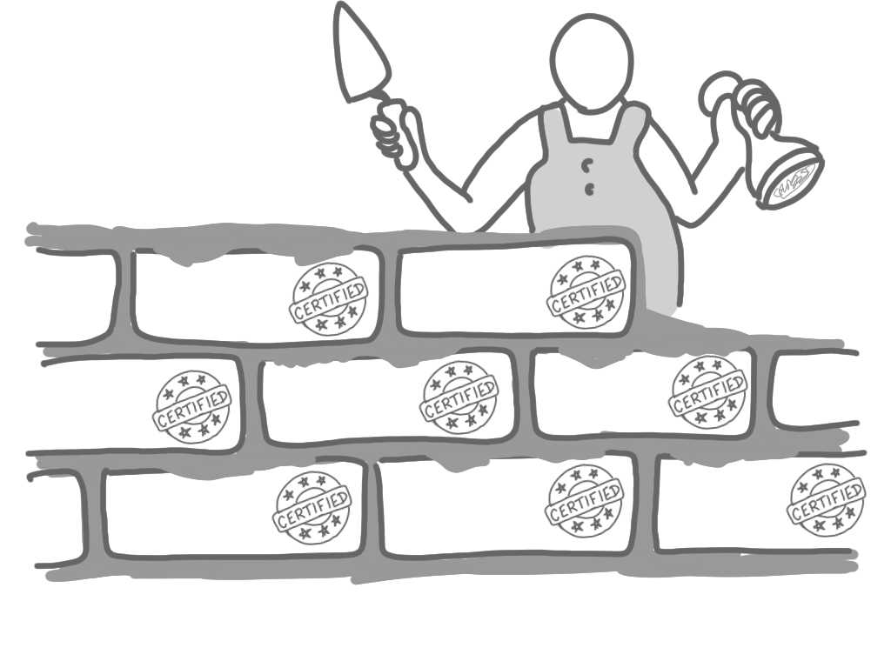
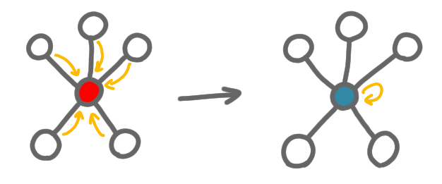

---
layout: post
title: Can we always build and certify at the same time? (Introduction)
redirect_from: "/2020/10/01/build-certify-1/"
permalink: build-certify-1
---   

It is common for a network self-stabilizing algorithm to have the 
following shape: it starts from an arbitrary configuration, ends 
up with a correct solution, and during this computation some key pieces
of information are kept in memory. This information is useful to ensure
that once the algorithm has stabilized, if there is a new fault, then 
the nodes can catch it. In general, without this "trace" of the 
computation, the nodes are not able to detect such faults. 
 
Having some certification of the solution at the end of the computation
is known to be necessary (for the classic stabilization). 
Something that is unclear is whether this 
certification 
can always be computed *at the same time* as the solution itself, 
in particular if we have strong time and memory restrictions. 
This is what this couple of posts is about. In particular the second 
post will contain arguments 
indicating that for minimum spanning tree, if the one aims for the 
optimal memory and fast stabilization, then one might have to first build the 
solution, and *then* certify it.   

{: .center-image width="90%"}

## Self-stabilization in the state model (in a nutshell)

I won't go in too much details here, but hopefully it will make sense 
even for readers who are not very familiar with self-stabilization on 
networks. 

The classic model for such stabilization is the *state model*, 
where each node has a "public" state, in addition to its ID. The 
computation is based on a series of rules of the form: if the node see 
some combinations of states around itself (at distance 1), then it 
update its state to some new state. 
For example, suppose each state encodes a pointer to a neighbor and a 
color ; then a rule could be: if all neighbors' pointers are pointing 
toward me, and I have color red, then I make my own pointer point 
towards myself, and change my color to blue.

{: .center-image width="90%"}

Asynchrony is modeled by an adversarial scheduler who decides at every 
round which nodes can update their states (with the only constraint 
that at each round at least one node should so such an update).

The idea of self-stabilization is that your algorithm (that is, your set
 of rules) should be robust enough so that starting from an arbitrary 
collection of states, you end up with a correct configuration. Note that 
this should hold for any choice of schedule by the scheduler. For example the
 scheduler can choose that some node will not apply any rule, until it 
 is the only node that can apply a rule (in this case the scheduler is 
forced to "activate" this node otherwise the computation is stopped). 

The state model is very basic and simple. This has a drawback: to 
be precise, algorithms have to be described by long lists of rules, which
 is often unpleasant to write and read. 
A good thing is that the number of bits of 
used by the states represents both the "message size" (as the nodes 
communicate y reading their neighbors states) and the memory of a node 
(the information it should store for later use).  

At the end there are basically two measures of complexity: the time 
before convergence and the space used to encode states. 

## Silent stabilization and certification

As we said, a self-stabilizing algorithm ends up in a good configuration
after some time, even if it started from a chaos of states. For example,
if the goal is to compute a spanning tree, at the end of the 
computation, every node has in its state the description of a pointer to
a neighbor, and the collection of pointers forms a spanning tree. 
Now suppose that a fault occur, and a pointer is 
changed. If the nodes only hold the pointers in memory, 
they cannot detect that something is wrong. 

Thus the nodes have to store more than just the output. For 
example in the case of a spanning tree, the nodes keep their distance to
the root and the ID of the root. 
This can easily be computed during the computation. More importantly, 
it is 
enough for stabilization. Indeed, one can show that if the distances are 
consistent, then the pointers must form a spanning forest, and the ID of 
the root ensures the connectivity. 

A good property of this type of stabilization, is that once the algorithm 
has stabilized to a correct solution, the states do not change anymore 
(unless there is a fault) ; that is no rule of the algorithm can be 
applied anymore. 
These are called *silent algorithms*. (There are other algorithm that 
keep exchanging information after stabilization.)

Silent algorithms basically end up with a certification of the solution. 
Such certification has been shown to be equivalent to so-called 
proof-labeling schemes (or locally checkable proofs, 
or more generally local certification)[^1].  

## Space and time efficiency

As said earlier, given an algorithm one can measure the time until it 
stabilizes and the space it needs. The space needed for the certification,
that is for the very end of the algorithm, is a lower bound on the 
space needed. It was proved that actually one can always design an 
algorithm with this space complexity (up to an additive $O(\log n)$ term), 
but the technique uses exponential time.[^1] A question is then: what are 
the problems that can be solved with optimal space and polynomial time?

In a recent paper,[^2] we proved as a side result that minimum spanning 
tree is one of these problems. A intriguing thing is that we were somehow 
forced to use an uncommon approach: instead of book-keeping information
during the computation for certification, we had to first build a solution
and only then certify it. 

We'll discuss this in detail in the 
[next post of the series](https://discrete-notes.github.io/build-certify-2).

### Notes

[^1]: Lélia Blin, Pierre Fraigniaud, Boaz Patt-Shamir: Proof-Labeling Schemes versus Silent Self-stabilizing Algorithms. SSS 2014: 18-32
[^2]: Lélia Blin, Swan Dubois, Laurent Feuilloley: Silent MST approximation for tiny memory. To appear at SSS 2020. ([arxiv link](https://arxiv.org/abs/1905.08565))
