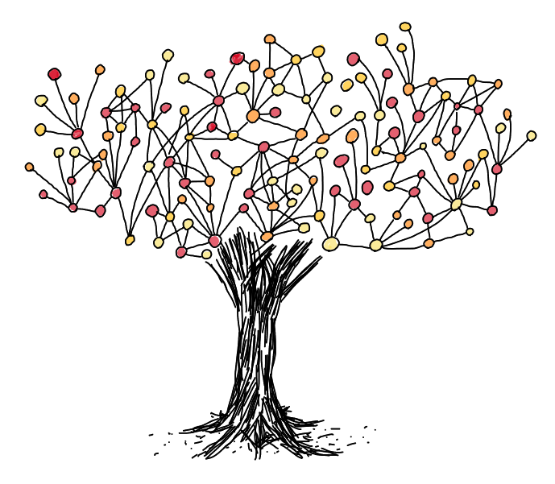
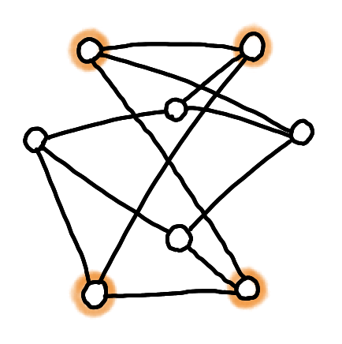
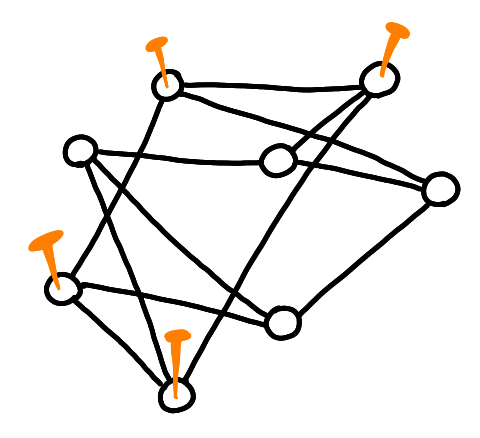
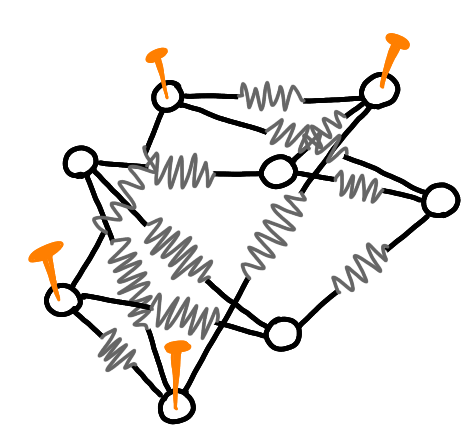
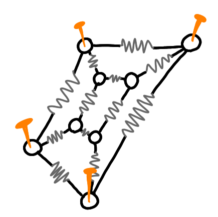
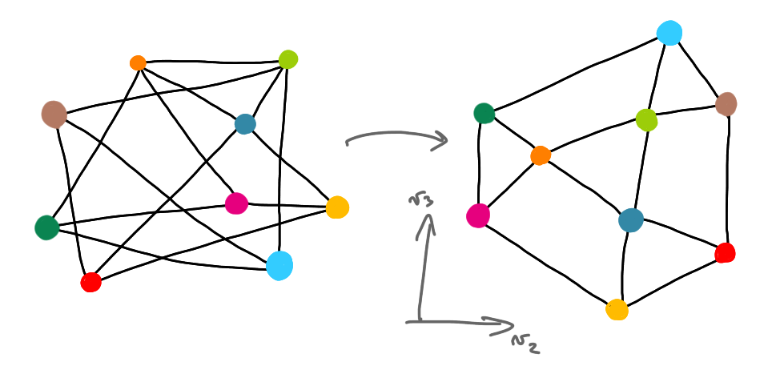
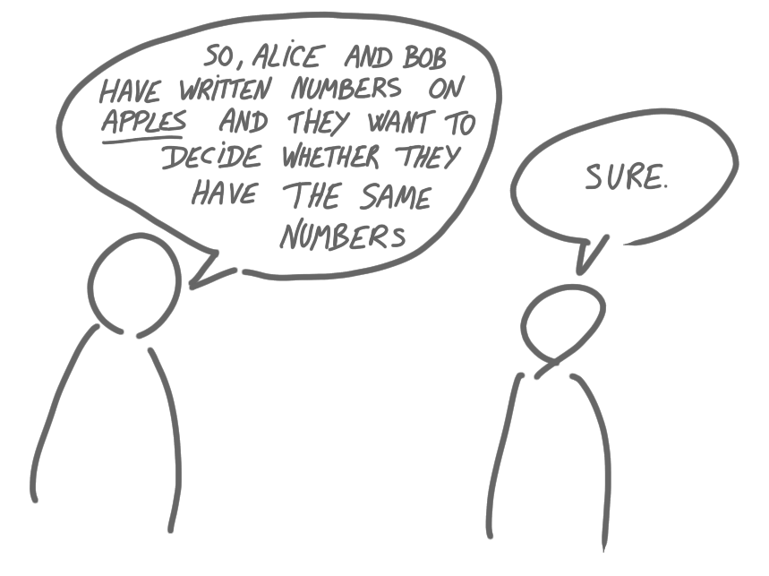

I have a growing pile of topics on which I'd like to write some notes. Here are 
some of them.

{: .center-image width="70%"}
 

## Differential privacy

Differential privacy keeps showing up in papers titles, keynotes, and in 
laudatio of awards (recently, the Knuth award of 
[Cynthia Dwork](https://en.wikipedia.org/wiki/Cynthia_Dwork)), so I tried to
understand a bit what it is. 

A very good reference seems to be the book "The Algorithmic Foundations of 
Differential Privacy" by Dwork and Roth
(pdf version [here](https://www.cis.upenn.edu/~aaroth/Papers/privacybook.pdf)). 
I just skimmed through the first 30 pages, but it already gives a lot 
insights, in particular about why easy approaches fail. Here is a one paragraph 
summary, if you have no idea what differential privacy is about.

Differential privacy is about the following type of question: given a database
with information about individuals, how to allow queries about the population 
(e.g. the average size of the individuals) without leaking information about a 
particular person. There are tons of questions one can ask about what this 
means, what is a good definition etc. and the book is very good to answer these. 
The approach of differential privacy is to ask the following property: if one
individual is replaced by another one in the database, then the result of the 
queries should almost not change. 

[If you know already the idea and want something more solid, you might like the 
recent primer by Kamath and Ullman. See 
[here](https://kamathematics.wordpress.com/2020/04/14/a-primer-on-private-statistics-part-i/)
for the blog version.]

## Algebraic graph theory: two introductory talks

Understanding graphs by seeing them as matrices
is called [algebraic graph theory](https://en.wikipedia.org/wiki/Algebraic_graph_theory)
(or sometimes 
[spectral graph theory](https://en.wikipedia.org/wiki/Spectral_graph_theory), 
although it is a bit more restrictive). It's a fascinating topic, that offers 
some fresh perspective on graph theory. 

Here are two introductory recorded talks that I enjoyed watching:

* [The Unreasonable Effectiveness of Spectral Graph Theory: A Confluence of Algorithms, Geometry & Physics](https://www.youtube.com/watch?v=8XJes6XFjxM) by James R. Lee.

* [Miracles of Algebraic Graph Theory](https://www.youtube.com/watch?v=CDMQR422LGM)
by Daniel Spielman.

The first one introduces the topics via heat flow, makes links with random 
walks, and is maybe a bit easier to get into for complete outsiders. The second 
one uses springs, and quadratic forms. Both show the relations between eigenvalues,
conductance, partitioning and clustering etc. They are very hand-waving, 
illustrated, fun to watch, and they are actually quite complementary.

Two little things from Spielman's talk appear below.

## Tutte's spring theorem

[Tutte's spring theorem](https://en.wikipedia.org/wiki/Tutte_embedding) is the 
following beautiful result. 

Suppose you have a 3-vertex connected planar graph, and that someones tells you:
"here are k vertices that form a face in one embedding of the planar graph", 
then there is simple way to find the full embedding: nail the specified nodes 
into a simple polygon, replace all the edges by springs. The (unique) 
equilibrium of this system in a planar embedding. 

Here on an example. Four vertices are marked as belonging to a face.
 
{: .center-image width="50%"}

Now I move the right bottom nodes to the left, to make it a simple face, and I 
nail the nodes.
 
{: .center-image width="50%"}

I replace the edges by springs.

{: .center-image width="50%"}

And at the equilibrium, I get a planar embedding.

{: .center-image width="50%"}

## Drawing graphs with second and third eigenvectors

Given a graph, one the matrices that represents it is the 
[Laplacian matrix](https://en.wikipedia.org/wiki/Laplacian_matrix). 
The eigenvalues and eigenvectors of this matrix can be very useful for algorithms,
for example for clustering. In his talk Spielman also say that a good heuristic
to understand seemingly obscure graphs is to draw them in the plane in the 
following way. Compute the second and the third eigenvectors, $v_2$ and $v_3$, 
that is, the eigenvectors that correspond to the second an third smallest 
eigenvalues. Then plot the graph in such a way that every node $x$ is at 
coordinate $(v_2(x), v_3(x))$. If the network has some type of underlying
structure, then this can give you a nice drawing that helps you understand
what's going on.

Here is the example from Spielman's talk, with a random embedding on the left, 
and the $(v_2,v_3)$ embedding on the right.

{: .center-image width="90%"}

## Attending a virtual conference: DISC 2020

I've just attended DISC 2020, which was virtual for obvious reasons. It was 
great! Thanks to the organizing team for the huge work. Jukka Suomela is going 
to write something about how it worked but here are a few things. 

* Every paper had both a recorded talk, put on youtube before the conference, 
and a live (shorter) presentation during the conference, mimicking the 
usual set-up (thematic sessions, session chairs, questions etc.). An easy way to
get the best of both worlds, and presenting the paper twice is not that much.
The pros of the recorded talk is that there is no technical problem, that the 
talks are in general better, and that it can be archived without further editing.
The pros of the live presentation is that it creates a real event, where people 
attend the talk together and can ask questions. Also the fact of having a short
and a long version is pretty good. 

* There was a chat platform (powered and offered by Zulip) with several 
channels (for the talks, for general discussions, for private discussions etc.).
It worked really well. It allows asynchronous public discussions, that in-person
meetings do not allow. For general discussion, that typically happen only in the
business meeting, I thinks it's much much better. 

* Some events appeared for the first time at DISC: "Meet other postdocs", 
"Junior-senior meetings" and "Ask me anything sessions". I couldn't attend the 
two first ones, but the AMA sessions were very interesting. And I think it fits 
the virtual format: it puts everybody on the same level, and makes the event 
informal and cool (whereas having one person on stage in front of everybody 
would be a bit strange). 

You can find the videos of the talks, of the keynotes, and of the AMA sessions 
on youtube on the PODC-DISC channel. An important aspect of DISC this year was
the discussion of the new possible models for DISC and PODC. I'll write about 
this latter. 

## About applications

It is common to find TCS paper claiming that there are important applications to 
the results, although this is not true. Jeremy Kun who comes from theory and works in industry
wrote [a piece on this subject](https://buttondown.email/j2kun/archive/whats-in-production/). 
Basically he is very tired of this, and says that
it destroys the trust of practitioners and of students who later discover the 
truth. 

He takes a few examples of things that are well-studied topics in theory, are 
sold as very useful in practice, but seemingly are not: 
[semidefinite programming](https://en.wikipedia.org/wiki/Semidefinite_programming),
[topological data analysis](https://en.wikipedia.org/wiki/Topological_data_analysis),
and SAT solving (although for this last one it's a bit more subtle). 

There are obvious reasons why we write that our results have applications although 
we're not sure: in general it's seen as something positive and is not really 
checked, and it's nice to think that you do something useful. (I've already 
written in this blog about algorithms applications, without checking whether
these were real applications, and it indeed felt good that some of what my 
community does is used in practice.)

Two ways I see to tackle this problem are: 

* being more cautious when saying "this has many applications". Actually 
"has many applications" is not precise enough to make sense. It can be 
that the method is coded just as it is, and used in real softwares, it can also 
be that the method somehow gives some insight for practitioners, and it can 
be that some other theoretical papers from another area uses it, with no 
practical impact. Each of this cases is great, but they are very different and
one should specify which type one is talking about. 

* valuing more the works  that try to bridge the gap between the theory and 
practice by evaluating how good are the theoretical methods in practice. 
For example, I noticed 
[this paper](https://arxiv.org/pdf/2005.01182.pdf) on arxiv, co-authored by 
some known theoreticians, and that investigate how well the theoretical methods 
compare on real data for the problem of optimal transport. Another example is 
[this paper](https://arxiv.org/abs/1910.11144) that does the same for neural 
network compression.

## Toy applications considered (sometimes) harmful

Let me start with a story. In France there is a very old and respected 
institution called the "Collège de France". It is basically a mini university 
with few professors, who teach to "the public": anyone can come, there is no
registration, no exam, and the courses are of very high quality on a vast variety 
of topics. [Claire Mathieu](http://www.di.ens.fr/ClaireMathieu.html) was invited
to give a series of lectures on algorithms in 2017. I attended some of the 
talks, and one day the topic was algorithmic game theory. 
I was sitting next to an elegant old man taking a
lot of notes, and when Claire mentioned some auction example I felt that he was 
suddenly upset. I took a 
look at his notes, and I saw something like "that's not the way auctions work, 
useless, insanity!". Then he underlined three times "insanity", took his coat 
and left. 

Of course this person was overreacting (Claire's lectures were great), and it 
was actually quite funny, but there's probably something to learn from this. 
Basically Claire was using what one can call a "toy application": a situation
related to real life but oversimplified. This is useful to us, because it makes
things concrete, and helps to describe situations, and even helps to think. But 
when using such examples to explain what we do to outsiders, it often worsen 
our explanation instead of improving it. I've experienced that myself: you try 
to give an concrete example to explain what an algorithm can do, and people
tell you that actually there is this other aspect that makes your example stupid. 

Again I don't have a good solution for that, but I try to avoid creating such 
confusion. 

{: .center-image width="70%"}
