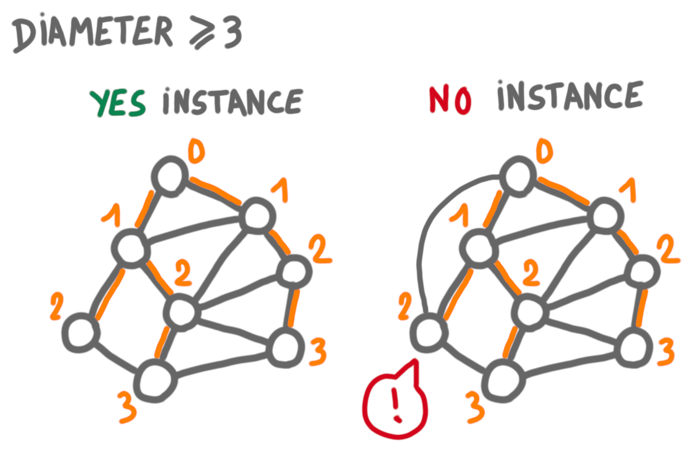
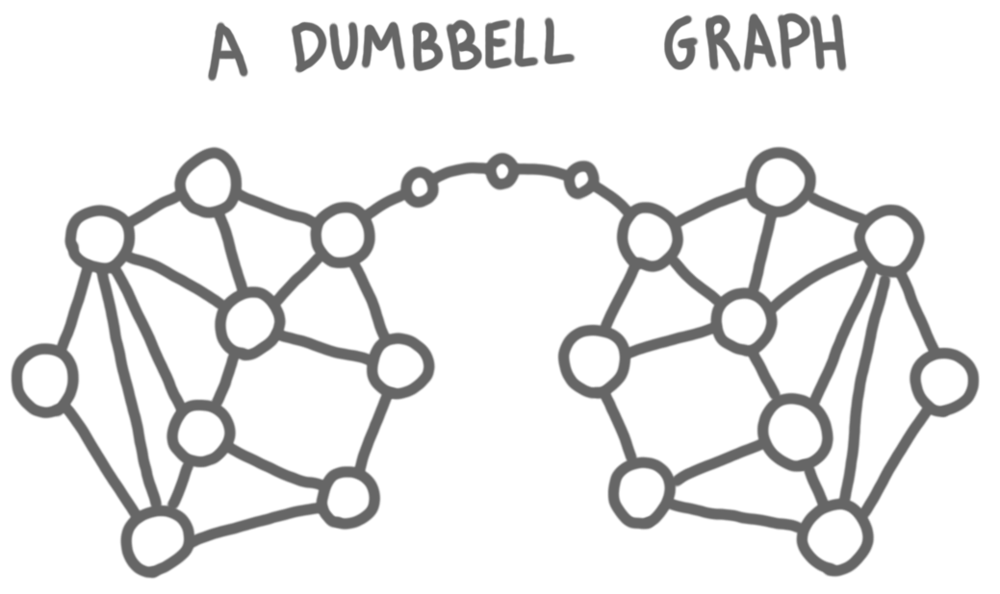
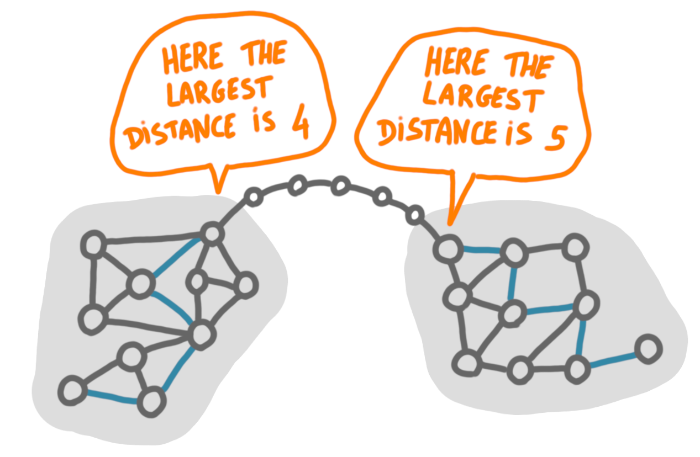
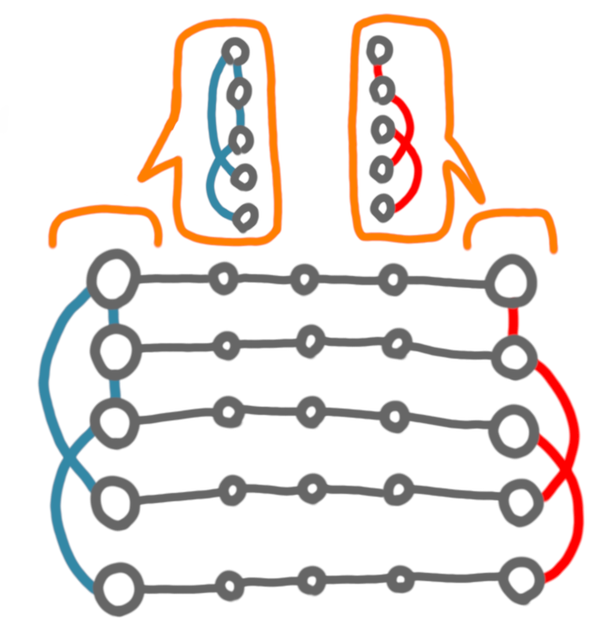

This is the first of a couple of posts where I will describe the 
$\tilde{\Omega}(n)$ lower bound technique for the diameter in local 
certification. 
In this post I'll give some background and intuition and in the next post 
I will go through the real proof.
I assume basic knowledge of local certification. 
(If you want to learn about this topic you can check 
[this tutorial](https://arxiv.org/abs/1910.12747) I wrote.)

## Problem and model

The problem we look at is to *certify that the graph has diameter at most 
$k$* (think of $k$ as a small constant). 
If we allow the verifier algorithm to look at distance $k+1$ then 
this is trivial: 
no certificate is needed, every node can just look far enough to decide 
whether the diameter is small enough. 
This is not very informative, as we would like to understand the locality 
 the task for any $k$.
Thus we take a more restricted model: a node can just look at its neighbors. 
Now clearly the diameter cannot be verified locally, and we need 
certificates. 

It is useful here to check what happens for the opposite problem of 
certifying that the diameter is large, that is at least $k$. 
To certify that, we just have to take two nodes and certify that they are
far apart. 
In other words, we have to certify that the shortest path between two nodes 
$u$ and $v$ is at least $k$. 
This can be done efficiently (eg with logarithmic size certificates) by 
building and certifying a BFS tree rooted at $u$
(every node is given its parent and its distance to the root in the tree, 
and can check the consistency of the distances).

{: .center-image width="70%"}

(One also needs spanning trees pointing to $u$ and $v$, which do not 
appear in the picture.) 

So certifying that the diameter is large is easy. 
Certifying that the diameter is small is not that easy. 
Intuitively the problem is that the certificates have to convey information 
about every pair of nodes, which takes much more space than talking only 
about two nodes. 
One way to certify that the diameter is small is to have a BFS 
for each node, which takes $\Theta(n\log n)$ bits. 
The lower bound we are going to see says that this is basically the best 
possible. 

## Polynomial lower bounds and communication complexity

In terms of certification lower bounds, there are two classic regimes: 

* the logarithmic regime, where one usually use cut-and-plug techniques to 
create an instance that contradicts the assumption that one can use 
$o(\log n)$ bits.
* the polynomial regime, where the arguments are of the form "a large 
amount of information has to be transferred from one part of the graph to 
another, and it can only travel through the certificates". 

Here we will only consider the second regime. 
Let's start with a simple example. 
We want to check whether the graph is a dumbbell graph, that is a graph $G$
formed by taking two copies of a graph $H$ and linking them by a long path. 

{: .center-image width="70%"}

Intuitively one has to transfer the whole map of the left graph to the 
right graph or vice-versa, in order to have one node comparing the two 
copies. 
This communication can be done only via the certificates, thus the 
certificates of the nodes of the path
have to contain the map of at least one of the graphs, and this takes 
$\Omega(n^2)$ bits. 
This can be done more formally by a counting argument: if you use
$o(n^2)$ bits in the certificates of the path, there are several dumbbell 
graphs that correspond to the same certificates on the paths
and then you can merge these instances to form a graph that is not a 
dumbbell but is accepted.

## First steps for certifying small diameter

Now that we have some background on the problem and on the techniques, 
let's try to find a lower bound for our problem.
A first approach is to mimic the dumbbell setting, by considering only 
graphs of the following form: two graphs $H_1$ and $H_2$ linked by a paths. 
But this is not so good for lower bounds, because little information needs 
to be transferred from one end to the other. Basically the nodes only need 
to know what is the longest shortest path starting at the connection
with the path. 

{: .center-image width="70%"}

As we are looking for linear-in-$n$ lower bounds, what we would like is 
that for every new node we need to send one more bit of information, which 
is clearly not the case with the dumbbell construction. 

Let's keep the intuitive idea of "transferring information between a 
left part and a right part", but change a little the construction. 
What happens if instead of one paths we had two? Let's look at the 
simplest set of instances with two paths: the graph below, with either 
(1) both the red and the blue edge, or (2) only the red, or 
(3) only the blue or (4) none of them (let's not worry about connectivity 
here).
   
{: .center-image width="70%"}

Now, if the paths have length $k-1$, the diameter can be either $k$ (case 1), 
or $2k-1$ (case 2 and 3), or infinite (case 4). 
This is a good start, in the sense that we have to really transfer 1 bit of 
information, and we didn't use more nodes than the ones that were already
there with the paths. 
Now it is natural to try to create more complicated
structures on the left and right, instead of just edges, but it is not 
going to work. 
Just like before, the only information needed is the length of the shortest 
path between the endpoint of the two paths, and the number of bits to 
encode this length will grow at most logarithmically in the number of nodes, 
whereas we want a linear growth. 

What about more paths? This is the right direction to go, but we have to be
careful.
Remember that for the dumbbell problem the idea was that we needed to 
transfer a lot of information, and that this information 
had to go through the path, thus the certificates of the path had to be 
large. 
Here if you double the number 
of paths, then the amount of information transferred per path can be halved, 
so you need that the total amount of information to be transferred is at 
least doubled (otherwise it is useless). Fortunately, we are in a situation 
where the total amount of information to transfer is growing faster than 
the number of paths. 

Intuitively, if there are $p$ paths, then on each side there are $p$ 
endpoints, and the total information about the adjacency of these nodes 
takes $\Omega(p^2)$ bits. 

{: .center-image width="70%"}

The number of nodes in such an instances is around $\Theta(p)$ 
so transferring $\Omega(p^2)$ bits through
$p$ paths means that at least one path is transferring $\Omega(p)$ bits, 
which is linear in the number of nodes.

Now this whole reasoning was very hand-wavy. In particular, for the last 
step I have not justified why we couldn't hope to have a more compact 
representation of the adjacency. 
In the next post we will see how to make this very precise 
through a reduction from communication complexity. 

 
