Some notes on graph theory topics.

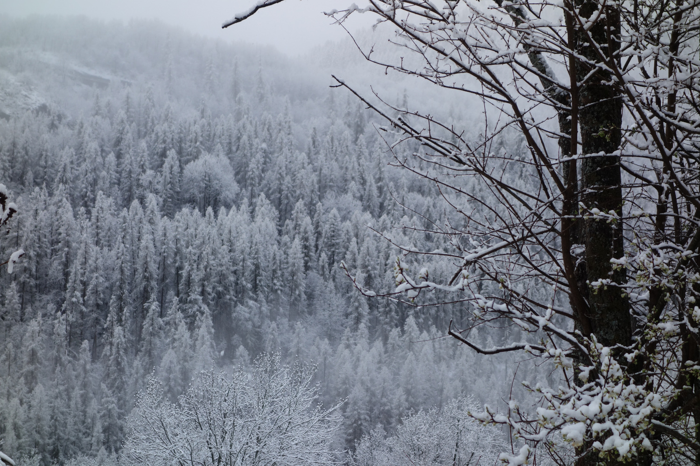{: .center-image width="70%"}

## Linkless embedding, a generalization of planar graphs to three dimensions

Planar embedding are embedding of a graph in the plane without crossing of 
edges.
Only planar graphs have such embeddings.
If one goes to three dimensions it is easy to avoid edge crossing, for any 
graph. 
But there is a meaningful generalization of planarity to 3D, which is 
[linkless embeddings](https://en.wikipedia.org/wiki/Linkless_embedding).

A linkless embedding, is an embedding of a graph in 3D such that no two 
cycles are "linked". I found no easy way to describe this notion with words
so I'll just make a drawing (the important part is highlighted in yellow).

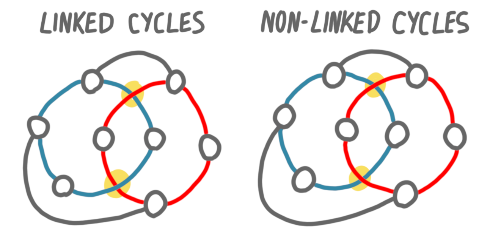{: .center-image width="70%"}

I discovered this notion (along with other things) in the blog post
[Ten things you (possibly) didn't know about the petersen graph](https://cp4space.wordpress.com/2013/09/06/ten-things-you-possibly-didnt-know-about-the-petersen-graph/). 
Petersen graph, and in general the 
[Petersen family](https://en.wikipedia.org/wiki/Petersen_family) are 
archetypes of graphs that do *not* have a linkless embedding. 
One of these graphs is $K_6$, the clique on 6 vertices. 
Below is an attempt at building a linkless embedding for $K_6$, that 
unsurprizingly fails.

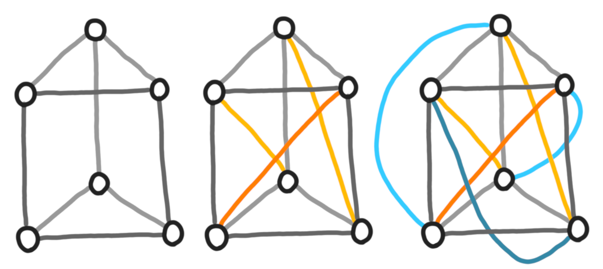{: .center-image width="80%"}

<small><i>
Constructing a $K_6$ little by little. First the gray edges (the clique 
minus two matchings), then the orange edges (one matching) and then the 
blue edges (the other matching).
</i></small>

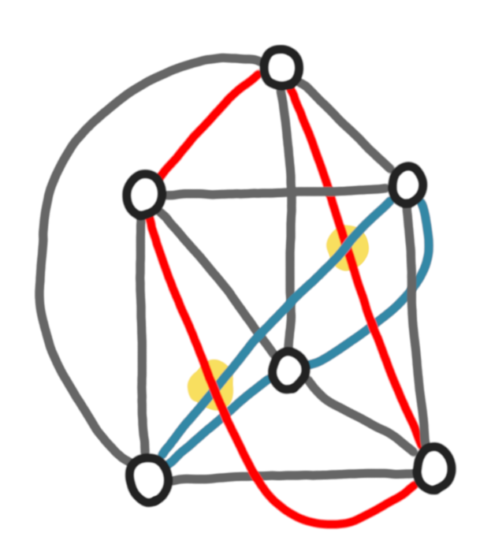{: .center-image width="60%"}

<small><i>
The same embedding, but now with two linked cycles highlighted.
</i></small>

## Pointer to JCRAALMA

A few weeks ago was the second edition of 
[JCRAALMA](https://www.lirmm.fr/~goncalves/pmwiki/index.php?n=Main.HomePage)
a French 3-days workshop (in English) on a graph theory topic. This 
year the topic was width parameters (treewidth, cliquewidth, and all their 
friends). 
Because I had to prepare for a job interview I didn't attend, but I plan 
to catch up in the months to come. The videos are available on
[https://webconf.u-bordeaux.fr/b/mar-pmc-ht6](that webpage).

Actually I didn't attend last year either, but I learned a lot from the few 
recorded talks I watched. (The two next notes come from the first 15 minutes
of the [first talk](https://visio.u-bordeaux.fr/playback/presentation/2.0/playback.html?meetingId=2f0650b79e14fde9ea24e2530b31c59a0ced0d87-1590392967834) by 
[Gwenaël Joret](https://gjoret.be/).)

I think the format is very nice: around 10 one-hour online talks, spread 
on three days, with a meaningful schedule (a precise topic per day, and 
increasing difficulty, starting from scratch in the first talk and finishing 
with cutting-edge research). 

## Small separators = small treewidth

If you know the notion of 
[treewidth](https://en.wikipedia.org/wiki/Treewidth), you 
probably know that having a small treewidth implies having a small (balanced) 
separator.

You might not know that in some sense the converse is also true. 
Dvořák and Norin proved ([paper](https://arxiv.org/pdf/1408.3869.pdf)) that
if every subgraph of a graph $G$ has a balanced separator of size $a$, then 
$G$ has treewidth at most $15a$. 

## Baker's technique for peeling planar graphs

[Baker's techniques](https://en.wikipedia.org/wiki/Baker%27s_technique) 
(named after [Brenda Baker](https://en.wikipedia.org/wiki/Brenda_Baker)) is
a way to decompose planar graphs. Basically it's about peeling the graph 
like an onion, by iteratively removing layers.

Let's make an example. Consider the following graph.

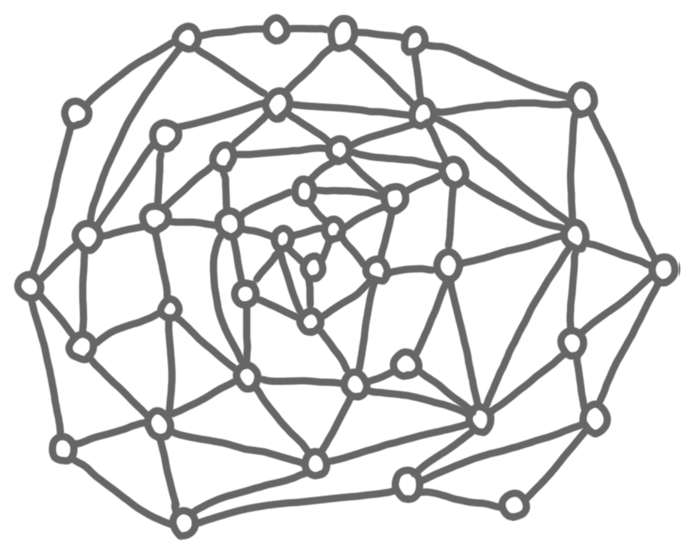{: .center-image width="70%"}

The first layer is the nodes that are on the outerface, plus the edges 
between these nodes. For the next steps, we can forget about the edges that 
have exactly one endpoint in the layer (depicted in light gray in the picture).

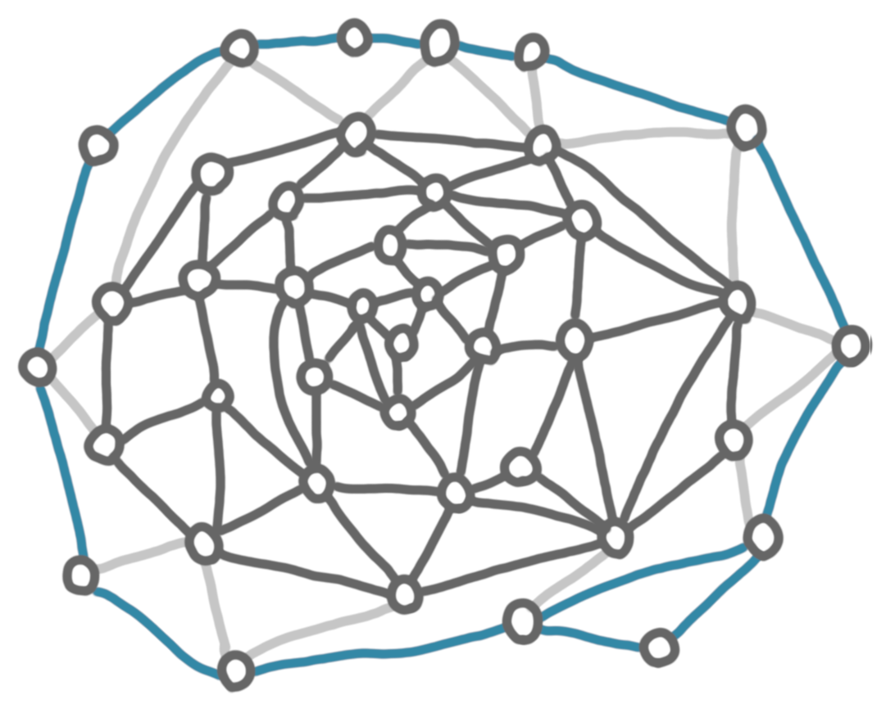{: .center-image width="70%"}

Now we repeat the process until every node is in a layer.

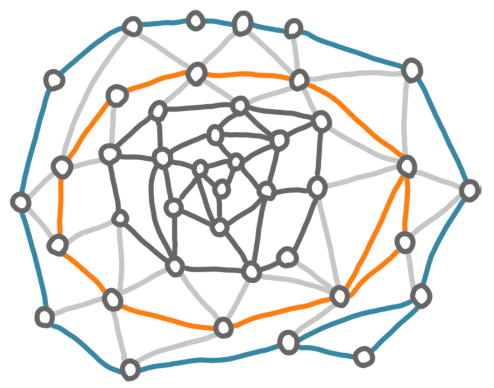{: .center-image width="50%"}
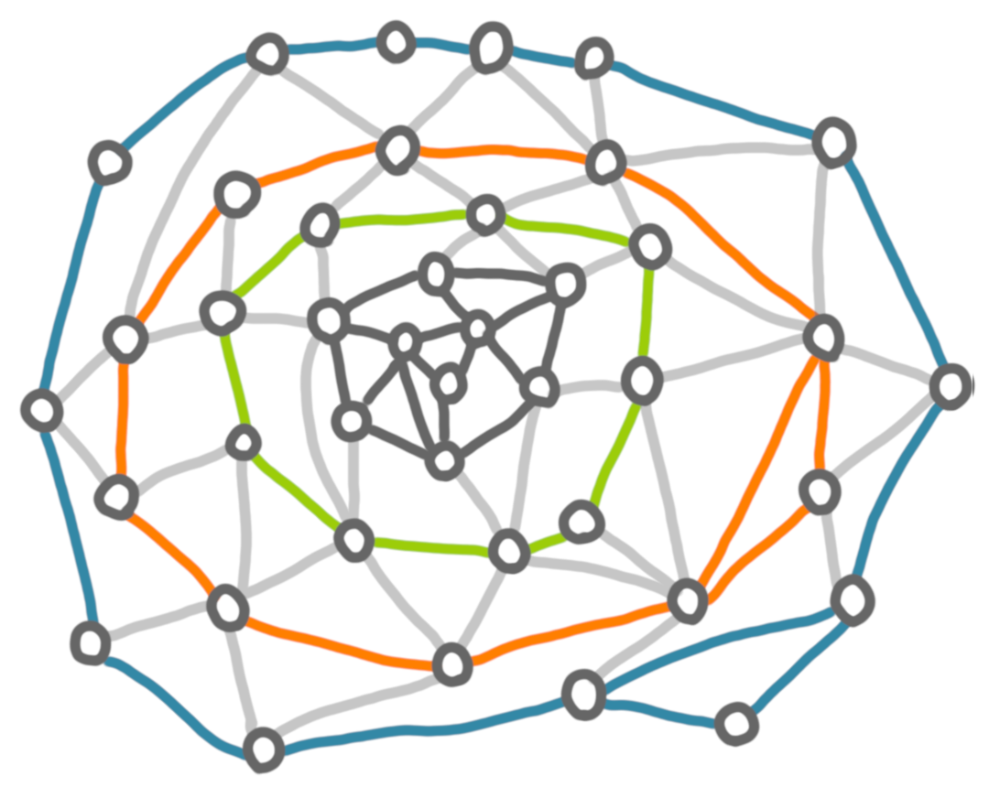{: .center-image width="50%"}
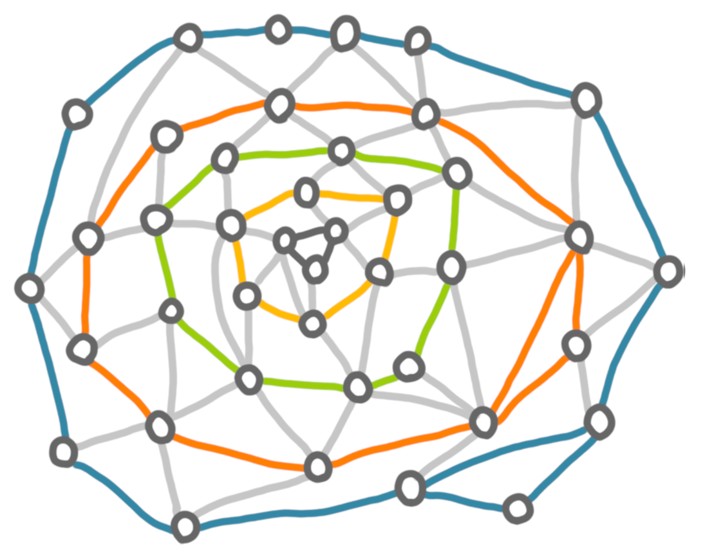{: .center-image width="50%"}
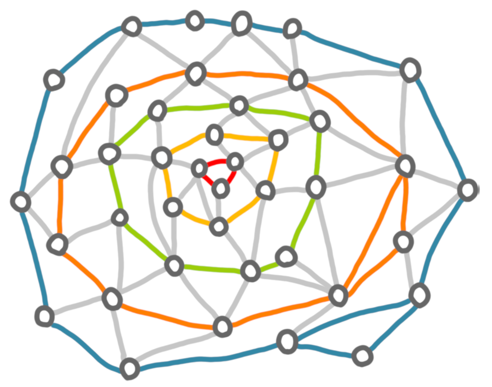{: .center-image width="50%"}

Now how to use this decomposition? The idea is that removing any layer 
divides the graph into two components: the part strictly outside the layer, 
and the part strictly inside. Then you can for example design approximation
algorithms of the following form: 

* remove a layer every $k$ layers, which creates a collection of groups of 
$(k-1)$ consecutive layers (here we put back the edge between these layers).
For example if we remove the green layer we get:

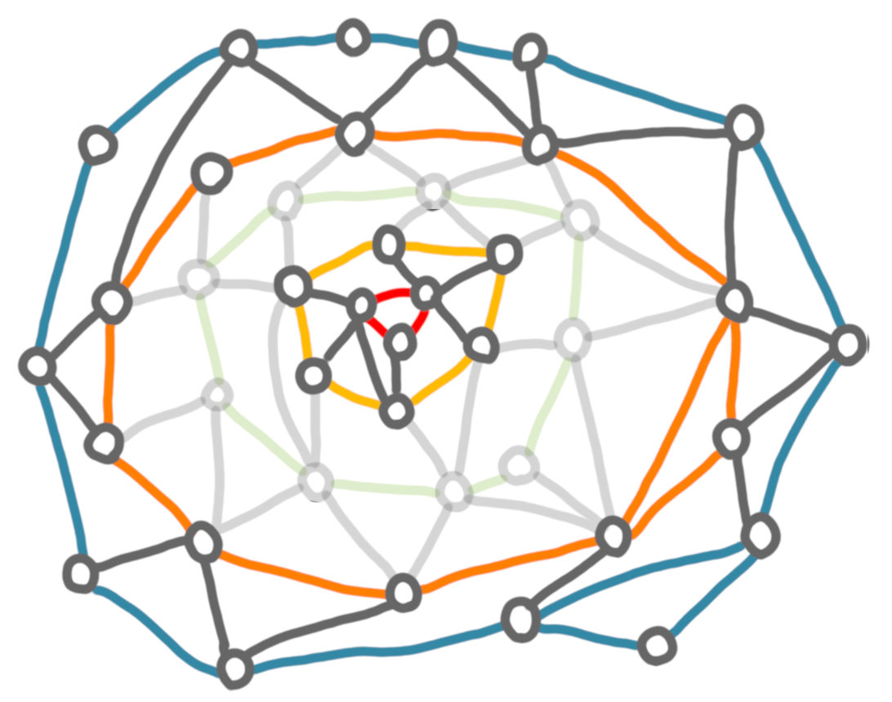{: .center-image width="70%"}

* solve optimally the problem on each groups of layers
* add back the removed layers, and fix some things if needed.

The idea is that if we are careful, we do not loose too much by forgetting
about some layers, and solving the problem optimally on the groups of 
layers is not too hard because these have a constrained 
structure (small treewidth, k-outerplanar, etc.). 

## Graph burning 

I saw [a preprint](https://arxiv.org/pdf/2003.07746.pdf) on the arxiv about 
"graph burning", and it made me curious. The graph burning if the following 
process. You have time steps, and at each time-step:

* you can chose an arbitrary vertex to burn
* a vertex that has burned before burns its neighbors. 

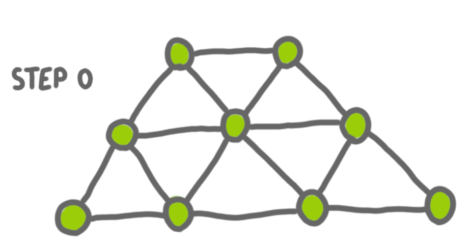{: .center-image width="60%"}
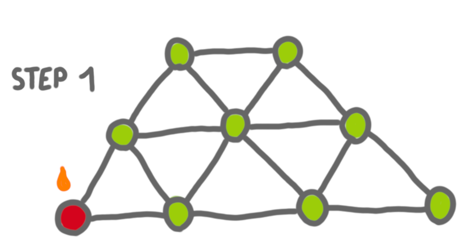{: .center-image width="60%"}
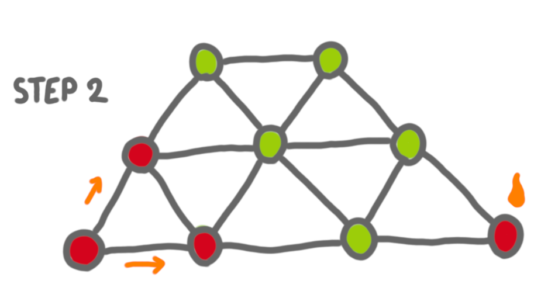{: .center-image width="60%"}
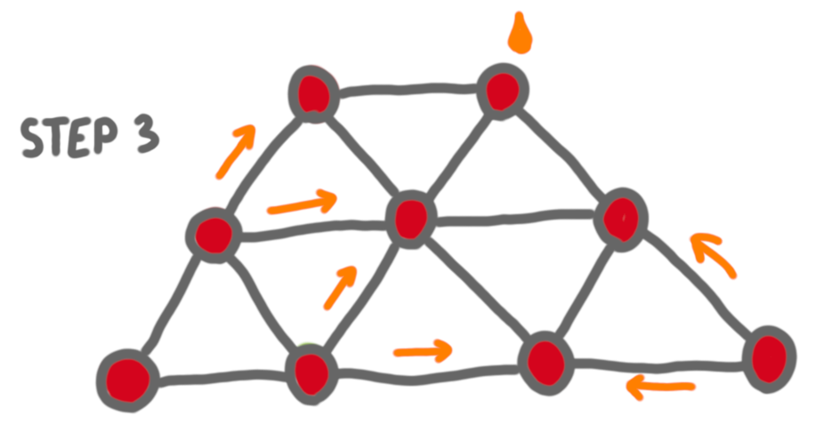{: .center-image width="60%"}

The burning number of a graph is the minimum number of steps before the 
whole graph is burned (this the optimal sequence of "external burns").

A nice exercise is to prove that the burning number of an $n$-node path is 
(around) $\sqrt{n}$.

