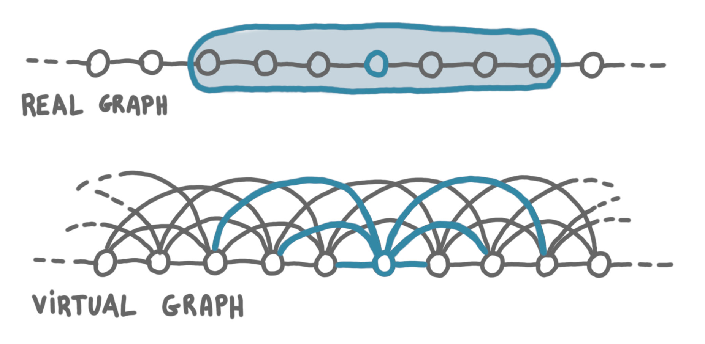
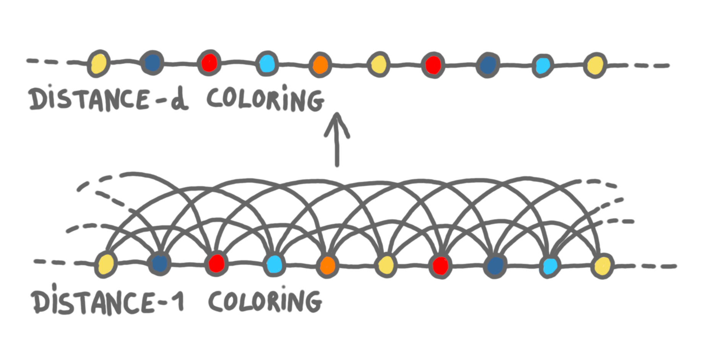
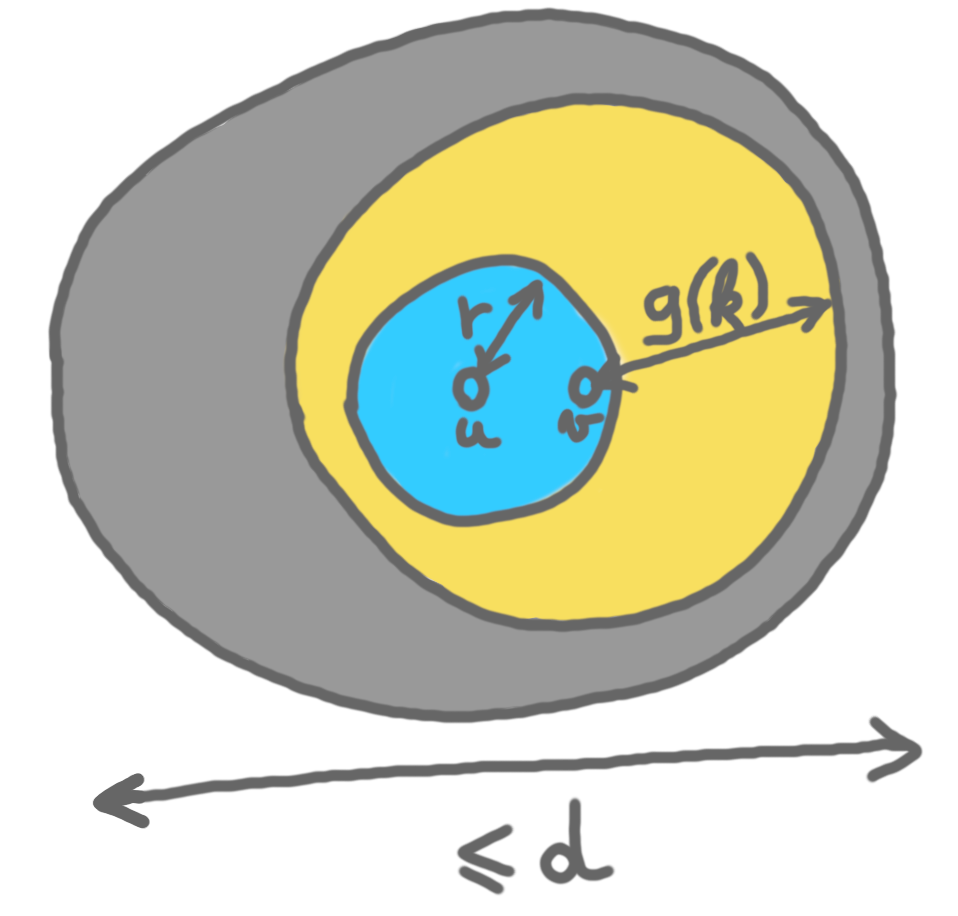

This is the second post of a series about the small-ID techniques (also 
known as speed-up technique, simulation technique or gap technique, and not 
to be confused with the round-elimination technique). 
The first post is [here](https://discrete-notes.github.io/small-ID-1).

In this post, we will study the case of cycles in details. We do not 
optimize the construction because the goal is to build intuition for the 
general case, not to get the best results for cycles.

## Coloring algorithm and setting

We will use the following coloring theorem of Linial, for graphs of
maximum degree $\Delta$.

**Theorem:** There exists a distributed algorithm $L$ that computes a 
$(\beta \Delta^2)$-coloring in time at most $\log^{\ast}n$, with $\beta$ a constant.

We consider a cycle of $n$ nodes. The LCL we look at has verification 
radius $r$. We assume that we have an algorithm $A$ in time $g(n)$, 
where $g$ is not constant, and not too large either (we will precise this later).

## Computing small-IDs

Let's say that we want to compute small-IDs such that no two vertices 
$u$ and $v$ at distance at most $d$ have the same small-ID, for some $d$.

To compute small-IDs that are distinct up to distance $d$, we will use the 
coloring algorithm of the theorem above. Every node will gather its 
neighborhood at distance $d$, and will locally build a virtual graph where
all these nodes are its neighbors. That is, the nodes simulate the 
$d$-product $G^d$ of the original graph $G$.
Note that in $G^d$ the degree of every node is $2d$.
In the picture below, $d=3$.

{: .center-image width="90%"}

In the virtual graph $G^d$, running $L$ takes $\log^{\ast}n$ time and 
gives us a $\beta (2d)^2$-coloring. 
Now, in $G$, this coloring is a proper coloring at distance $d$, and each 
step of the computation in the virtual graph takes $d$ rounds, thus we 
get this coloring in $d \log^{\ast}n$ time.

{: .center-image width="90%"}

## Relation between the parameters

Here is the problem we want to avoid: we tell the algorithm that it works 
in a graph of size $k$, but when the algorithm looks at distance 
g(k), it sees two identical small-ID, because we have not taken $d$ large enough.
The problem is that if we increase $d$, then we increase the identifier range,
then we increase the size $k$ we announce. Thus we need to be careful about the
$k$ and $d$ we use. 

We claim that for a $k$-coloring at distance $d$, it is sufficient to 
ensure that $2(r+g(k))\leq d$. 
Suppose that the inequality holds, and consider a node $u$. All the 
nodes in its $r$-neighborhood, that is the nodes it needs to check for the 
LCL verification, have their $g(k)$-neighborhood inside the same ball 
of diameter $d$, thus inside a ball where no small-ID is used twice. 
For every node, its $r$-neighborhood is correct, thus the solution is 
globally correct.

{: .center-image width="60%"}

Now, as we use $\beta (2d)^2$ colors, the smallest $k$ we can claim is
$\beta (2d)^2$.
Thus we want $2(r+g(\beta 4d^2))\leq d$. 
Let's make our life easy and make this happen by assuming:
$g(n)\leq \frac{\sqrt{n}}{4\sqrt{\beta}}-r$. (This is for large enough $n$.)

## Conclusion

So what do we get with this trick? If you have an algorithm whose complexity 
is between $d \log^{\ast}n$ and $\frac{\sqrt{n}}{2\sqrt{\beta}}-r$, then you can 
speed it up to $O(d \log^{\ast}n)$:
compute the coloring at distance $d$ in time 
$d \log^{\ast}n$ and then run the orginal algorithm that works for size 
$\beta (2d)^2$ in time $g(\beta (2d)^2)\leq d$.
In other words, there is no LCL problem on the 
cycle whose optimal complexity is between these two functions. (Actually the 
square root is an artefact here: the right answer is that there is nothing
between $\Theta(\log^{\ast}n)$ and $\Theta(n)$.)

In the next post, we'll see the full result for graph of bounded degree. 

