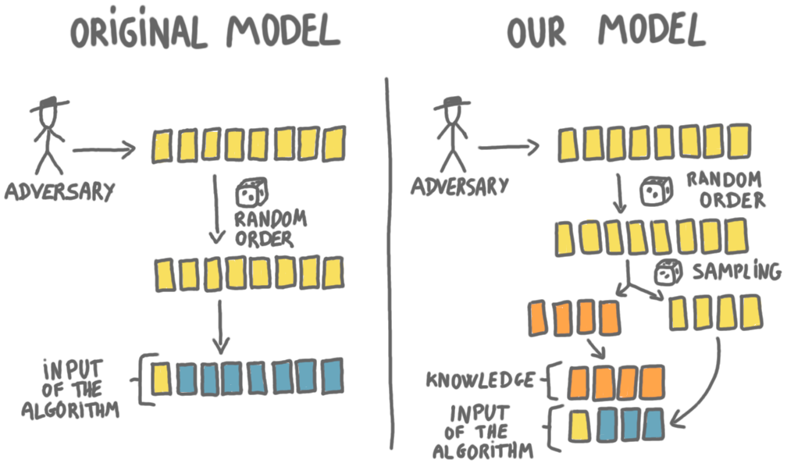

I recentely presented the paper 
[The secretary problem with independent sampling](https://perso.liris.cnrs.fr/lfeuilloley/publications/secretary.html)
at the [Highlight of algorithms conference](https://www.highlightsofalgorithms.org/) 
in the three-minute format (+ poster). Here is a blog version of this 
teaser talk. 

The paper is joint work with 
[José Correa](https://www.dii.uchile.cl/~jcorrea/), 
[Andres Cristi](https://sites.google.com/view/andres-cristi),
[Tim Oosterwijk](https://sites.google.com/view/timoosterwijk/),
and [Alexandros Tsigonias-Dimitriadis](https://www.gs.tum.de/en/adone/participating-researchers/tsigonias-dimitriadis-alexandros/).

## The secretary problem

The [secretary problem](https://en.wikipedia.org/wiki/Secretary_problem) 
is a classic problem of online algorithmic. Basically numbers are presented 
to a player, one after the other, and the player has to stop on the largest 
number. 

More precisely, an adversary chooses a set of $n$ numbers, 
these numbers are presented to the player in a random order, and for every 
number, the player has to decide either to discard it, or to keep it. 
The decisions are irrevocable: if a number is discarded it is destroyed, 
and if a number is chosen, then the game is stopped, and this number is the 
output of the player. 

The player wins if and only if the number she chooses is the maximum number. 

Of course this is very hard, and one cannot win all the time. 
But surprisingly there is an algorithm that is guaranteed to pick the 
maximum with probability $1/e$. (See the wikipedia article linked above.) 

{: .center-image width="70%"}

<small><i>
At this point, we have discarded a 2 (the turtle) and a 1 (the rabbit), and 
we see a 5 (the cow). We know that there are $n=4$ numbers (animals) in 
total. So maybe, it's a good idea to stop there. 
</i></small>

## Issues with the classic model and our new model

A problem with the secretary problem, when it comes to modeling real-world
situation, is that it is very pessimistic because we start with absolutely no 
knowledge about the numbers. The fact that we can still ensure $1/e$ is 
because the order is random, and if we had an adversarial order, then we 
couldn't guarantee anything. 

{: .center-image width="80%"}

<small><i>
In the adversarial order, anything can happen.
</i></small>

In general, in a real-life situation (say in auctions), one has some idea 
about what the numbers (that is, the offers) will be. This can be modeled 
with replacing the adversarial inputs by inputs generated by a distribution,
but this approach also has issues (e.g. how do you know the exact
distribution?). 

We propose a new model summarized in the following picture.

{: .center-image width="80%"}

<small><i>
The classic and the new secretary model.
</i></small>

The left column represents the classic secretary model. In our model, the 
beginning is the same: an adversary chooses $n$ numbers, and these numbers 
are shuffled at random. But then there is a twist. Each number will join
a "sample set" with probability $p$, and will stay in the "online set" with 
probability $(1-p)$. The numbers in the sample set are removed from the 
game, they are given directly to the player at the very beginning. 
The player sees these numbers, and then plays only on the online set. 
In other words, the sample set is a way for the algorithm to learn about 
the way the adversary chooses the numbers. 
(In some sense, the sample set is a training set, and the online set is a 
test set.)

The rational behind this model is that the samples model the past data 
that we know about when we start the game. Still having an adversary
makes the model more robust than having a distribution, and samples are 
close to the type of knowledge one would have in a real-world scenario.

## Results

In our new model, we can consider both the classic random order for the 
numbers and the adversarial order. For these two variants we give algorithms
with optimal success guarantee. Unsurprisingly, in both cases the larger 
the sampling probability $p$ the better the guarantee. (See the paper for 
the curves.)

The proofs in the two cases are very different: in the first
case we make the problem more continuous and use tools from optimization, 
whether in the second case we build technique for proving impossibility 
results, based on indistinguishability arguments similar to the ones used 
in distributed computing. 

