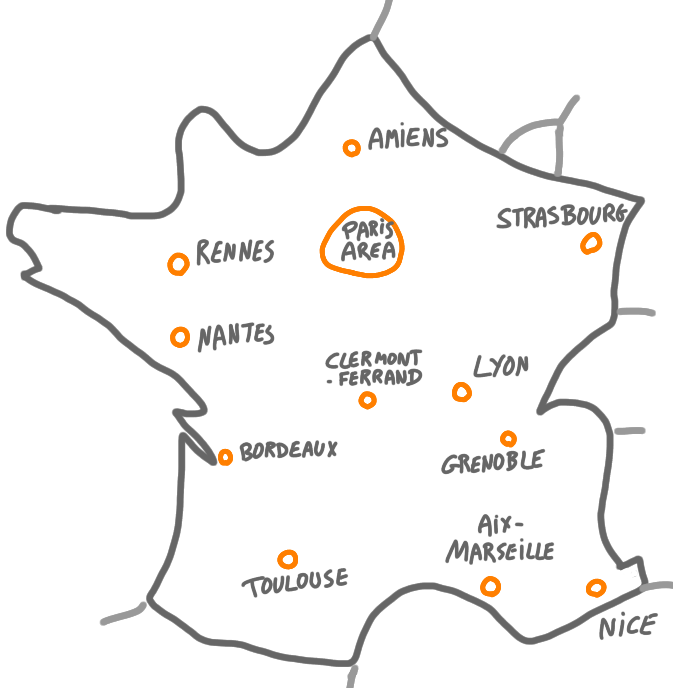

It is often difficult for people of the PODC/DISC community to understand
the university systems and the affiliations in France. 
This post is a list of PODC/DISC people working in France, sorted by 
affiliations, with a few keywords.
It has been compiled by 
[Fabien Dufoulon](https://fabiendufoulon.github.io/) (who came up with the 
idea) and myself, with help from 
[Anaïs Durand](https://sancy.iut-clermont.uca.fr/~durand/) and 
[Mikaël Rabie](https://www.irif.fr/~rabie/)..

This list is meant to be inclusive. If you feel that someone is missing, 
just let us know. Our rule of thumb to decide who to list was: people with
permanent positions and with at least two
papers in the last five years in a conference with similar topic as PODC/DISC
(eg PODC, DISC, OPODIS, SSS, SIROCCO etc.). 

{: .center-image width="70%"}

<small><i>
Map of the centers of PODC/DISC research in France.
</i></small>

## Paris' area (Île-de-France)

(We divide the list into Paris' area and outside Paris area for convenience.)

### Sorbonne University - LIP6

(Former Université Pierre et Marie Curie, Paris 6, Paris Jussieu)

* [Lélia Blin](https://www-npa.lip6.fr/blin/) (also affiliated to 
Université Evry Val d'Essonne). Distributed algorithms, self-stabilization, 
spanning trees, memory minimization, sensor networks.
* [Swan Dubois](https://pages.lip6.fr/Swan.Dubois/). Fault tolerance, 
self-stabilization, dynamic systems, byzantine faults
* [Franck Petit](https://pages.lip6.fr/Franck.Petit/). Algorithmic aspects 
of synchronization, stabilization and fault-tolerance, cohort of robots, 
dynamic networks
* [Maria Potop-Butucaru](https://pagesperso.lip6.fr/Maria.Gradinariu/). 
Fault-tolerant and self* distributed systems, sensor and robots networks, 
P2P or distributed ledgers
* [Sébastien Tixeuil](https://www-npa.lip6.fr/~tixeuil/wiki/pmwiki.php)
Fault and attack tolerance in self-organized distributed systems and networks

### University of Paris - IRIF 

(Former University Paris Diderot/Paris 7 - LIAFA)

* [Carole Delporte-Gallet](https://www.irif.fr/~cd/). Distributed 
algorithms, fault-tolerance, consensus, security and privacy, networks
* [Hugues Fauconnier](https://www.irif.fr/~hf/)
    Distributed algorithms, fault-tolerance, consensus, security and privacy, networks
* [Pierre Fraigniaud](https://www.irif.fr/users/pierref/index). Design and analysis of distributed algorithms and data structures for networks.
* [Amos Korman](https://amoskorman.com/). Distributed algorithms in 
networks, computations under uncertainties, algorithmic aspects of biology
* [Mikaël Rabie](https://www.irif.fr/~rabie/). Complexity, Computability, 
Distributed Computation
* [Laurent Viennot](https://who.rocq.inria.fr/Laurent.Viennot/)
Transportation networks, routing, labelings

### Paris-Saclay University - LRI/LISN + LSV

* [Thibaut Balabonski](https://www.lri.fr/~blsk/). Formal proofs for mobile 
robot swarms protocols, lambda calculus, concurrency
* [Evangelos Bampas](https://www.lri.fr/~bampas/). Distributed and mobile 
agent systems
* [Joffroy Beauquier](https://www.lri.fr/membre\_en.php?mb=275). Population 
protocols, self-stabilization
* [Janna Burman](https://www.lri.fr/membre.php?mb=1614). Population 
protocols, self-stabilization
* [Johanne Cohen](https://www.lri.fr/~jcohen/). Algorithms and 
telecommunications, self-stabilization.
* [Matthias Függer](http://www.lsv.fr/~mfuegger/). Fundamentals of 
computationally extremely restricted distributed devices
* [Thomas Nowak](https://www.thomasnowak.net/). Distributed algorithms, 
synthetic biology, discrete-event systems, wireless ad-hoc networks of 
mobile agents
* [Ami Paz (starting in Fall 2021)](https://sites.google.com/view/amipaz)
Distributed graph algorithms, topological methods, streaming algorithms

### Paris-Saclay University - CEA LIST

* [Sara Tucci-Piergiovanni](https://fr.linkedin.com/in/sara-tucci-piergiovanni-1582672). 
Byzantine fault tolerance, blockchain
* [Antonella Del Pozzo](https://fr.linkedin.com/in/antonella-del-pozzo-60165651).
Byzantine fault tolerance, blockchain, distributed storages

### École polytechnique - LIX

* [Bernadette Charron-Bost](https://www.lix.polytechnique.fr/~charron/)
    Distributed algorithms, fault-tolerance, consensus, natural algorithms
* [Eric Goubault](http://www.lix.polytechnique.fr/~goubault/)
Topological methods and verification of concurrent, distributed and fault-tolerant computing
* [Samuel Mimram](http://www.lix.polytechnique.fr/Labo/Samuel.Mimram/)
Denotational semantics, concurrency, rewriting theory, category theory, 
linear logic, programming languages, algebraic topology, and hybrid systems

### University of Versailles - LI-PaRAD

(The full name is University of Versailles Saint-Quentin-en-Yvelines)

* [George Manoussakis](https://sites.google.com/view/gom/home). 
Self-stabilization, graph theory
* [Laurence Pilard](https://fr.linkedin.com/in/laurence-pilard-4528003).
    Fault-tolerance
* [Devan Sohier](https://fr.linkedin.com/in/devan-sohier-6307393). 
Randomized methods, population protocols, self-stabilization.

### CNAM - CEDRIC

* [Pierre Courtieu](https://cedric.cnam.fr/~courtiep/index.fr.html).
    Formal proofs, robots
    
### Télécom Paris - INFRES

* [Petr Kuznetsov](https://perso.telecom-paristech.fr/kuznetso/)
Synchronization, failure detection, algebraic topology and distributed 
computing, distributed aspects in networking 
* [Matthieu Rambaud](https://perso.telecom-paristech.fr/rambaud/).
    Cryptography, algebraic geometry, byzantine fault tolerance
* [Pierre Sutra](https://sites.google.com/site/0track/).
Data consistency and concurrency in distributed systems
    
### University of Technology of Compiègne

* [Bertrand Ducourthial](https://www.hds.utc.fr/~ducourth/dokuwiki/doku.php).
Dynamic networks

## Outside Paris'area

### University of Bordeaux - LABRI

* [Marthe Bonamy](https://www.labri.fr/perso/mbonamy/).
    Graph theory, local algorithms, labelings
* [Arnaud Casteigts](https://www.labri.fr/perso/acasteig/).
    Highly dynamic networks, algorithms
* [Cyril Gavoille](https://dept-info.labri.fr/~gavoille/).
    Distributed graph algorithms, routing, labelings
* [Nicolas Hanusse](https://fr.linkedin.com/in/nicolas-hanusse-9ab0b766).
    Fault-tolerance, networks
* [David Ilcinkas](https://www.labri.fr/perso/ilcinkas/).
    Mobile agents, distributed computing
* [Colette Johnen](https://www.labri.fr/perso/johnen/).
    Self-stabilization
* [Ralf Klasing](https://www.labri.fr/perso/klasing/).
    Networks
* [Yves Métivier](https://scholar.google.fr/citations?user=7B3iaYYAAAAJ&hl=fr).
    Distributed network algorithms, beeping model
* [Alessia Milani](https://www.labri.fr/perso/milani/publications/).
    Distributed and concurrent computing, consensus, anonymous dynamic networks
* [Corentin Travers](https://www.labri.fr/perso/travers/).
    Coordination and fault-tolerance

### Aix-Marseille University - LIS

* [Jérémie Chalopin](https://pageperso.lif.univ-mrs.fr/~jeremie.chalopin/index.html.en)
    Distributed algorithms, mobile agent systems, metric graph theory 
* [Shantanu Das](https://pageperso.lif.univ-mrs.fr/~shantanu.das/en/).
Design and analysis of distributed algorithms, Fault tolerance in 
distributed systems, distributed robotics, dynamic networks, sensor networks
* [Emmanuel Godard](https://pageperso.lis-lab.fr/emmanuel.godard/research/).
Distributed Algorithms, structural properties and distributed, computability, termination detection, reliability and fault-Tolerance.
* [Damien Imbs](https://pageperso.lif.univ-mrs.fr/damien.imbs/)
Distributed algorithms, malicious behaviors in distributed systems, combinatorial topology
* [Arnaud Labourel](https://pageperso.lif.univ-mrs.fr/~arnaud.labourel/index.php?lang=en\&page=index)
 Graph representation, mobile agents, robots

### University of Rennes - IRISA

* [Emmanuelle Anceaume](https://people.irisa.fr/Emmanuelle.Anceaume/)
    Data stream algorithms, reputation mechanisms, dependability issues in peer-to-peer systems, blockchain technologies
* [George Giakkoupis](https://sites.google.com/site/ggiakk)
    Design and analysis of algorithms, with emphasis on distributed algorithms and randomization
* [Michel Raynal](https://team.inria.fr/wide/team/michel-raynal/)
Distributed algorithms and systems, concurrency, distributed computing, 
fault-tolerance, synchronization
* [François Taiani](https://team.inria.fr/wide/team/francois-taiani/).
    Large-scale distributed computer systems, programmability of distribution, cloud computing, social networks
* [Bruno Sericola](http://www.irisa.fr/dionysos/pages\_perso/sericola/index.htm).
    Markov chains, Queuing theory, population protocols
* [Yves Mocquard](http://people.irisa.fr/Yves.Mocquard/). 
Randomized methods, population protocols

### University of Nantes - LS2N

* [Achour Mostéfaoui](https://www.irisa.fr/asap/index.html\%3Fp=205.html).
    Synchronization, fault-tolerance, scalability, group communication, data consistency and checkpointing
* [Matthieu Perrin](https://matthieu-perrin.fr/).
Message-passing distributed systems, weakly consistent shared objects, message broadcast primitives

### Grenoble Alpes University - Verimag and GSCOP

* [Karine Altissen](https://www-verimag.imag.fr/Karine-Altisen,102.html?lang=en).
Fault tolerant distributed algorithms: design and (pen-and-paper) proof, formal proof, simulation
* [Louis Esperet](https://oc.g-scop.grenoble-inp.fr/esperet/). Graph theory, 
optimization
* [Lionel Rieg](https://www-verimag.imag.fr/~riegl/)
    Formal proofs, robots, self-stabilization

### University of Picardy Jules Vernes - MIS

(The lab is in Amiens.)

* [Alain Cournier](https://home.mis.u-picardie.fr/~cournier/).
    Self-stabilization
* [Yoann Dieudonné](https://www.mis.u-picardie.fr/membre/60/Yoann-DIEUDONNE)
    Robots, anonymous systems
* Vincent Villain. Self-stabilization
* [Stéphane Devismes](https://www-verimag.imag.fr/~devismes/WWW/introduction.html) 
(starting in Fall 2021, previously in Grenoble). Self-stabilization, robots.

### University  of Strasbourg - ICUBE

* [Quentin Bramas](https://bramas.fr/).
    Autonomous mobile robots, distributed ledgers, wireless sensor networks, dynamic graphs
* [Anissa Lamani](https://sites.google.com/view/lamani/).
    Distributed systems, fault tolerance 

### University Clermont-Auvergne - LIMOS

* [Anaïs Durand](https://sancy.iut-clermont.uca.fr/~durand/).
    Fault-tolerance and self-stabilization
* [Pascal Lafourcade](https://sancy.iut-clermont.uca.fr/~lafourcade/). 
    Security, cryptography, formal proofs

### University of Lyon - LIRIS

* [Nicolas Bousquet](https://perso.liris.cnrs.fr/nbousquet/).
    Graph theory, coloring, reconfiguration
* [Xavier Urbain](https://perso.liris.cnrs.fr/xavier.urbain/).
    Formal proof for networks of autonomous mobile robots, automated proof, verification, rewriting, termination

### Côte d'Azur University - I3S

* [Emanuele Natale](https://www-sop.inria.fr/members/Emanuele.Natale/).
    Computational neuroscience, artificial intelligence, distributed probabilistic dynamics
* [Nicolas Nisse](https://www-sop.inria.fr/members/Nicolas.Nisse/).
    Distributed algorithms, labelings, games, graphs
* [Chuan Xu](https://sites.google.com/view/chuanxu).
    Population protocols, self-stabilization, distributed machine learning, federated learning, stochastic optimization
    

### University of Toulouse - LAAS + IRIT}

* [Matthieu Roy](https://homepages.laas.fr/mroy/LAAS/Home.html).
    Distributed algorithms, consistency and safety, geo-localized systems, 
    human-carried distributed systems, real-time systems and distributed embedded systems
* [Gilles Tredan](https://homepages.laas.fr/gtredan/).
    Data analysis, graphs, distributed algorithms, machine learning
* [Philippe Quéinnec](http://queinnec.perso.enseeiht.fr/).
    Distributed embedded systems and distributed real time systems, refinement of concurrent and distributed algorithms, verification of asynchronous communicating systems
* [Aurélie Hurault](http://hurault.perso.enseeiht.fr/index.html).
    Formalizing distributed systems, asynchronous communication

