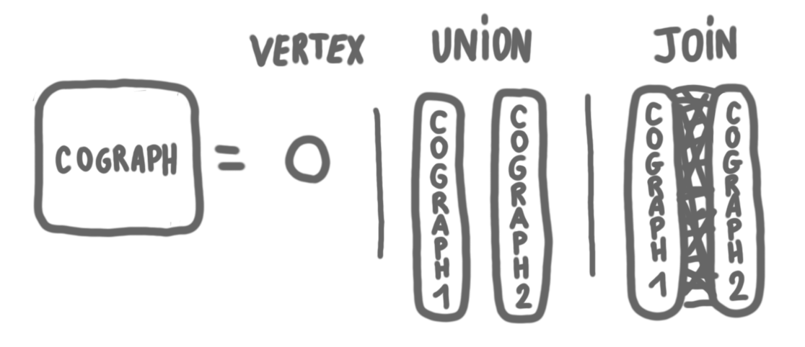
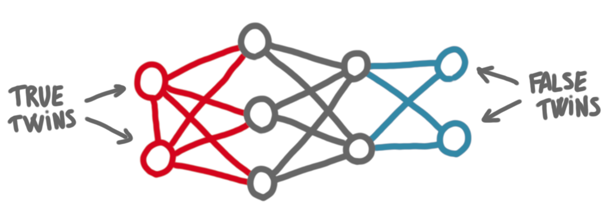
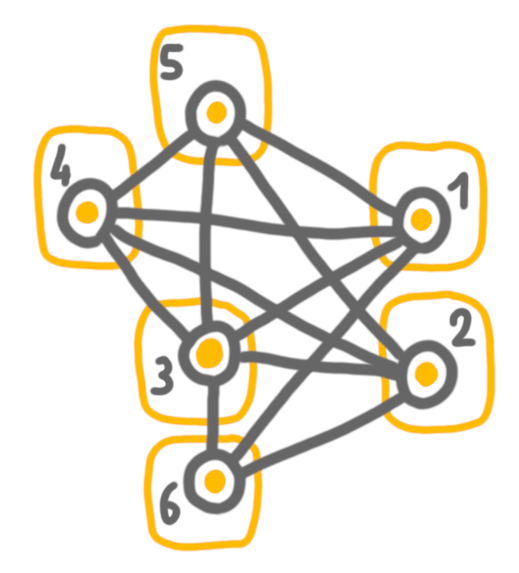
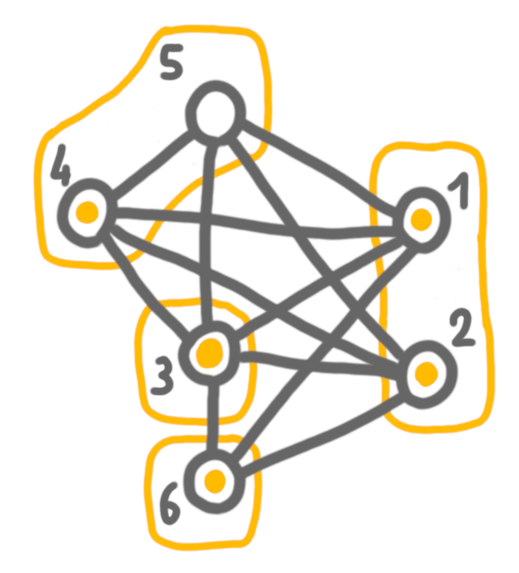
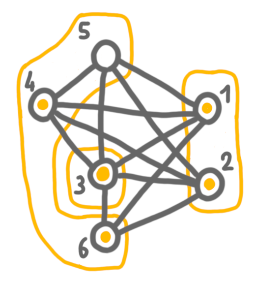
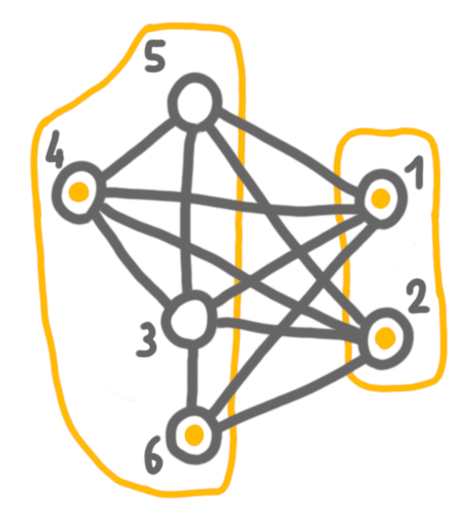
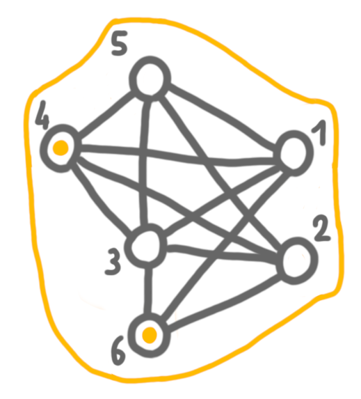
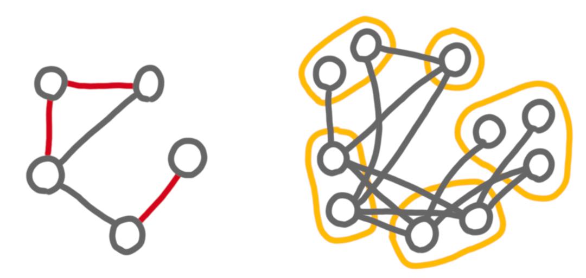

(Note: this is an unpolished version, I will polish the post next week.)

Contraction sequences is a new point of view on some algorithmic graph 
concepts such as 
[Courcelle's theorem](https://en.wikipedia.org/wiki/Courcelle%27s_theorem). 
It arises from the study of a new 
parameter called *twinwidth*. 
The paper developing the concept will appear at SODA next year, and is on 
the arxiv [here](https://arxiv.org/abs/2111.00282).
[Edouard Bonnet](https://perso.ens-lyon.fr/edouard.bonnet/) 
gave a talk on the topic at our 
[local graph meeting](https://perso.liris.cnrs.fr/lfeuilloley/graph-meeting.html) two weeks 
ago, and this week a longer one at the 
[French Graph and Algorithms days](https://jga2021.sciencesconf.org/).
Here are some notes on the topic, following the structure of the introduction 
of Edouard's talk.

## Warm-up with cographs

Let us start with a warm-up. We will consider a specific graph class, and a 
simple independent set algorithm for this class.
The [cographs](https://en.wikipedia.org/wiki/Cograph) 
are the graphs that can be built iteratively in the following 
way: 

* a single vertex is a cograph
* the union of two cographs is a cograph
* the join of two cographs is a cograph (where a join is taking the union of 
two graphs, plus all the edges between a vertex in the first graph and a 
vertex in the second graph.)

{: .center-image width="90%"}

Cographs have the following property (which is actually a characterization). 
In a cograph, every induced subgraph has at least two 
vertices with the same neighborhood. 
These are called *twins*. 
More precisely, *true twins* are twins that are adjacent one to the other, 
and *false twins* are twins that are not adjacent.

{: .center-image width="90%"}

Let's design an efficient algorithm for 
[maximum independent set](https://en.wikipedia.org/wiki/Independent_set_(graph_theory)) 
using this property. 
We will maintain a partition of the vertices, 
and at first every vertex is in its own part of the partition. 
In other words, there is a bag for each vertex. 
We will maintain a maximum independent set in each bag. At the beginning, 
every vertex is the maximum independent set of it own bag.

Now, let's take two twins of the graph. 
We will merge their bags. 
If the twins are false twins, then the solution is the union of the two 
vertices. 
If the twins are true twins, then they are linked by an edge, thus we cannot 
be both in the solution, and we take an arbitrary vertex in the solution. 
For the rest of the algorithm, we will consider that we have merged these 
vertices into one. We will call this operation a *contraction*.
As the twins have the same neighborhood, it is easy to define the adjacency 
of the new vertex: it is again the same neighborhood.

Note that after the merge, we have an induced subgraph of the original 
graph, hence the twin property still holds. We will iterate the operation, 
but now in a more general context, where the twins are bags with more than 
one vertex. 
Let us note that any time we make a contraction we preserve the 
following properties: 

* If two bags $A$ and $B$ are linked by an edge in the 
contracted graph, then every couple $(a,b) \in A\times B$ corresponds to an 
edge in the original (un-contracted) graph.
* If two bags $A$ and $B$ are not linked by an edge in the contracted graph, 
then no couple $(a,b) \in A\times B$ corresponds to an edge in the original 
graph.

If we have false twins, we simply take the union of the solutions
from the two bags to create the solution for the merged bag. 
If we have true twins, we cannot take vertices in both bags, because of the 
complete bipartite graph between the two bags. 
We take the solution of the bag that has the largest solution, and erase 
the solution from the other bag.

Let's take an example. At first, every vertex is in its part of the 
partition.

{: .center-image width="50%"}

Then we contract 1 and 2, which are false twins. And then 4 and 5 which are
true twins. In the first case, we keep vertices in the solution. 
In the second case, we have to chose, and we keep 4 (arbitrarily). 

{: .center-image width="50%"}

Next, we merge 4+5 with 6, which are false twin bags, and keep both solutions. 

{: .center-image width="50%"}

Then 3 and 4+5+6, which are true twins, and here we chose to keep the 
solution of 4+5+6 because it is larger. 

{: .center-image width="50%"}

Finally, we merge  4+5+6 with 1+2, and keep the solution on one side.

{: .center-image width="50%"}

## Contractions for general graphs

Cographs have this very nice structure that two bags are either linked by 
nothing or by a complete bipartite graph. 
In general graphs, it is not possible to define a contraction sequence 
with such strong constraints. 
The general notion of contraction sequence uses three types of edges between 
bags: edges, that correspond to complete bipartite graphs, non-edges, which
correspond to "no edge", and red edges which correspond to cases where there 
are some edges, but not all of them.
At a given step of the sequence, the red graph is the graph of the red edges.

{: .center-image width="70%"}

A cograph is then a graph that admits a (general) contraction sequence with
no red edge. More generally by putting constraints on the successive red 
graphs given by the sequence, we can redefine several interesting notions. 

For example, consider the maximum degree of the red graph in the sequence. 
The minimum such value (over all sequences) is equal to the twinwidth of 
the graph. Other example are the size of red components, which is related to
rankwidth, and simply the number of red edges, which is related to the 
linear rankwidth.

## Algorithmic consequences

Contraction sequences are a good framework to design algorithm: one "just" 
has to prove that taking one step of the sequence does not take too much 
time. 
Very very roughly if the size/size-of-connnected-component/degree of the 
red graph is small, then it means that for many contractions, things are 
easy, like for cographs. 
When there are red edges, then we might need to do complicated things. 
Then it is fairly natural to expect FPT-flavored results parameterized by a
measure of the red edges.

Contraction sequences can be used to get a new proof of Courcelle's theorem.
Remember that Courcelle's theorem is basically saying that any problem that
can be described by a logical formula of some type (an MSO formula), 
of length $l$, can be 
solved in time $O(f(l,t).n)$, in a graph of treewidth $t$ and size $n$, 
where $f$ is an arbitrary function. 
The idea of the proof is that one can maintain at each step which formulas 
are true in each bag, just like we kept a correct independent set in 
the case of cographs.
 

