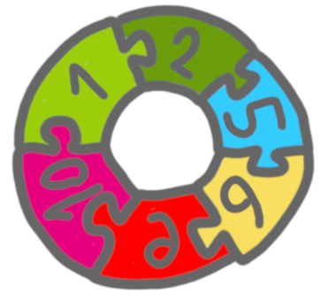

One of my area of research if the study of algorithms that are 
distributed (in space but also in time), and that are local, in the sense
that the decisions are based on the partial vision of the system/input. 
In this area (at least for classic distributed algorithms) a standard
technique is *indistinguishability*. 
The proofs using this technique often end up using some combinatorics 
results, and working on such a proof recentely I had to expand my 
combinatorics toolbox.
The purpose of this post is to give an intuition of
indistinguishability, and to list a few results that are 
useful to me.

## Let's start with a jigsaw puzzle

Suppose we want to design a jigsaw puzzle that only leads to 
configurations that are "waves", like this one:

{: .center-image width="80%"}

Suppose that you have designed the pieces in such a way that not 
only the configuration above works, but also this one:

{: .center-image width="80%"}

Now, there is a problem: by using only connections that already appeared 
in the two waves above (thus that are "correct"), we can create following
configuration, that is not a wave, but a circle.

{: .center-image width="35%"}

That is, it was not possible to create pieces that would work
with both wave instance, but not with the circle. 

A way to see this is that, if we want to allow waves with these color 
patterns, but not circles, then we need more global rules than just "this 
pieces fits with this one". 
For example, we could specify that there cannot be three pieces
in a row that have the "same curvature" (eg after two hill-shaped pieces, 
we want a valley-shaped piece).

Taking one more step in the generalization, this is an example of a 
global properties that cannot be reduced to a collection of 
very local properties. 
In other words, with a "local view", one cannot distinguish between correct 
configurations and incorrect configurations.

## Indistinguishability for algorithms

The idea of indistinguishability proofs is basically the one above. 
If the algorithm is too local (= does not see enough of the system), then 
it cannot lead to correct decision on all instances. 
Or more specifically, we can design a set of instances, such that if the 
algorithm is correct on these instances, then it will be incorrect on 
another instance. 
This is easier to get with decision problems: because of locality, 
accepting a set of *yes*-instances will automatically lead to also 
accepting a *no*-instance. 

The jigsaw example above can be translated into a more serious 
distributed graph algorithm lower bound. Suppose that you consider 
a directed network where the nodes have identifiers, and the nodes want to check 
that the network is a directed path. We want this verification to be 
very local, thus we restrict ourselves to algorithms where every node 
looks at its successor (if it has one), and either stay silent, or 
raises an alarm saying "this is not a path!". Can such an algorithm 
exists? No. 
Because on the instances $(0,1,2,3,4,5,6,7,8,9,10,11)$ and 
$(0,2,5,8,3,6,9,4,7,10,1,11)$ every node has to stay silent, 
which implies that on the cycle $(1,2,5,6,9,10,1)$ every node will stay 
silent, although at least one should raise the alarm. 

This is a simplistic example, but the same idea can work for much more 
subtle properties.

## Defining a meta-graph

A classic way to derive proofs by indistinguishability is to consider 
a meta-graph where the nodes are all the local views (and possibly the 
decisions of the algorithm on this view), and to put an edge between 
two nodes that correspond to views that are adjacent in some correct 
configuration. 

For example, in the jigsaw puzzle, one could have one node for every 
piece, and add an oriented edge between two pieces that can follow one 
another in a correct wave. 
Now, we could derive the contradiction from this graph: if we put the 
edges that correspond to our two example waves in this graph, then it
is not acyclic anymore, and by creating the instance that corresponds to 
a cycle, we create an incorrect configuration where everything is fine 
locally. 

## Handy extremal combinatorics tools

In real life, one might have to work quite
hard to prove that the meta-graph contains a sub-structure that corresponds
to an incorrect configuration. 

A useful result is the following:

**Theorem ([Bondy, Simonovits](https://www.sciencedirect.com/science/article/pii/0095895674900525?via%3Dihub))**
Any graph on $n$ vertices with at least $100kn^{1+1/k}$ edges contains
a cycle of length $2\ell$, for every integer $\ell \in [k,kn^{1/k}]$.

For example in 
[this paper](https://www.theoryofcomputing.org/articles/v012a019/) by 
Göös and Suomela, one first proves that considering enough *yes*-instances
leads to a large number of edges in the meta-graphs, and then use the 
result to conclude.

In other contexts, one may be interested in substructures that are not
cycles. Fortunately, there is a huge literature on this type of problems, 
sometimes called Turán-type theorems, because of 
[Turán number](https://en.wikipedia.org/wiki/Tur%C3%A1n_number). 

For example, if you look for a complete bipartite graph in a graph that is itself
bipartite, then the right pointer is 
[Zarankiewicz problem](https://en.wikipedia.org/wiki/Zarankiewicz_problem), 
and one upper bound is given by the Kővári–Sós–Turán theorem.

## One more tool about set intersections

In the proof I wanted to do, every edge had a set of colors, and in order to use 
Kővári–Sós–Turán bound, I needed to prove that there was a couple of 
colors such that the edges having both colors formed a large enough 
set.

In the end, what I needed was a result saying that for a ground set of a
given size, if there are many sets, and that every set is large enough, 
then there exists two sets with a large enough intersection. 

I struggle more than expected, but finally found the following lemma.

**Theorem (Corrádi):** Let $A_1, ..., A_N$ be $r$-element sets and $X$
be their union, if $|A_i \cap A_j| \leq k$, for every $i \neq j$, then:

$$|X| \geq \frac{r^2N}{r+(N-1)k}$$.
 
For the anecdote, I first found the lemma mentionned in these 
[lecture notes](https://homes.cs.washington.edu/~anuprao/pubs/CSE599sExtremal/lecture3.pdf)
where it is connected to 
[pseudorandom generators](https://en.wikipedia.org/wiki/Pseudorandom_generator), 
with a proof but no citation. Then I discovered that there was a wikipedia
article about this, [but only German](https://de.wikipedia.org/wiki/Lemma_von_Corr%C3%A1di). 
I could use the references and find the book 
[Extremal Combinatorics](https://www.mathematik.uni-muenchen.de/~kpanagio/draft.pdf), 
from which I took the formulation above.
   

