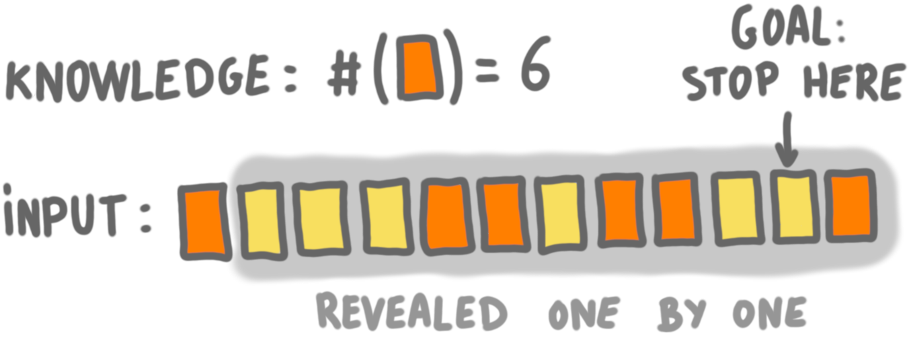
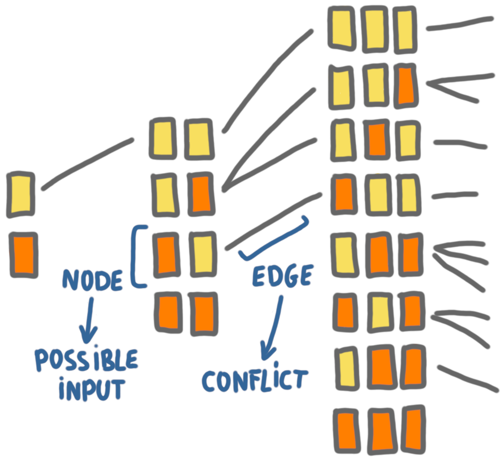
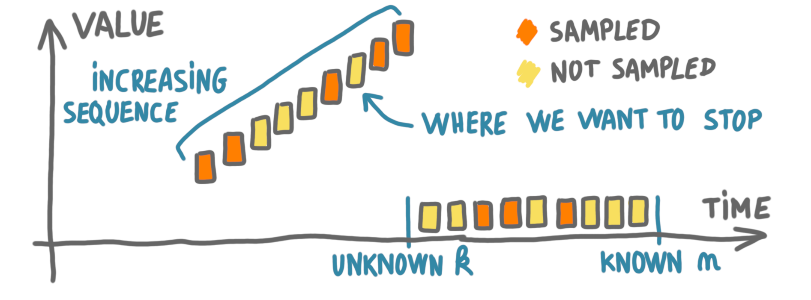

Last year, I wrote 
[a teaser](https://discrete-notes.github.io/teaser-secretary) about our 
SODA paper 
[The secretary problem with independent sampling](https://perso.liris.cnrs.fr/lfeuilloley/publications/secretary.html)
(joint work with 
[José Correa](https://www.dii.uchile.cl/~jcorrea/), 
[Andres Cristi](https://sites.google.com/view/andres-cristi),
[Tim Oosterwijk](https://sites.google.com/view/timoosterwijk/),
and [Alexandros Tsigonias-Dimitriadis](https://www.gs.tum.de/en/adone/participating-researchers/tsigonias-dimitriadis-alexandros/)).
Today, I'd like show how we could transfer a bunch of 
ideas from distributed computing to 
online computing to prove impossibility results. 
This is not a complete proof, but an overview of the techniques.

## The problem

The problem is an extension of the classic [secretary problem](Secretary problem): 

* An adversary chooses a set of $n$ numbers and orders them. 
* Then, for each number independently: with probability $p$, it joins the 
*sample set* ; and with probability $(1-p)$, it joins the *online set*. 
* The player is given $n$ and the sample set. 
* The numbers of the online set are presented one by one to the player, 
in the order chosen by the adversary. 
* The player wins, if and only if, she stops on the maximum of the online
set. 

See the [teaser post](https://discrete-notes.github.io/teaser-secretary)
for the origin of this problem.

## Context

Quite early in our study of the problem, we realized that a simple threshold
algorithm (the most common type of algorithm for secretary-like problems)
seemed optimal. Unfortunately, the classic approach in this area to prove 
optimality, which consists in proving that one can restrict attention to a 
specific set of algorithms, would not work with the sampling extension. 

We proved that the algorithm was indeed optimal, following a 
completely different paths: we showed an upper bound on the optimal 
performance, and that bound happened to match the performance of the 
threshold algorithm. 

I will now list a few ideas of this upper proof. 

## Playing with parameters

A classic assumption in secretary-type problems is that the player 
knows the length $n$ of the sequence. This can be questionned, since in 
real life one might not know this length, but it prevents silly 
counter-examples, *e.g.* when there is only one number. 

To make our life easier, we tried to 
remove the assumption that the player knows $n$, and checked what would 
happen. Note that since we have the sampling set
(and know the sampling probability $p$), we still have some estimate of 
$n$. 

This idea of playing with the assumptions regarding the knowledge of the 
parameters is common in distributed computing, where one might assume
(or not) that the nodes know the size of the network, the maximum degree, etc. 

Also, we assume for now that $p=1/2$, and that the algorithm must be deterministic.

## More structured instances and reduction

A second idea that is common in the distributed computing community is 
to consider the easiest possible problem we cannot solve. 
Here the idea was to make the simplifying assumption, that the adversary 
does not chose the ordering of the numbers: they are presented in increasing 
order. 
If the player knew the length of the sequence, then this would be trivial, 
since the maximum is the last value. 
But without this knowledge, it's not so easy. 

The problem becomes equivalent to what I call the "Last yellow card game":

* There are $n$ cards, where $n$ is unknown to the player.
* There is a deck of $n$ cards, and each of them is yellow with 
probability 0.5 or orange with probability 0.5.
* The player is given the total number of orange cards.
* The cards are revealed one by one, and the player should stop 
on the last yellow card.

{: .center-image width="70%"}

## Identifiying indistinguishability situations

As mentioned in the 
[previous post](https://discrete-notes.github.io/indistinguishability-tools),
indistinguishabilty is a classic technique in distributed computing. 
It consists in finding two situations in which the algorithm should make 
different decisions to be correct, but cannot, because it has the same 
view of the system. Here is how we can adapt this technique to our setting.

Consider two instances of the game: 
* Instance 1: the sequence of cards is yellow, yellow, orange.
* Instance 2: the sequence of cards is yellow, orange. 

At the beginning of game the player cannot distinguish between these 
instances: she does not know the length, and for both instances, she knows 
that there is one orange card in the sequence and that the first 
card is yellow. 
Then, either in this situation she decides to stop, in which case she
 wins in Instance 2, but looses in Instance 1, or she decides to 
continue and then looses in Instance 2, and maybe win in Instance 1 
(if she stop on the second yellow card).

In other words, these instances are in conflict: no algorithm can win in 
both. 

## Building a conflict graph

One of the classic results in distributed graph algorithms is the 
$\Omega(\log^*n)$ lower bound of Linial for coloring. The proof of Linial
consists in building a meta-graph, where every vertex represents a neighborhood 
at some distance $d$ in the original graph, and then to study this graph. 
We use the same type of idea.

We build an infinite graph, where the vertices are all the possible 
instances (that is all the sequences of orange and yellow). The edges
represent the conflicts between the instances. 
For example, on the 
picture below, we can see an edge between yellow-orange and yellow-yellow-orange. 
 
{: .center-image width="70%"}

Actually, the picture does not show all the edges of the graph, only the 
ones between instances of consecutive sizes.

Now, the key property is that for any algorithm $A$, the instances where 
$A$ succeeds form an independent of the graph, because of the 
indistinguishability argument.

We study the structure of the graph (which takes a few pages), and prove 
upper bounds on the size of such independent sets, which translates directly
into upper bounds on the performance of any algorithm.
(The performance is measured as the minimum on $n$ of the probability of
winning on instances of size $n$, which is why it is meaningful to consider the 
instances ordered by size.) 

## Generalizing

Now that we have the result for the modified problem, with unknown length
and increasing order, we have to go back to the original setting. 
We do this by considering that the adversary chooses some secret time 
$k$, and put numbers in increasing order until $k$, and then chooses only 
low numbers like the picture below. It is easy to see that this simulates 
the previous case.

{: .center-image width="90%"}

Removing the assumption that the algorithm is deterministic and that 
$p=1/2$, only requires a more intricate analysis of the conflict graph.
  

 

