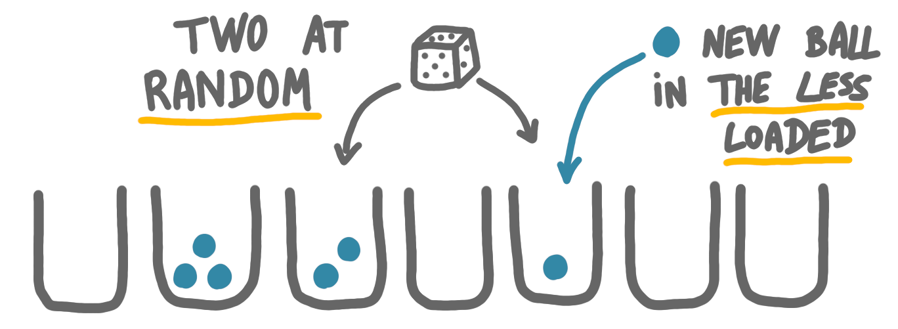
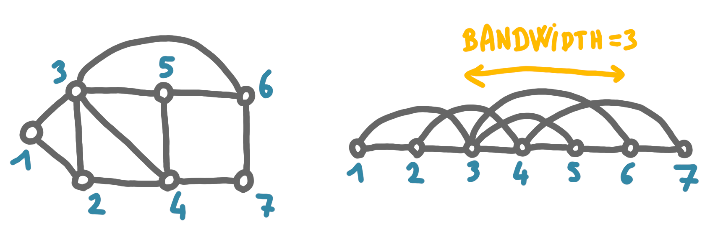
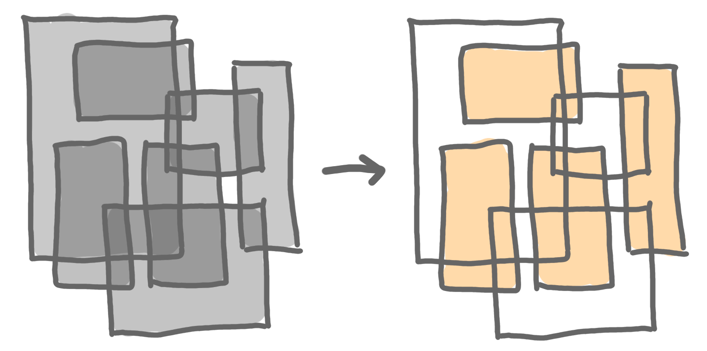
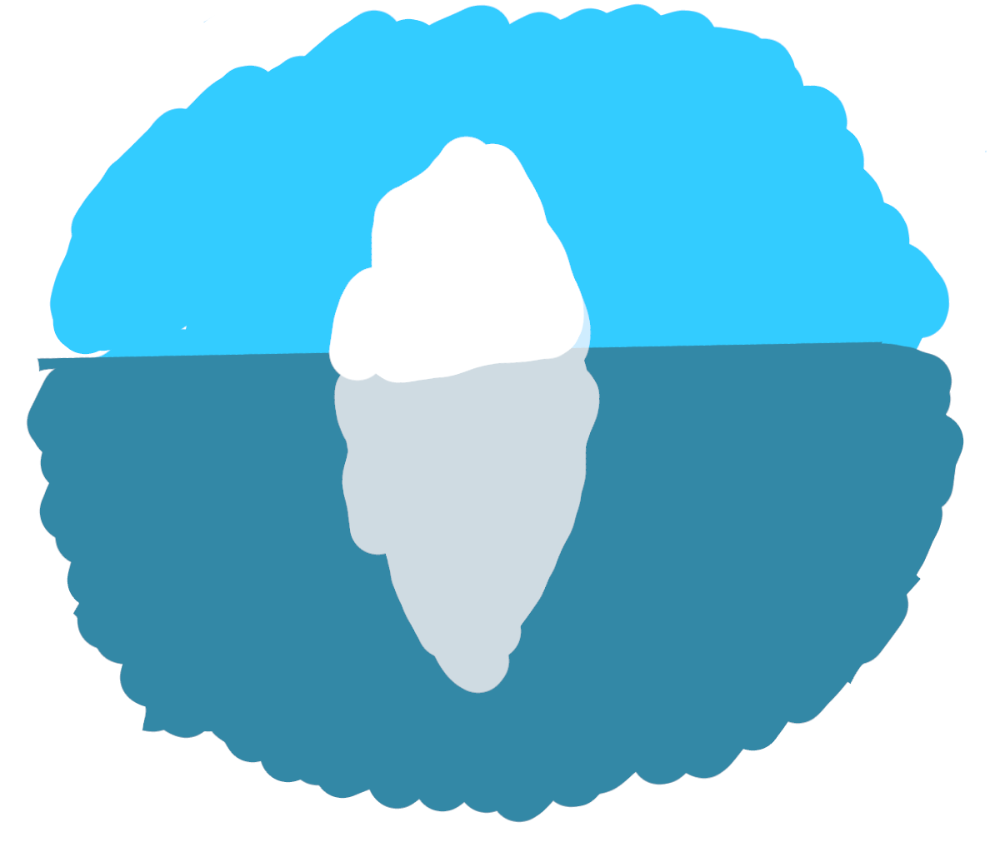
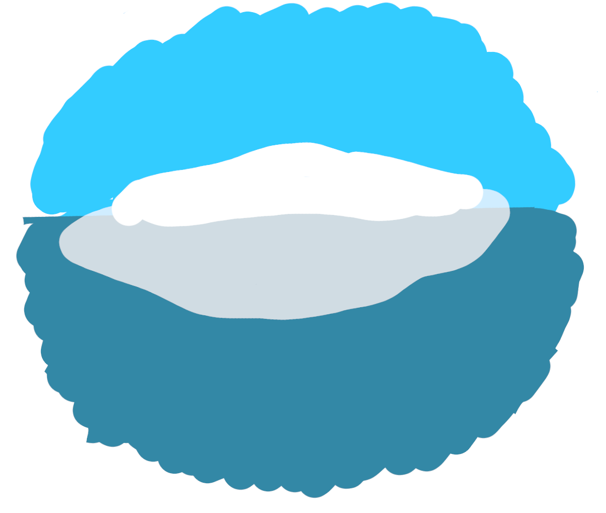

It's been almost a year since the last set of technical notes and I've been 
piling up topics to blog about. I'll try to empty the list through a series of 
spring cleaning blog posts. 

{: .center-image width="60%"}

## The power of two choices

The "power of two choices" is a neat idea and a surprizing theorem, with
(really) useful applications.
What follows is based on 
[this survey](http://libeccio.di.unisa.it/ASDII/2006/Approf/mitzenmacher.pdf).

Consider the following simple scenario: $n$ balls are placed into $n$ bins, 
following some rule. 

* First rule: place it in the least loaded bin of all. At the end you get 
one ball per bin, but you have to check the load of the bins at every step.

* Second rule: do it at random. There is no checking involved, but the 
maximum load at the end is around $\log n$, with high probability.

How to interpolate between these two, to have little load checking and 
sublogarithmic maximum load? 
The good idea for a third rule is: take two bins at random, and place the 
ball in the least loaded bin. 

{: .center-image width="80%"}

The checking is limited: there are only two bin to check. 
What about the maximum load at the end? One can prove that it is 
$O(\log \log n)$ with high probability, which is small for every (?) 
practical context. 

The work around this idea has been awarded the 
[Paris Kanellakis Award](https://en.wikipedia.org/wiki/Paris_Kanellakis_Award), 
that honors theoretical works having significant impact in practice. 
(The authors are Yossi Azar, Andrei Broder, Anna Karlin, Michael Mitzenmacher, 
and Eli Upfal). The laudatio for the award cites hashing 
and load balancing as applications, and more specifically "i-Google's web 
index, Akamai’s overlay routing network, and highly reliable distributed 
data storage systems used by Microsoft and Dropbox".
 
As for the proofs, they are quite non-trivial because of the conditioning 
between the different random events. The survey mentioned above explains the 
different techniques and ideas.

## Scaffolding

Scaffolding is a graph problem (or set of problems) stemming from 
bioinformatics. It has been in my things-to-blog-about list since it was 
mentioned in the talk 
[Graphs in phylogenomics, a few applications](https://www-sop.inria.fr/coati/events/JGA2020/presentation/mardi-aprem/44-Scornavacca.Celine.pdf) by 
[Celine Scornavacca](https://sites.google.com/view/celinescornavacca)

The context of the problem is the reconstruction of a biology sequence, such 
as DNA. In the first stage of DNA reconstruction, we might be given some 
very small pieces of DNA, and it might might not be too hard to assemble them 
into larger chunks. But then we have to do scaffolding: given a large set of 
medium-length strings, we have to put them together, and it is not clear
from the strings themselves how to do that.

We have to use external knowledge. For example, for two strings $A$ and $B$
of our input, we know that $A$ contains a substring $A'$, that is 
often found not too far from substring $B'$ of string $B$, with some padding 
$C$ in between. We want to get the most plausible combination of strings 
with respect to this knowledge.

In the talk mentioned above, the algorithmic problem was to build
the longest (or heaviest) path alternating between strings of our input, 
and weighted strings of padding. 

In 
[this paper](https://publications.mpi-cbg.de/Huson_2002_6349.pdf), 
the knowledge is of the form: the distance between this string and that 
string should be in some interval [min, max]. One can then ask whether it 
is possible to find a single string, that joins together all the strings of 
the input, and satisfies all the constraints. 
It is proved in the paper 
that this second problem is NP-complete, by a pretty direct reduction to 
the bandwidth problem. 

The bandwidth problem consists, given a graph and an integer $K$, to find a
vertex ordering $\sigma$ such that for every edge $(u,v)$, 
$|\sigma(u)-\sigma(v)|\leq K$.

{: .center-image width="90%"}

(Note that "bandwidth" is maybe not the best name, given that the important 
parameter is more similar to a stretch of the edges than to the natural 
notion of bandwidth that would be the number of edges stacked one on top of 
another. But the two notions are intuitively related.)

## Independent set of rectangles

The maximum independent set of rectangles problem is following: given a set of
axis-aligned rectangles, find the largest set of rectangles that do not 
intersect. 

{: .center-image width="80%"}

The key question on this problem is: Does there exist a polynomial-time
constant-approximation algorithm?

I've worked on this problem in 2013, and we gave a positive answer in a 
special case. Last year, I was amazed to discover on the arxiv 
[a paper](https://arxiv.org/pdf/2101.00326.pdf) 
by Joseph B. Mitchell solving the general problem (FOCS 2021). 
The only sad thing was that the approximation constant was large. 
But later the constant was brought down to 3 by Waldo Gálvez, Arindam Khan, 
Mathieu Mari, Tobias Mömke, Madhusudhan Reddy Pittu, and Andreas Wiese 
(SODA 2022). Great!

## Review/submission balance		

At the end of 2021, I wanted to measure my balance between reviews and 
submissions. There are several obstacles, first one should count fractions 
of submissions, since a paper submitted with eight authors should weight less
than a solo paper. Also a journal paper takes more energy to review than 
a conference paper, and there might be several revisions. 

At the end, I couldn't find a precise and meaningful way to measure the 
balance, but as my ratio conference/journal is similar for submissions and
reviews, and as the number of authors of my paper is usually three, that 
is approximately the number of reviewers of a paper, it is relevant to just 
count in the simplest way possible. 

In 2021, I both submitted and reviewed more than the previous years, and 
both counts are around 12, so probably quite balanced.
 

## Iceberg orientation

Finishing with a bit of fun. One often pictures an iceberg as a kind of 
tower of ice, with only the roof being above sea level, like on the picture 
below. 

{: .center-image width="60%"}

Actually, this type of orientation is unstable, and a stable orientation 
would look more like this.

{: .center-image width="60%"}

This was reminded Megan Thompson-Munson in
[this twitter thread](https://twitter.com/GlacialMeg/status/1362557149147058178?ref_src=twsrc%5Etfw), 
and then Joshua Tauberer made 
[this webpage](https://joshdata.me/iceberger.html), where you can draw an 
iceberg shape and see how it would stabilize.

