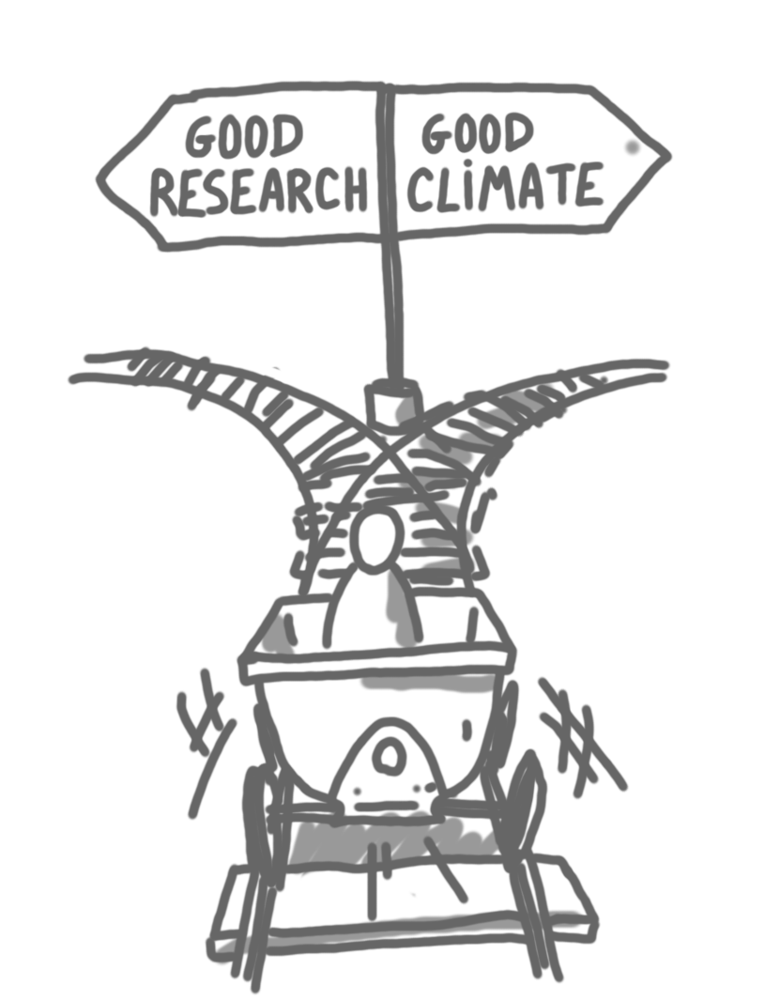

There has been a lot of discussion in the CS research community about the 
"conference culture": the fact that the 
main publications in our field are conference publications, and its 
consequences.

In this post I would like to discuss just one bad aspect: traveling to 
conferences is bad for the climate. 
I propose to consider one modification to the system, which is to remove 
the rule that one has to attend the conference to have the paper in the 
proceedings. 
I will summarize quickly the motivation and proposal, and then try to discuss the 
issues of this proposition. 

## The carbon-recognition correlation

Prestigious publications are crucial to us: it is the way to get a 
permanent job, to get funding, and to be recognized by the peers. 
In CS, the prestigious venues are the international conferences, and 
attending international conferences very often involves flying.
In other words, our system creates a correlation between recognition of our
work and carbon emissions. 

It is safe to say that this is a wrong incentive, given the current climate 
crisis.

{: .center-image width="65%"}

Before going further, let me comment on the answer that would be "yes, 
it is bad for the planet, but our job is important, others should make the 
effort, not us". 
One could argue about how solid this opinion is, but instead I'd like to 
make two points. First, not everybody in the community 
thinks the same way, and we should try to create space for these other people. 
Second, it is very improbable that in 20 years the conference system will 
still work as it does, so it is good to start changing some things now. 

## What to change?

There has been intense discussion about what to change in the system: moving to 
a journal system (like in maths), stopping some conferences, etc. 
These are important discussions, but the proposed changes are big steps, 
and as a community it is difficult to take such steps. A friendly 
atmosphere is somehow needed to keep doing reasonably good and fair 
science, and bold moves create animosity.

A small step I propose to consider is removing this one sentence that 
every CFP has: "Any submission accepted into the technical program but not 
presented on-site will be withdrawn from the final proceedings" 
(this one is from DISC 2022 CFP). In other words, I propose to abolish 
mandatory attendance, and to allow people who do not want to attend 
physically to have recorded talks or online talks.

In this post, I don't want to discuss what would be the exact replacement, 
which kind of hybrid conference would be the best, etc. Also, since this is 
a small step, that could be reverted or be followed by other
changes, I don't want to discuss what would be the dynamic in the long run. 
Let's say that we discuss what would happen if we do this for five years. 

## Critics and answers

Below I have listed some critics of this proposition, and tried to answer 
them. 

### The travel-publication correlation is good for some people

I have used the expression "carbon-recognition correlation" to highlight 
the bad aspects of the current system, but for some people the correlation 
between having good publications and traveling to conferences is actually a 
good one. 
The typical reasoning would be: "For my work I need to meet my colleagues
regularly. My institution/grant would pay for traveling only if it 
yields to more prestige. I can trade high-level publications for travel 
funding thanks to mandatory attendance."

This is a real phenomenon, but I would like to discuss two aspects. First, 
it does not affect every researcher. Some have enough money anyway, and can
for example go to workshops that do not yield to publications. 
Some would not get any funding anyway, because they don't have grants, and 
their institutions would not fund the trip to a conference. 
Only the people in between would be hurt by the change. 
Second, it is very bad if these people are indeed hurt. But, note that with 
the current system there are already people who want to attend and cannot. 
My opinion is that we have to tackle this problem in a more satisfactory 
way than by a kind of extortion. Maybe some travel grants, maybe more local 
events, etc. 

### Mandatory attendance is good for organizers

As a local organizer I see that mandatory attendance is very reassuring: 
you know that approximately X papers will be accepted, thus there will be at 
least X people, and this is useful when balancing the budget. 

I would answer that: (1) anyway, there is always some fraction of 
the participants who do not present a paper (so X is just a lower bound), 
(2) after the first year without mandatory attendance, one would already 
have some statistics, (3) workshops (even large ones in maths) have done 
this for years, and (4) asking early for registration or some kind of 
soft commitment could help.

Of course, it is very difficult to be a local organizer, and it is pity to
make the job even more difficult, but I think it is worth it.

### Hybrid conferences have issues

I think everybody now knows that hybrid conferences are sometimes not great. 
In the following I'll take the perspective of someone who 
would attend onsite, since people who attend online would have made this 
choice, knowing the difficulties.

Problem 1: Recorded/online talks are not as good as real talks. This is quite
true, partly because of technical problems, partly because seeing people 
for real is a better experience. But I would argue that anyway, conference 
talks in general are not very good, and that I prefer a good recorded talk 
to a bad live talk. That is, there is a much larger difference between the 
talks themselves than between "technologies", so it is more important to 
optimize the first, not the second. Also note that recorded talks could go 
through a round of reviews+revision, which could improve the quality of lot.

Problem 2: It is not convenient to communicate with people that are not 
on-site. Again, I partly agree. For the questions at the end 
of talks, I think that anyway, they are not always useful (either too specific, 
or too general, or just odd). For the little chat at the coffee break, 
at the restaurants, breakfast, yes indeed, we are loosing quite a lot with 
hybrid. Beyond just the fun of it, these discussions build trust, which is 
essential when one needs someone for advice, for reviews, for collaboration, 
and more generally to build a community. 
I hope this trust can be created a bit differently, via 
internet, or with more local people, or during fewer events that could 
maybe be longer, etc. Again, other communities do not use so many 
international conferences, and they seem to work pretty well. 

## More comments

I got some feedback on the first version of this post, and here are two 
things I forgot to mention: 

* One way to relax mandatory attendance without completely removing it 
is to require that people present their papers on-site at some point.
For example it could be in the 3 years after publication, and if there are 
several conferences of similar strength in the field (eg DISC/PODC), one 
could maybe choose which one to present at. Then one could choose the 
conference place that is closer to her/his place. 
We could call this delayed mandatory attendance. 

* There is one aspect that is not related to climate change, but has to be
mentioned to balance the drawbacks of hybrid I mentioned: for some people
it is very difficult to get visas to go to conferences, thus having 
something online is much better for them. 

(Thanks to Joel and Darya, for pointing this out.)

