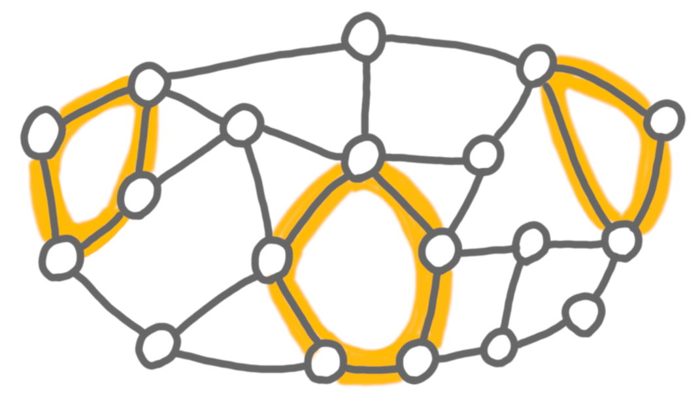
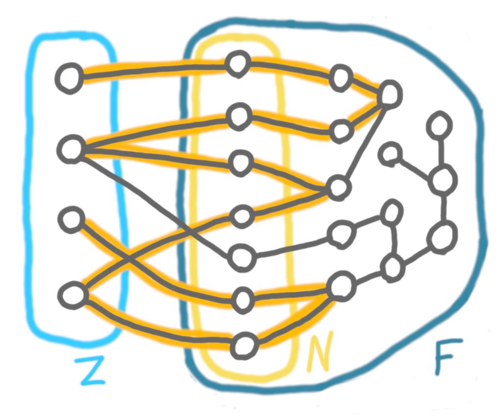

A classic exercise when studying shortest paths algorithms is to prove that
there can be an exponential number of shortest paths between two vertices. 
Such proofs are usually based on graphs that look like this:

{: .center-image width="80%"}

The core idea is that when there is cycle, you can go around it on one side or
the other, and if you stack many such cycles, then you have a large number 
of choices to make, which creates lots of paths.
To streamline the question we can remove the notion of shortest paths, and
just look at the number of [induced paths](https://en.wikipedia.org/wiki/Induced_path)
in a graph. Stacking cycles is still a good option for those.
An interesting question now is: can you create many induced paths without 
using a series of cycles?

There has been very recent progress on this question, with the preprint 
[Induced paths in sparse cycle-touching graphs](https://arxiv.org/abs/2212.01089),
by [Tung H. Nguyen](https://web.math.princeton.edu/~tunghn/), 
[Alex Scott](https://people.maths.ox.ac.uk/scott/), and 
[Paul Seymour](https://web.math.princeton.edu/~pds/). (I got interested in 
the question after having worked on this a bit, see the end of the post.)

## Sparse cycle-touching graphs

A way to formalize the notion of "stacking cycles is cheating" is to 
consider graphs that are *s-cycle-touching*, that is, 
there does *not* exist $s$ cycles that are vertex-disjoint and have no edge 
joining them. For example, in the following picture we can find three such 
cycles (that are highlighted), but not four, thus the graph is 4-cycle-touching.

{: .center-image width="70%"}

Very little is known about these graphs: we don't even know how to recognize 
2-cycle-touching graphs efficiently. 
One way to tame this class is to enforce some kind of sparsity, by forbidding large 
[biclique](https://en.wikipedia.org/wiki/Complete_bipartite_graph) subgraphs 
(that is, considering $K_{tt}$-free graphs). 
With this assumption, it was proved recently that sparse
$s$-cycle-touching graphs (also called $O_k$-free graphs) have logarithmic-in-$n$ 
[treewidth](https://en.wikipedia.org/wiki/Treewidth) (See 
[Sparse graphs with bounded induced cycle packing number have logarithmic treewidth](https://arxiv.org/abs/2206.00594) by 
[Bonamy](https://www.labri.fr/perso/mbonamy/),
[Bonnet](https://perso.ens-lyon.fr/edouard.bonnet/),
[Déprés](https://perso.ens-lyon.fr/hugues.depres/),
[Esperet](https://oc.g-scop.grenoble-inp.fr/esperet/),
[Geniet](https://perso.ens-lyon.fr/colin.geniet/),
[Hillaire](https://www.labri.fr/perso/chilaire/),
[Thomassé](https://perso.ens-lyon.fr/stephan.thomasse/),
and [Wesolek](https://www.sfu.ca/~agwesole/index.html), SODA 2023).

## The theorem and a tiny bit of the proof

The main theorem of the Nguyen-Scott-Seymour paper is the following. 

**Theorem:** For all integers $s,t > 0$ there exists $c>0$ such that,
if $G$ is $s$-cycle-touching and does not contain $K_{tt}$ as a subgraph, 
then $G$ has only at most $|G|^c$ induced paths. 

In other words, in sparse graphs, the only way to have exponentially many 
induced paths is to have many independent cycles.

The proof seems quite technical (although fairly short in its current form). 
I have looked at the sketch of the idea of the proof, and here is a glimpse
of a summary of it. 

First, the paper crucially uses the SODA 2023 paper cited above, which 
establishes that not only do the graphs we are interested in have 
logarithmic treewidth, but they have logarithmic 
[feedback vertex set](https://en.wikipedia.org/wiki/Feedback_vertex_set). 
A feedback vertex set (or cycle-hitting set) is a set of vertices whose 
removal cuts all cycles, that is, after removing this set we are left with 
a forest. In the following drawing, $Z$ is a feedback vertex set, and $F$ 
is the remaining forest.

{: .center-image width="70%"}

(The drawing is arguable stupid, since there is only one cycle, but let's
keep it simple.)

Let $N$ be the set of vertices of $F$ that are adjacent to a vertex in $Z$. 
The core of the proof consists in studying a special case in which $Z$ is an 
independent set, each vertex of $N$ has exactly one neighbor in $Z$, 
and all the paths we are interested in go through all the vertices of $Z$, 
and have both endpoints in $Z$. 
In this case, the key lemma is that $N$ has basically the same size as $Z$.
One of the ingredients for this lemma is [Erdős–Pósa theorem](https://en.wikipedia.org/wiki/Erd%C5%91s%E2%80%93P%C3%B3sa_theorem).

This is good, because it means that the number of edges between $Z$ and $N$
is of order $O(|Z|)=O(\log n)$. 
Then we can enumerate all the sets of edges of $(Z,N)$, and for each such
set there is at most one path using it (under the conditions listed above).
This means that we have $2^{O(\log n)}=O(n^c)$ paths: a polynomial number.

## Some context

The motivation given at the beginning of this post is not the 
motivation for the paper. The original motivation is this fact that we don't 
know how to recognize 2-cycle-touching graphs efficiently. 
If one can prove (without the sparsity assumption) that the number of paths 
is polynomial in such graphs
(which is Ngoc-Khang Le's unpublished conjecture), then it solves the 
recognition problem, since one can enumerate the cycles and check whether 
they are touching. 

[Lena Yuditsky](https://sites.google.com/view/yuditsky/home),
[Nicolas Bousquet](https://perso.liris.cnrs.fr/nbousquet/), 
[Théo Pierron](https://perso.liris.cnrs.fr/tpierron/) and I worked on this
problem for a few days some months ago, thanks to 
[Nicolas Trotignon](https://perso.ens-lyon.fr/nicolas.trotignon/) who told 
us about Le's conjecture. We had some partial results but nothing good 
enough to be written down. We are happy to see that there is some progress!

---

As usual, please email me if you see any writing or scientific mistake.

