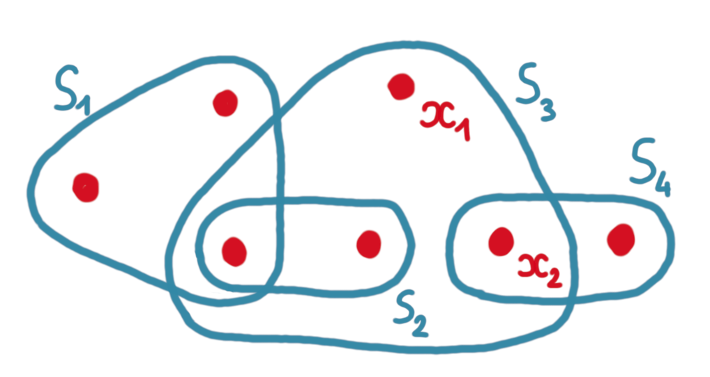
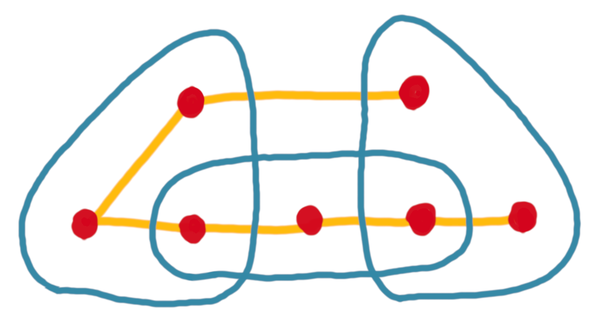
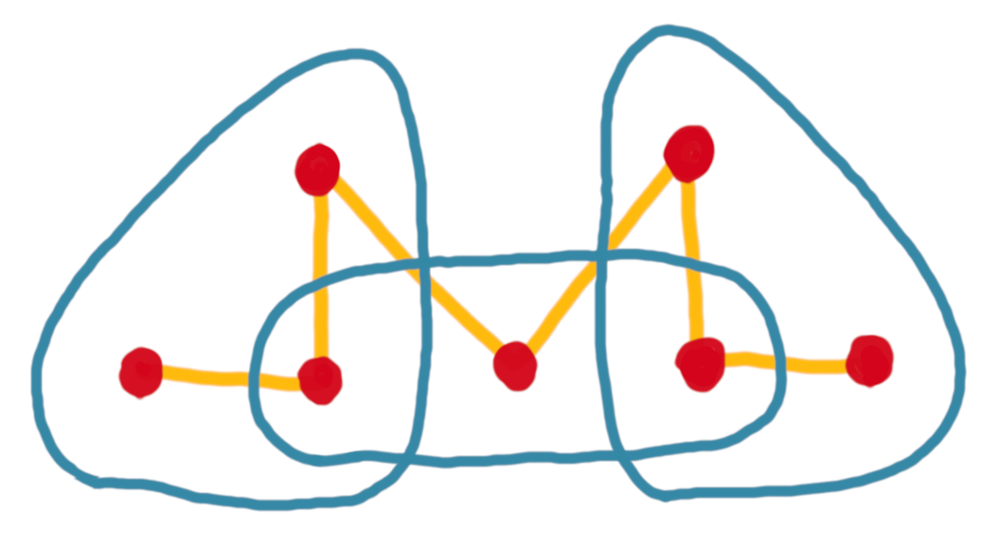
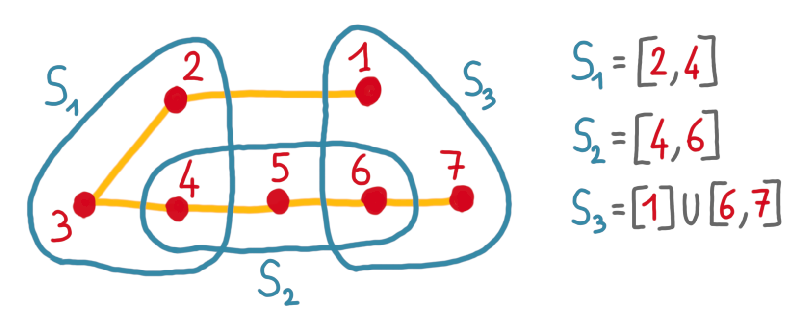

In December, I participated in an algorithms/OR 
[mini-workshop](http://gdrro.lip6.fr/?q=node/294), where I attended the talk 
of [Mónika Csikós](https://csikosm.github.io/) about her work on low 
crossing number 
([this paper](https://drops.dagstuhl.de/opus/volltexte/2021/13827/pdf/LIPIcs-SoCG-2021-28.pdf), 
with [Nabil Mustafa](https://lipn.univ-paris13.fr/~mustafa/index.html)). 
Here is a glimpse of it.

## Set systems and crossing number

A *set system* $(X,S)$ is just a ground set $X$ with a family of subsets $S$. 
Alternatively, you can think of an hypergraph, with a set of vertices 
(the ground set) and hyperedges (the subsets). 
I will use both points of view. (In the picture below, $S=${$S_1, S_2, S_3$}.)

{: .center-image width="70%"}

Now, consider a pair of vertices $x,y \in X$. Such a pair *crosses an hyperedge* 
if it has one endpoint in the hyperedge, and one endpoint out of it. 
For example in the picture above $(x_1,x_2)$ crosses $S_4$ (but no other 
hyperedge).

We are interested in computing a graph $G$, whose vertex set is equal to
the vertex set $X$ of the hypergraph, and whose edge set $E\subseteq X^2$ is 
such that: 

* it satisfies some structural constraints, for example being a spanning 
path (variants could be a spanning tree or a perfect matching) ; 
* it has *low crossing number* which means that for every hyperedge $S_i$, the 
number of edges of $G$ crossing $S_i$ is small. 

For example, below are two spanning paths for the same set system. The first 
one has crossing number 2 (every hyperedge is crossed at most twice), while 
the second has crossing number 6, because of the middle hyperedge. 
 
{: .center-image width="65%"}
{: .center-image width="65%"}

## An application 

These structures have a lot of applications in geometry, theory of ML, and 
discrepancy theory. 
A simple example is the following:
suppose you have a huge set system, and you want to succinct data structure 
to answer queries of the form 
"list the points in hyperedge X". If you have a spanning path with 
low crossing number this can be done very efficiently. 
Indeed, you just have to store the points in the order of the path, and then
for every hyperedge store a few intervals.
This is because for any hyperedge the path crosses the border only a 
small number of times, and it is enough to remember what are the points of 
entry and exit. See the picture below.

{: .center-image width="90%"}

## A condition for existence 

To get some intuition about the crossing number, consider a
hypergraph that contains all the possible hyperedges on a set of $n$ vertices. 
This hypergraph does not have a spanning path of crossing number lower than 
$n-1$. 
Indeed, for any path, the hyperedge that takes every 
other vertex of the path is crossed $n-1$ times. Se the picture below.

{: .center-image width="80%"}

In the following, when we say "low crossing number", we mean "crossing number 
$o(n)$", and the example above shows that we cannot always hope for a 
spanning path with a low crossing number. 
But bounding some structural parameters of the hypergraph allows to go reach this 
$o(n)$ regime. Specifically:

**Theorem:** If the dual VC dimension of $(X,S)$  is at most $d$, then $X$ 
has a spanning path with crossing number $O(n^{1-1/d})$.

I don't want to define the dual VC dimension here, since it is not needed 
for the rest of the post, and it is a bit of a mouthful. But let's just 
say that bounding it rules out the behavior above, and many natural 
hypergraphs do have a bounded dual VC dimension (including the ones arising 
from geometry, which is one of the main applications of what we discuss here).

## The previous algorithm

In 1989, Chazelle and Weyl gave a polynomial algorithm for computing a 
spanning tree with low crossing number (see [this paper](https://link.springer.com/content/pdf/10.1007/BF02187743.pdf)) under the assumption of the theorem above. 
The main contribution of Csikós-Mustafa paper is to improve greatly on the 
time complexity by modifying the algorithm in several clever ways.
For the explanation we will keep the example of a spanning paths, but again 
it could be a spanning tree or a perfect matching. 

The original algorithm 
follows the intuition of the 
[multiplicative weight update method](https://en.wikipedia.org/wiki/Multiplicative_weight_update_method). 
The algorithm defines and updates a *weight for every hyperedge* and a
*cost for every edge* (here edge simply means an element of $X^2$, or in 
other words, we start with a clique).
The *cost of an edge* will simply be the sum of the weights of the hyperedges 
it crosses. 
Here is a pseudo-code. 

1. Initially, every hyperedge has weight 1.
2. For $i=1$ to $n-1$:
* Select an edge $e$ with minimum cost, and add it to the path. 
* Double the weight of any hyperedge that is crossed by $e$.
* Remove all vertices that have two incident edges selected (ie those that do
not need more edges, since we look for a path). 

Intuitively, here is what's going on. Since, we want to minimize the 
maximum crossing number of an hyperedge, one wants to keep an eye on the 
hyperedges that are already crossed by a lot of selected edges, and try to 
avoid adding even more edges crossing them. 
In the algorithm, an hyperedge in this situation will have a high weight, 
hence in general the algorithm will not 
pick an edge that is crossing it. The magic of the 
multiplicative weight update method (and of the dual VC dimension) is that 
doubling the weights allows to get theoretical guarantees on the outcome. 

Now the complexity of this algorithm is basically the cost of 
finding the edge of minimum cost for each iteration of the loop, which 
leads to $O(mn^3)$ (where $n$ is the size of $X$ and $m$ is the size of $S$).

## Key new idea: sampling edges

The new algorithm achieves the better complexity of $\tilde{O}(mn^{1/d}+n^{2+1/d})$. 
The dependency in $d$ might seem counter-intuitive: the larger the parameter, 
the fastest they solve the problem. But remember that the goal is to compute
a spanning path with crossing number $O(n^{1-1/d})$, hence the target becomes 
easier to reach when $d$ increases.

For the new algorithm, the key idea is to avoid 
the costly procedure of finding the edge with the smallest cost. 
Instead, we will do some sampling. That is, we define *weights for edges*, 
and sample according to these weights, which is means that the probability 
of picking an edge will be proportional to the weight.
Just to clarify the vocabulary: now both edges and hyperedges have weights, 
and there are no cost anymore. 

So how do we update the weights of the edges in order to give more weights 
to the ones that do not cross already-heavy hyperedges? One way would be, 
for every edge, to go over the hyperedges it crosses, and compute some weight, 
but we would revived the $O(mn^2)$ we want to avoid. 
Instead the edge weight update will itself depend on a sampling. 

Here is the pseudo-code of the modified algorithm.

1. Initially, every hyperedge and every edge has weight 1.
2. For $i=1$ to $n-1$:
* Sample an edge $e$ according to edge weights, and add it to the path. 
* Sample a hyperedge $h$ according to hyperedge weights.
* Double the weight of any hyperedge that is crossed by $e$.
* Halve the weights of any edge that is crossing $h$.
* Remove all vertices that have two incident edges already in the path.

Thanks to sampling the complexity of each loop is much reduced. What is less
clear is whether this is good enough to lead to a good path. And the answer
is no a priori. 

## Even more new ideas

Something that makes the algorithm above deviate from the desired behavior 
is that the very innocent-looking last step of every loop (that is, removing 
the vertices that are useless) messes up the structure of the weights. 
And the error is amplified, iteration after iteration. What the authors do
is to reinitialize the weights periodically (a logarithmic number of times), 
to avoid too much deviation.

Finally, to gain even more on the complexity, they also do not fully perform
the weight doubling and weight halving, and again sample (uniformly this 
time) for this step. 

A very nice algorithm! And also an applicable one: the authors have an 
[open-access code](https://github.com/csikosm/LowCrossingMatchings) that
can handle large instances. 

