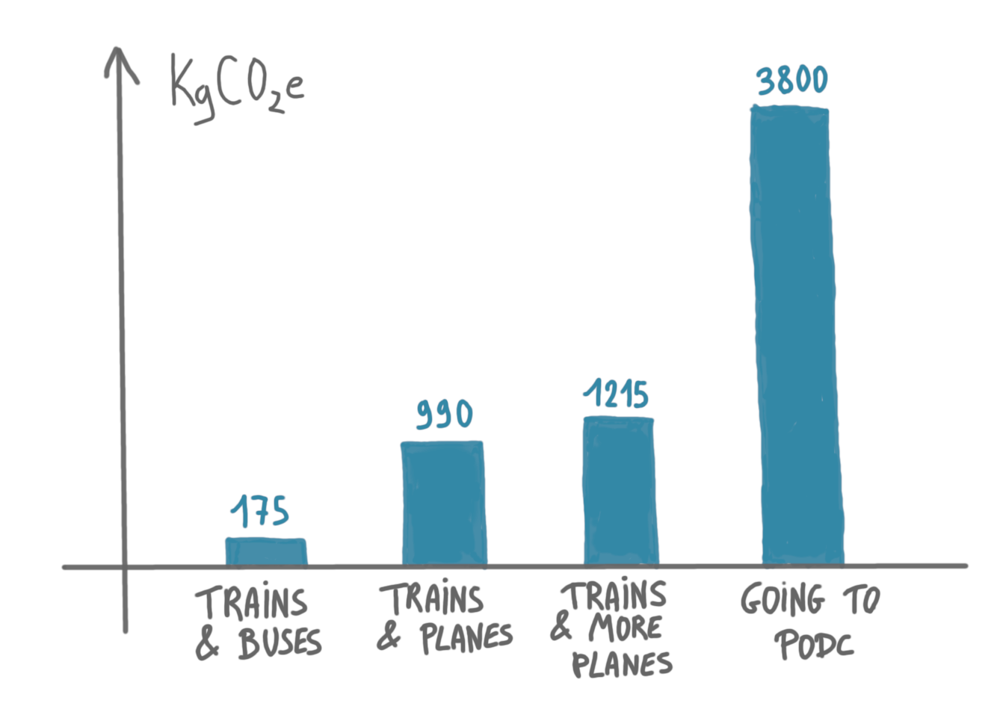

Following the work advertised in the previous post, about the carbon footprint
of conference traveling, I decided to estimate my own work-related travel footprint
for 2023. I have no precise expectation for this, I just want to get an 
idea of that number, and compare it with other scenarios, to see what makes a 
difference and what does not.

## List of trips

Here is the list of travels I made in 2023 for work. All were round trips from 
Lyon.

* Paris (three times) by TGV (fast train), which is the transportation choice 
that almost everybody would make ([except PSG football players](https://www.bbc.com/news/world-europe-62809829), maybe).
* Grenoble, a nearby city, by TER (regional train), again the natural choice. 
* Prague, for [HALG 2023](https://2023.highlightsofalgorithms.org/), by 
long-distance bus. I wanted to avoid flying, and train routes had too many 
connections to be reliable, so I took this opportunity to try buses. 
* Pisa, for [SAND 2023](https://2023.sand-conf.org/), with a mix of fast and 
regional trains.
* L'Aquila in Italy (that I will approximate by Rome), for
[DISC 2023](https://www.disc-conference.org/wp/disc2023/), 
again by long-distance bus. This was planned to be by train, but there were 
rockslides on the rails in the Alps. 

I'll discuss the bus option at the end of this post.

{: .center-image width="70%"}

## Rough carbon emissions estimates

For this post, I don't want to spend too much time fiddling with precise 
carbon emissions and precise connections, hence I will simply use the
following estimates (from [this webpage](https://www.sncf-connect.com/train/comparateurco2)):

* 3.5 gCO2e/km/traveler for TGV,
* 30 gCO2e/km/traveler for regional trains,
* 30 gCO2e/km/traveler for long distance bus,
* 260 gCO2e/km/traveler for plane. 

Also I use the road distance for train and bus, and the straight line distance 
for plane.

Two remarks here. First, the fast trains are extremely cheap in carbon in 
France (my three trips to Paris weight the same as my trip to 
Grenoble!). This is because electricity in France is mainly from nuclear 
plants, and also because TGVs have a lot of passengers, and have benefited 
from massive investments.
Second, I was surprised to learn that long-distance buses are just as good 
as regional trains. Intuitively a bus looks more like a car than a train, 
and is also smaller, so I would have guessed they emit more.

## Results

The following chart shows how much carbon is emitted for different scenarios:
the one I did with trains and buses, the one where buses are replaced by 
planes, the one where all trips abroad are by plane, and finally one where 
I would have made just one trip: going to 
[PODC 2023](https://www.podc.org/podc2023/) in Orlando.

{: .center-image width="90%"}

A few take-aways from this: opting out of attending PODC had a greater impact 
than abstaining from air travel for other trips, yet choosing buses over planes 
still had a significant effect. Remember that a reasonable carbon budget for 
one person per year is 1500kg (including both work-related and personal 
emissions).

## About long-distances buses

Long-distance buses are not a commonly chosen mode of transportation for 
attending conferences. They aren't even included as an option in the 
software my employer uses for planing trips. In some ways, buses combine 
the drawbacks of both planes and trains: the journeys are uncomfortable *and* 
time-consuming. The only thing that is convenient is that often one does
not need (many) connections.

If someone were to consider, 'Should I take a plane or a bus to get to 
conference X?' the prospect of spending 10 hours in close proximity to a 
stranger and making frequent stops at bus stations would likely be 
discouraging.

However, let's consider this from a different perspective: if I aim to keep 
my carbon emissions below a certain threshold and I'm contemplating attending 
conference X, then the only viable option might be taking a bus. Do I still 
want to go? In a way, the bus option broadens our possibilities within a 
given carbon budget.

(Side note: I tried using chat-GPT to improve some sentences here, which is why 
it might sound like my English much better than before suddendly improved!)

