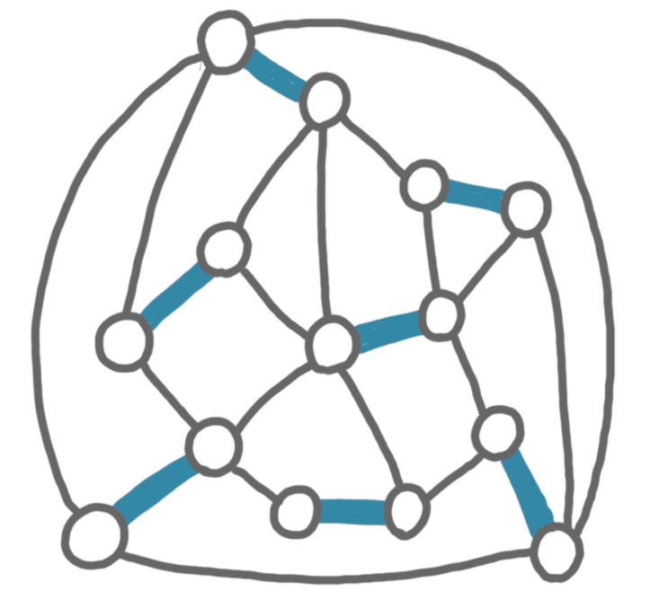

(In this post I will assume familiarity with the concept of local 
certification. If you are curious about this, my introduction to the area
is [here](https://arxiv.org/abs/1910.12747).)

Next week, Sébastien Zeitoun will present the paper 
[Local certification of local properties: tight bounds, trade-offs and new parameters](https://arxiv.org/abs/2312.13702)
at STACS, a joint work with Nicolas Bousquet and myself. 
The motivation for this paper, and our first main result is a proof that 
in order to locally certify that a graph is k-colorable, one basically 
needs to give the coloring in the certificates. But here I'd like to sketch 
a cute side result we have about matchings on planar graphs.

## Perfect matching certification

We want to certify that the graph at hand has a perfect matching. A natural 
way to do that is to give to every node the identifier of the neighbor 
it is matched to. Every node can easily check that this is consistent. 
But this takes $\Theta(\log n)$ bits. Can we do better? We have some related
lower bounds in the paper, indicating that probably not. But when the graph
is planar, we can do it with only two bits! 

## Contraction and four color theorem

Consider the following planar graph (with a perfect matching highlighted 
for the sake of the explanation).

{: .center-image width="70%"}

Now we contract the edges of the matching, keeping the adjcency if there was 
at least one egde linking the two pairs of nodes at hand. 
Because planarity is stable by contraction, the resulting graph is also 
planar. 

{: .center-image width="70%"}

By the [four color theorem](https://en.wikipedia.org/wiki/Four_color_theorem), 
there exists a proper coloring of this new graph with at most four colors.

{: .center-image width="70%"}

We use this coloring for our certification in the original graph: every node
is given the color of its contracted node. 

{: .center-image width="70%"}

Because this 
was a proper coloring in the new graph, there is exactly one node with the same 
color in the neighborhood: the one it is matched to in the perfect matching. 
It is easy to check that this is a correct certification, and it uses
only four different certificates, hence two bits.

