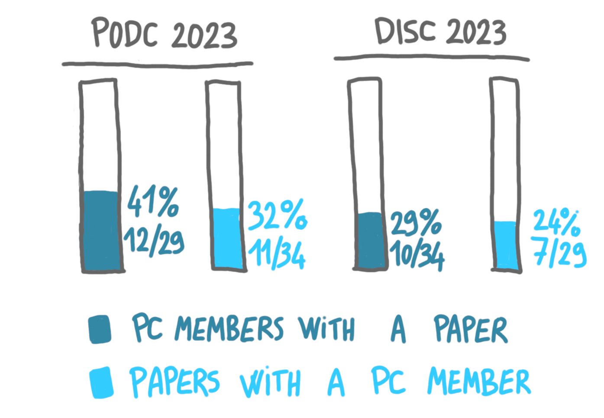

Mohammad Hajiaghayi 
[reports on the Computational Complexity blog](https://blog.computationalcomplexity.org/2024/01/guest-post-by-mohammad-hajiaghayi-on.html) 
discussions at SODA 2024's business meeting about submissions by PC members. 
There has been discussions in recent years at STOC/FOCS/SODA about whether
PC submissions should be allowed at all, but here the issue was 
the acceptance rate for PC member submissions. It ended up being much 
higher than the global acceptance rate: 42% versus 29%. The steering 
committee required the PC to lower the PC acceptance rate to 35%. 

Of course it is not clear in which proportions does this discrepency stems 
from unfair bias or from the possibility that individuals in the PC write 
better papers (after all they are arguably more notable reasearchers than 
the average).
I would argue that there is something in between: a community creates 
implicit standards of what a paper should look like, and people in the PC know 
these secret codes very well, while people more on the periphery do not 
know them. By the way, the SODA submissions are double-blind, but we know 
that this is only partially good to avoid bias.

I'm curious about the situation of PODC and DISC with respect to 
this topic. I don't have access to PC submission acceptance rates, but I 
quickly looked at the number of accepted papers co-authored by a PC member,
and at the number of PC members co-authoring a paper, at PODC and DISC 2023. 

{: .center-image width="90%"}

To be honest, I don't know what to do with these numbers. But I have been 
hesitant recentely to submit papers when I was a PC member, and at least 
now I have some estimate of how standard this is. (I finally submitted the 
paper because it was the good timing for my student, and it was 
rejected.)

