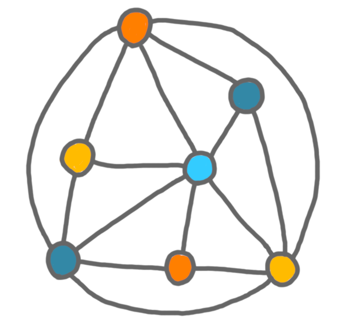
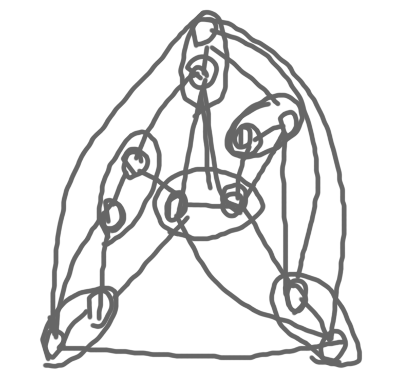
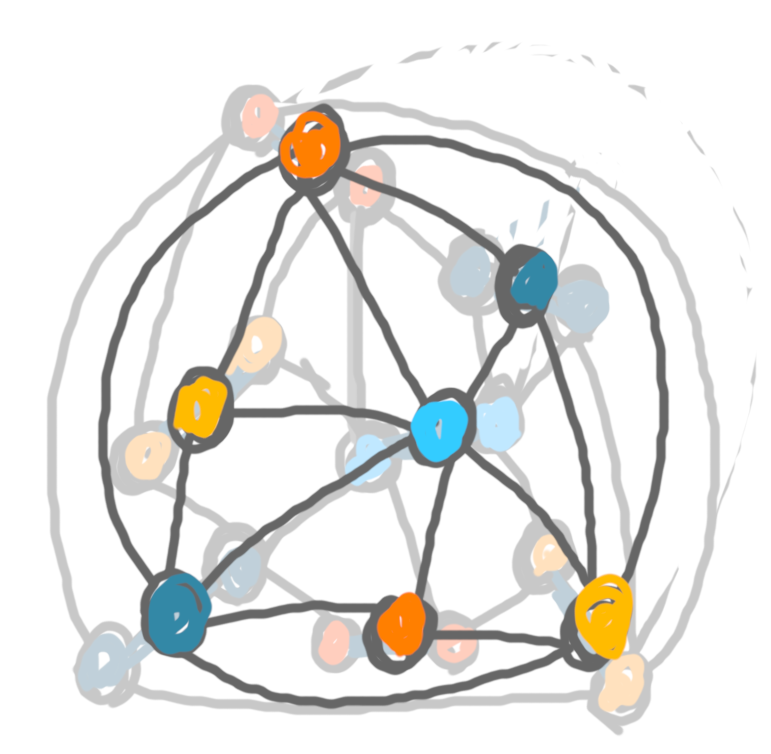
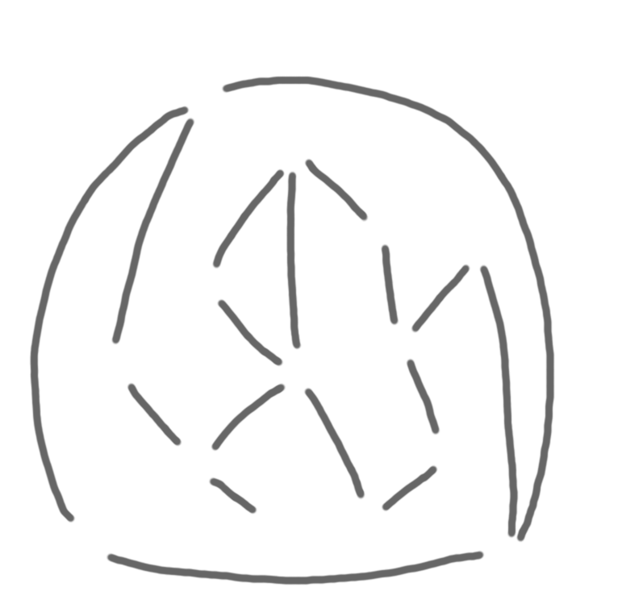
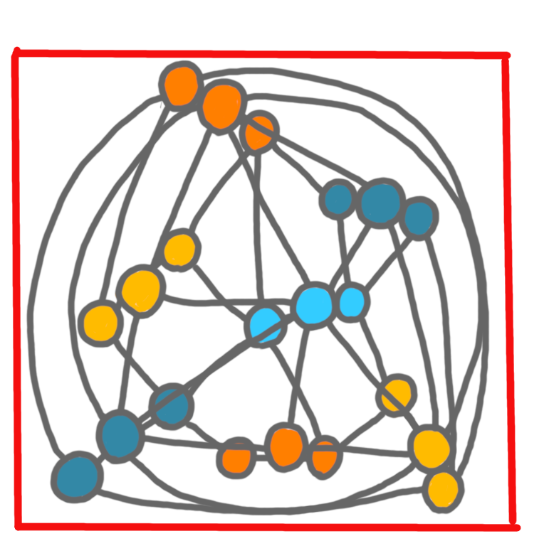

I have been asked a few times how I make the drawings for my slides and 
for this blog. I'll write a couple of posts about this. The first one shows
how I build a picture step-by-step.

Almost all drawing softwares allow to draw on several *layers*, and 
show/hide them at will. I'll illustrate how I use layers to get the 
following pair of pictures I made for a post a few weeks ago.

{: .center-image width="90%"}|{: .center-image width="90%"}

The first layers I create is a white background, that I won't edit, all the 
other layers are transparent. On the first (transparent) layer I very quickly 
draw a draft of the (first) picture. On this draft layer, I draw without 
erasing, in one color, just to place the elements.

{: .center-image width="70%"}

Then I reduce the opacity of this first draft layer, and create a second draft, 
where I better place the elements, and have colors. On that one, I roughly 
erase the useless stuff.
 
{: .center-image width="70%"}

Then I hide the first draft completely, reduce the opacity of the second 
draft, to create a draft for the second picture.
  
{: .center-image width="70%"}

Now, I draw the final version of the first picture. I do so on many layers 
which are from top to bottom: 
(1) vertices contours, (2) edges of the matching in grey, (3) the other edges of the graph, and 
(4) vertices colors, (5) edges of the matching in bold blue. 
Below are these five layers, along with the picture with all layers but (5).

  
{: .center-image width="90%"}|{: .center-image width="90%"}|{: .center-image width="90%"}

{: .center-image width="90%"}|{: .center-image width="90%"}|{: .center-image width="90%"}

A few remarks:

* The layers (2) and (5) are not used together: when I want to highlight 
the edges of the matching I use (5), otherwise I use (2). 
In general, to have an animation in a talk, I show/hide layers.

* I'm not always sure which objects are going to be appear together or not. 
I often have more layers than necessary. For example here, layer (1) and 
(4) could have been merged. This is also useful when I want to modify a 
picture for a later presentation, since it gives more flexibility.

* The order of the layers is important. For example, I can fill the vertices 
with colors harshly, because anyway layer (1) will be on top of 
layer (4).

I follow a similar process for the second picture. One handy thing in the software 
I use (which is gimp) is that you can have folders of layers, hence I can hide in 
one click the folder of layers for picture 1, while working on picture 2.

Finally, I display both pictures together for cropping. This allows to have 
the exact same frame, for animations in slides, and for allignment in blog 
posts. 

{: .center-image width="70%"}
