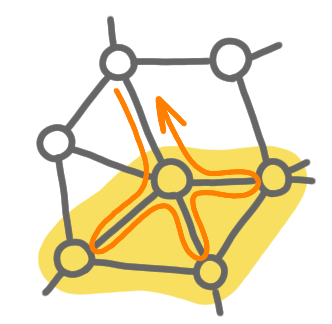

Continuing a series of posts about how I do my pictures. Today about the
hardware I use. 

I started drawing for research/blog/talks on a Samsung tablet (therefore
with my finger, not a stylus), using the first drawing software I found.
It worked pretty well. For example the picture below was made at that 
time, and looks ok to me. 

{: .center-image width="50%"}

The important feature is that your drawing software supports layers, as 
said in the previous post. 

Nowadays, I use a graphics tablet with a stylus. It is a "black" tablet, not 
one with an LCD display. So I need to plug it to the computer, and look at 
the screen of a computer, while moving the stylus on the tablet. It looks 
weird at first, but one gets used to it in a few minutes.

Specifically, I use a Repaper tablet by iskn, although I suspect any tablet 
would suffice for my modest needs. 
Actually, for me this tablet is a bit annoying because it is not supported by 
Linux (my usual OS), so I needed to go back and forth between Windows and 
Linux. I've heard that Wacom tablets work well with Linux (or Ubuntu at least).

I guess the bottom line is that for simple drawings you don't need fancy 
stuff.
