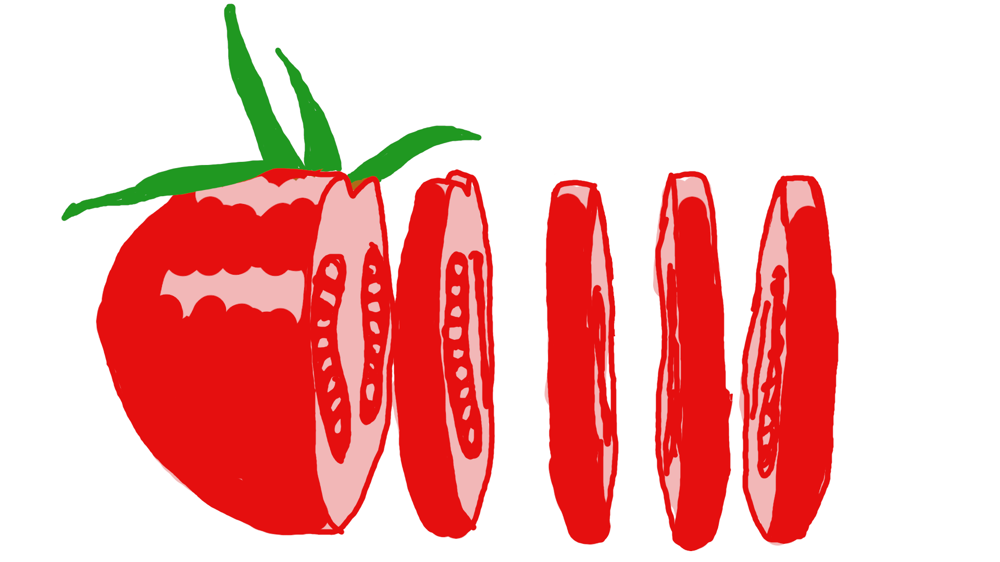

A quick non-technical post to kick off the new academic year. 
In short: it can be good to take small breaks regularly.

{: .center-image width="80%"}

I'm not a fanatic of "techniques to work efficiently": most are unconvincing, 
advertized to make money. Also it's often dubious 
what is meant by "efficiency" (Which measure? Long term vs short term?)
But there is one small thing that I do regularly, and makes me happier at 
the end of the day. It's called Pomodoro technique, and it's simply 
about working in the following schedule: 

* Work for 25 minutes,
* Take a 5-minute break,
* Repeat (with a longer break every four cycles or so). 

The technique gets its name from the tomato-shaped kitchen timer used by 
its "creator" (pomodoro is Italian for tomato).

The specific time are of course unimportant, but there are two aspects that 
are good to me:

* Taking breaks that often is counter-intuitive: 
one can certainly work for longer stretches, especially early in the day. 
But it often happens to me that as the hours go by, I'm getting distracted, 
taking uncontrolled breaks (doomscrolling the news, or getting depressed
reading the publication lists of my hyper-productive colleagues);
then feeling guilty, and not allowing myself to take a real break. 
Taking regular and controlled breaks is a good way to avoid this downward 
spiral.

* Cutting time into small period gives an opportunity to change activity. 
For example, without a break I can go "I just need a bit more time to 
finish this" for a full afternoon, while if I realize I have already spend 
three segments on some non-urgent thing, I can force myself to switch to 
something else, even if "I just need 5 more minutes". 

I discovered this while searching for background music. Some videos are 
designed to follow the Pomodoro technique, like [this one].
[this one](https://www.youtube.com/watch?v=grBFMP3HDZA). 

