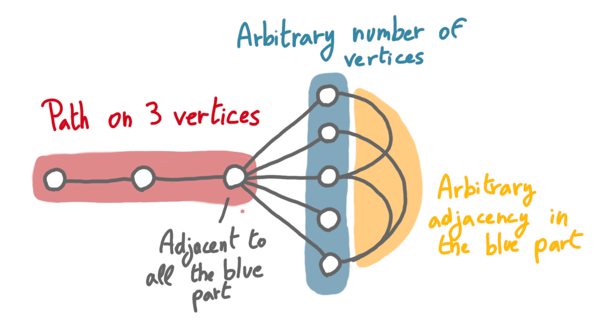
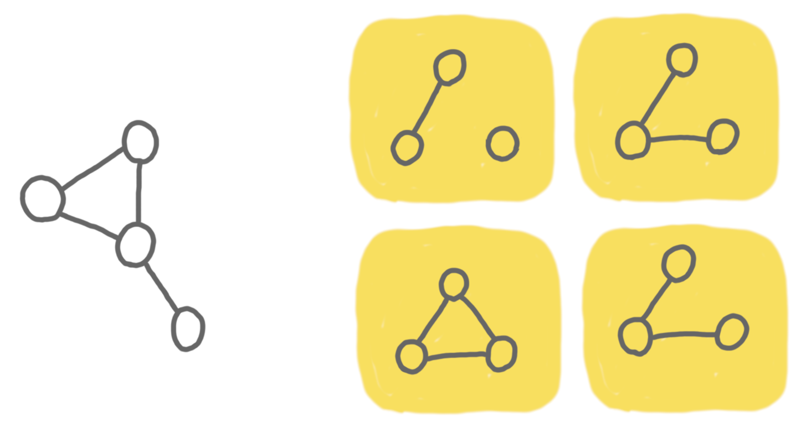
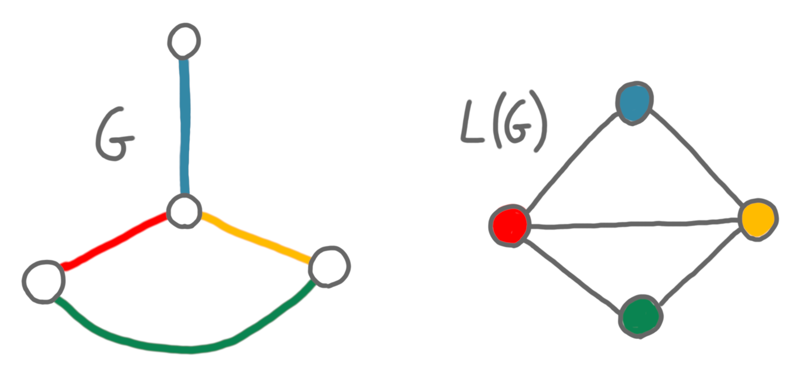
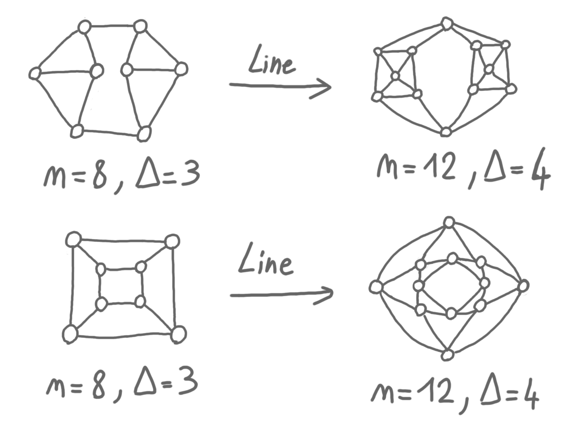

---
layout: post
title: Graph reconstruction conjectures
redirect_from: "/2024/10/xx/reconstruction-conjectures/"
permalink: reconstruction-conjectures
---

Last week I attended an online talk by 
[Paul Bastide](https://perso.eleves.ens-rennes.fr/people/paul.bastide/)
about graph reconstruction. In this post I will follow closely the 
structure of the first part of his talk, surveying open problems in the area. 
If you interested, the video is available online [here](https://scalelite-info.univ-lyon1.fr/playback/presentation/2.3/deb1788b716ce04af06dc1761a32ab0e724bb232-1727436820184) (with suboptimal sound), and also 
contains the second part where Paul speaks about his nice work on related problems.

## General approach

Graph reconstruction is about reconstructing a graph (or at least deciding 
if it has a given property) given a collection of partial views of it. 
In other words, one makes queries to a hidden graph $G$ 
(for various types of queries) and tries to output the hidden graph, or 
determine whether $G$ satisfies some property. Sometimes the question is 
whether this is possible at all, and sometimes one wants to determine the 
minimum number of queries. 

This has a similar flavor as graph 
[property testing](https://en.wikipedia.org/wiki/Property_testing) 
(making queries to a hidden graph), but there is no epsilon: you want to 
reconstruct the graph (resp. decide the property) exactly and 
deterministically.

In the following, I discuss quickly the three conjectures that Paul 
highlighted in his talk. They use three different types of queries: edge 
queries, deck queries and line queries.

## Evasivness conjecture

The most natural type of queries one can think of is: Is (u,v) an edge of the 
graph? This is an *edge query*. To be able to ask the question, one needs to 
know the names of nodes, and here we can assume that they are between 1 and $n$, 
for a known $n$. We will try to minimize the number of queries, for the
worst name assignment.

Now, one would like to prove statements of the form "deciding if the 
graph is planar can be done in X edge queries". 
And at first, this seems hopeless and uninteresting. Indeed, deciding whether 
the graph is empty takes $n(n-1)/2$ queries, the trivial upper bound.
But it is not true of every property. For example, deciding whether a graph 
is a *scorpion graph* can be done with $O(n)$ queries. The picture below 
describes such graphs. The proof is non-trivial but shortish, see e.g. 
[here](https://math.uchicago.edu/~may/REU2015/REUPapers/Zhao.pdf).) 

{: .center-image width="80%"}

Being a scorpion graph is not a *monotone* property: it does not stay true 
when one removes edges. (It seems that "monotone" refers either to removing 
or to adding edges, depending on the author, but here it doesn't matter.)
The [Evasivness conjecture](https://en.wikipedia.org/wiki/Aanderaa%E2%80%93Karp%E2%80%93Rosenberg_conjecture)
states that for all monotone graph property, the edge query complexity is 
the trivial $n(n-1)/2$. It is also known under the name of 
Aanderaa–Karp–Rosenberg conjecture.

There has been a series of papers proving that $c \cdot n^2$ queries are needed, 
for larger and larger $c$, the current best being $c=1/3$. The conjecture 
has been proved when 
$n$ is a power of a prime, by studying "group actions on topological spaces" . 

## Reconstruction conjecture

Consider now a new setting. One is given access to the *deck* of the hidden 
graph $G$, which is the multiset of all the graphs that can be obtained by removing 
exactly one vertex from $G$ (the *cards*). In this case the vertices have no names. 

For example, on the picture, the hidden graph is on the left and its deck 
on the right. 

{: .center-image width="80%"}

Now, it's not clear how to reconstruct the original graph, because of all 
the symmetries. (Try to imagine what you would have done with the deck above.)

The [reconstruction conjecture](https://en.wikipedia.org/wiki/Reconstruction_conjecture)
states that it is always possible to reconstruct a graph from its deck 
(if $n>2$ because an edge and two isolated vertices have the same deck). 

The conjecture has been proved for various graph classes, such as trees and 
outerplanar graphs.

## Graham tree reconstruction conjecture

A less-known conjecture is Graham tree reconstruction conjecture. (The only 
reference I could find online is [here](https://arxiv.org/pdf/1109.0522v1), 
but it seems to be well known in the reconstruction community.)

It is based on the notion of line graph. Given a graph $G=(V,E)$, its line graph 
is the graph L(G), with vertex set $E$ (one vertex for every edge of $G$), 
such that $(u,v)\in L(G)$ iff $u$ and $v$ correspond to edges in $G$ that share 
an endpoint. See the picture below. 

{: .center-image width="80%"}

If we iterate this operation, in general, we get larger and larger graphs. 
In other the sequence: $|V(G)|, |L(V(G))|, |L(L(V(G)))| ...$ increases quickly. 

A question is: is it the case that this sequence characterizes the original
graph $G$? In general, this is not true. For example, two $k$-regular graphs
of size $n$, have the same sequence. See picture below for an example on 
one step. 

{: .center-image width="80%"}

But Graham conjectured that this is true for trees. The conjecture is still 
wide open. 

 

