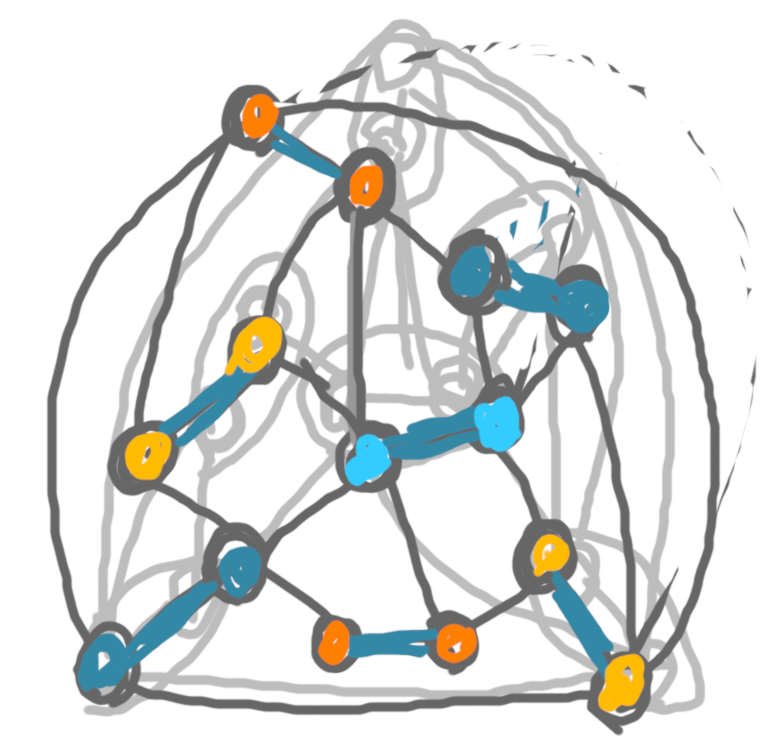
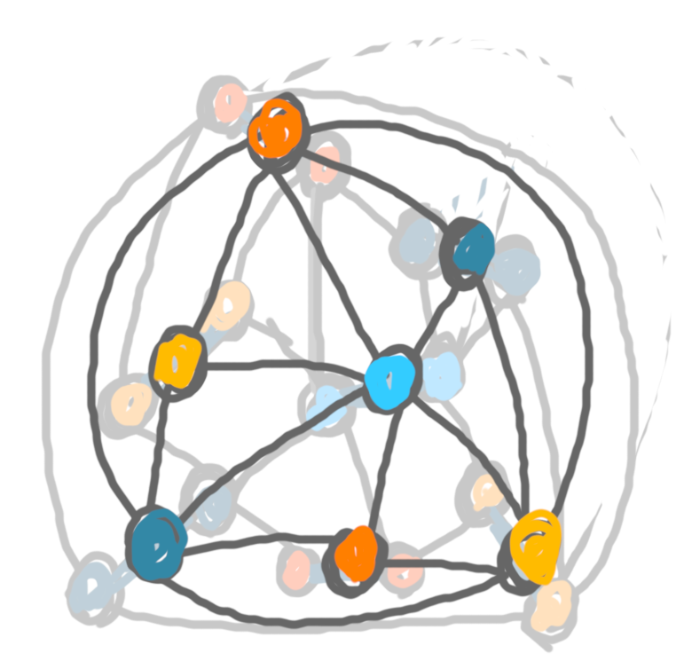
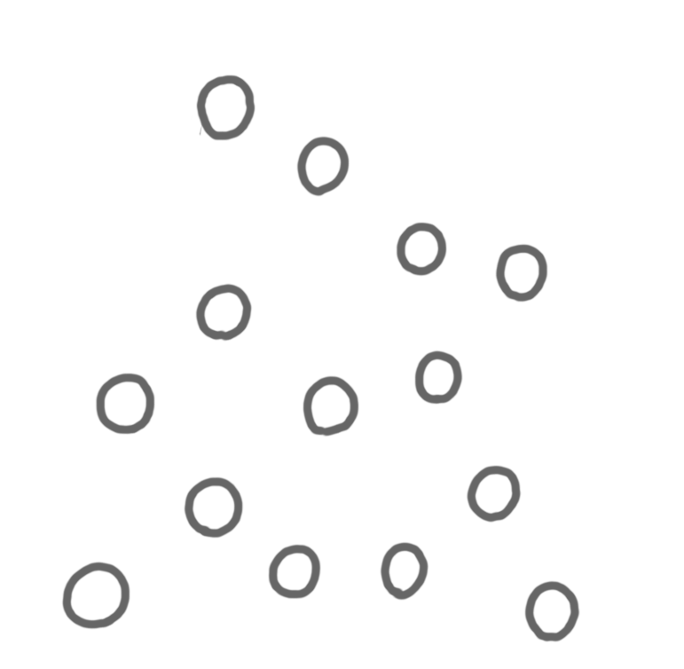
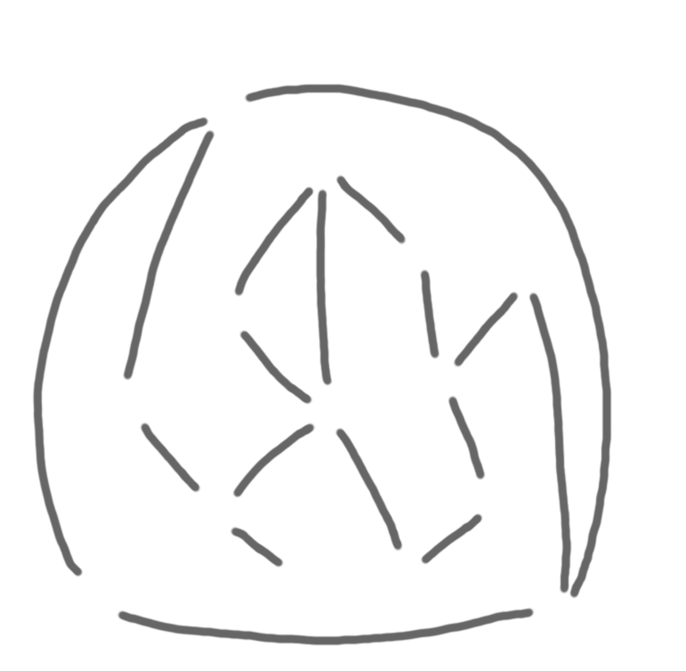
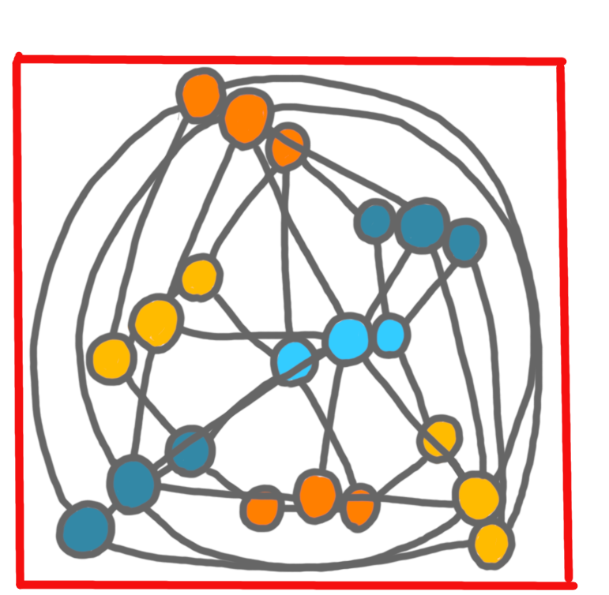

I have been asked a few times how I do the drawings for my slides and 
for this blog. I'll make a couple of posts about this. The first one shows
how I build a picture step-by-step.

Almost all drawing softwares allow to draw on several *layers*, and 
show/hide them at will. Let me illustrate how I use these layers, to get the 
following pair of pictures I made for a post a few weeks ago.

{: .center-image width="90%"}|{: .center-image width="90%"}

The first layers I create are a white background (that I won't edit) and a 
transparent layer, that I use as a draft. (All layers except the background 
at transparent.) On this draft layer, I draw without erasing, in one color, 
just to place the elements.

{: .center-image width="70%"}

Then I reduce the opacity of this first draft layer, and create a second draft, 
where I better place the elements, and have colors. On that one, I roughly 
erase the useless stuff.
 
{: .center-image width="70%"}

Then I hide the first draft completely, reduce the opacity of the second 
draft, to create a draft for the second picture.
  
{: .center-image width="70%"}

Now, I draw the final version of the first picture. To do so I actually 
have five different layers: (1) vertices, (2) edges of the matching in grey, 
(3) edges of the matching in bold blue, (4) the other edges of the graph, and 
(5) vertices colors.

  
{: .center-image width="90%"}|{: .center-image width="90%"}|{: .center-image width="90%"}

{: .center-image width="70%"}|{: .center-image width="70%"}

A few remarks:

* The layers (2) and (3) are not used together: when I want a picture of the
original graph I use (2) and when I want to highlight the edges of the 
matching I use (3). In general, to have an animation in a talk, I show/hide
layers.

* I'm not always sure which objects are going to be appear together or not. 
I often have more layers than necessary. For example here, layer (1) and 
(4) could have been merged.

* The order of layers is important. For example, I can fill the vertices 
with colors in an unprecise way, because anyway layer (1) will be on top of 
layer (5).

I do a similar thing for the second picture. One handy thing in the software 
I use (gimp) is that you can have folders of layers, hence I can hide in 
one click the folder of layers for picture 1, while working on picture 2.

Finally, I display both pictures together for cropping. This allows to have 
the exact same frame, for animations in slide, and for allignment in blog 
posts.

{: .center-image width="70%"}
